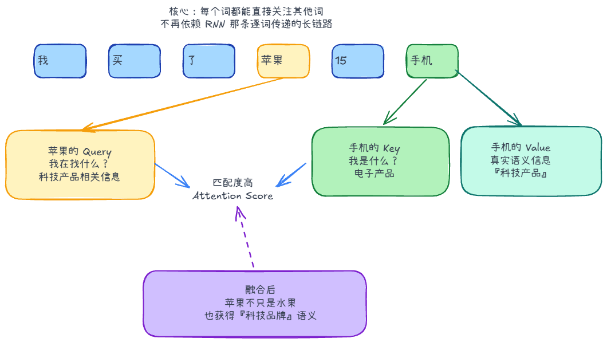

# Transformer

## 为什么用 Transformer

RNN/LSTM 按顺序处理词，后一步依赖前一步；远距离的信息要经过很多步传递，训练也难以并行。

Transformer 用自注意力，让每个位置直接关联其他可见位置。训练时可以并行计算一段已知序列，生成时仍通常逐 Token 输出。

## 自注意力

自注意力解决的是：**理解当前词时，应该重点参考哪些词？**

自注意力里最关键的是三个向量：Q、K、V：

- **Query（Q，查询）**：我想找什么信息？
- **Key（K，键）**：我能提供什么标签，供别人匹配？
- **Value（V，值）**：如果我被关注，我真正提供什么内容？

来看这句话：“小明把苹果递给小红，因为它很甜。”

当模型处理到 “它” 这个词时：
   - “它” 发出 Query：“我在寻找一个表示物体的名词。”
   - “小明” 的 Key 回应：“我是人，主语。”（匹配度低）
   - “小红” 的 Key 回应：“我是人，宾语。”（匹配度低）
   - “苹果” 的 Key 回应：“我是水果，物体，可被食用。”（匹配度极高）

计算后，“它”和“苹果”之间的注意力权重最高。于是，“它”的最终含义中就融入了大量“苹果”的信息，模型从而精准理解了“它 = 苹果”，而不是小明或小红。



## 位置信息

“猫吃鱼”和“鱼吃猫”包含相同的词，但顺序不同，含义也不同。

自注意力本身没有完整的词序信息，所以要额外引入位置：经典 Transformer 加入位置向量；RoPE 则在 Q/K 上引入旋转，让相对位置参与匹配。

## 多头注意力

只算一组注意力，表达能力有限。多头把表示投影到不同子空间，各自计算注意力，再拼接并投影回去。

不同头可能学到指代、位置等不同关系，但这些分工不是人工预先规定的。

## 三种架构

| 架构 | 怎么处理信息 | 常见用途与代表 |
| --- | --- | --- |
| Encoder-only | 双向关注输入上下文 | 分类、文本理解；BERT |
| Encoder-decoder | Encoder 编码输入，Decoder 结合输入逐步生成 | 翻译、摘要；原始 Transformer、T5 |
| Decoder-only | 根据已有前缀逐步生成 | 对话、续写、代码生成；GPT 类模型 |

### Decoder-only 怎么生成

输入“我喜欢” → 预测“吃” → 根据“我喜欢吃”预测“苹果” → 继续生成，直到结束。

回答问题、翻译和写代码，都可以组织成“给定上下文，继续生成”的任务。

### 掩码自注意力（Masked Self-Attention）

训练时虽然拿到完整文本，但预测下一个 Token 不能提前看答案。

计算注意力时，把未来位置的分数设为负无穷，Softmax 后权重就是 0。当前位置只能关注自己和左侧前缀。

```text
注意力矩阵示意：

          我   喜欢   吃   苹果
我       有    0     0     0
喜欢     有    有    0     0
吃       有    有    有    0
苹果     有    有    有    有
```

也就是说，“吃”可以看见“我、喜欢、吃”，但不能提前看到“苹果”。

训练时能并行计算这些已知位置；生成时未来 Token 还没产生，常规自回归解码需要逐步推进。

# 交互与分词
## Token

Token 是模型处理文本的单位，可能是字符、子词或符号组合，不等于一个汉字或一个单词。

1. **上下文容量**：规则、历史消息、工具说明和工具结果都会占用输入空间；还要给输出留预算。
2. **成本**：输入、输出通常按 Token 计费，具体看服务商规则。
3. **延迟**：输入长，处理提示词通常更慢；输出长，生成时间通常也更长。

实际数量要用对应模型的分词器或接口统计，不能用固定的字数比例套所有模型。

### 分词方式

按词切分，词表可能很大，生僻词也难处理；按字符切分，序列会更长。子词切分把常见片段保留为一个单位，把少见词拆开，在词表大小和序列长度之间取舍。

## 采样参数

| 参数 | 作用 |
| --- | --- |
| Temperature | 调整概率分布，控制采样随机性 |
| Top-k | 只在概率最高的 k 个候选中采样 |
| Top-p | 保留累计概率达到 p 的候选集合，再采样 |

具体支持哪些参数、组合顺序如何，以模型服务实现为准。先固定其他条件，再调整一个参数观察效果。

### 温度设为 0 就不会幻觉吗

不会。低温度主要减少随机性，不能保证模型掌握正确事实，也不能保证不同版本或服务环境下完全复现。
