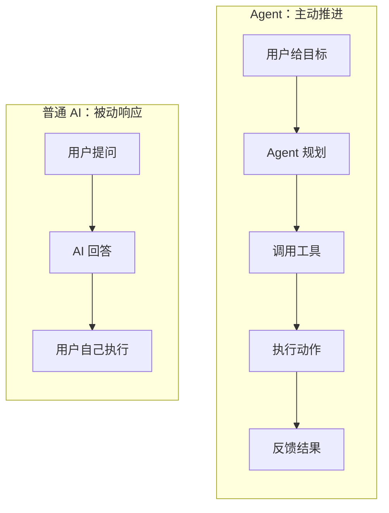
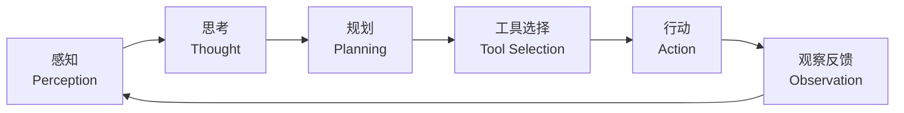
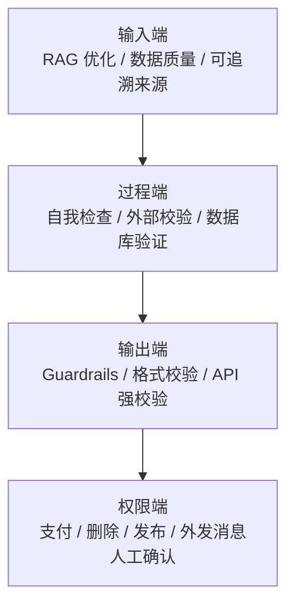

# 目录

1. 智能体（Agent）与普通 AI 的本质区别
2. 智能体的运行机制
3. 智能体的协作模式
4. Agent 为什么会产生幻觉
5. 如何降低 Agent 的幻觉风险

# 智能体（Agent）与普通 AI 的本质区别

理解 AI Agent，可以先抓住一个核心差异：普通 AI 更像“回答问题的助手”，而智能体更像“能围绕目标持续行动的执行者”。

我们用“帮老板订机票”这个任务来对比：

- **普通 AI（如 ChatGPT 网页版）**：
    - 你问：“帮我看看明天从上海到北京最便宜的机票。”
    - AI 可能回答：“明天上海到北京有春秋航空、东航等，最低价约 500 元。你需要我帮你预订吗？但我无法联网，也无法操作你的银行卡，请你登录携程购买。”
    - 它的特点是：**只说不做，被动响应**。

- **智能体（AI Agent）**：
    - 你对它说：“帮我订一张明天上午去北京最便宜的机票。”
    - 智能体会围绕这个目标持续推进：
        1. **拆解任务**：把目标拆成“查机票 -> 比价 -> 获得确认 -> 调用支付接口 -> 确认出票”。
        2. **调用工具**：通过授权接口查询航班、价格和余票。
        3. **做出决策**：根据时间、价格、退改规则等条件筛选方案。
        4. **执行动作**：在你授权后完成支付，或把确认链接发给你，再将电子票根发送到邮箱。
    - 它的特点是：**能说能做，主动执行**。

所以，Agent 不只是“会聊天的 AI”。它通常具备目标理解、任务规划、工具调用、状态反馈和持续迭代的能力。

# 智能体的运行机制

一个典型的智能体系统，可以理解为“感知 -> 思考 -> 行动”的循环。

1. **感知（Perception）**：这是循环的起点。智能体通过用户输入、API 回调、系统事件、数据库变化等方式接收环境信息。这些信息也常被称为**观察（Observation）**，既可以是用户最初给出的指令，也可以是上一步行动之后得到的反馈。

2. **思考（Thought）**：接收到观察信息后，智能体进入决策阶段。对于基于大语言模型（LLM）的智能体来说，这通常由模型完成推理、判断和计划更新。这个阶段可以进一步拆成两个动作：
    - **规划（Planning）**：根据当前目标、上下文和已有记忆，制定或调整行动计划，把复杂目标拆成更具体的子任务。
    - **工具选择（Tool Selection）**：从可用工具中选择下一步最合适的工具，并生成调用所需的参数。

3. **行动（Action）**：决策完成后，智能体通过工具或执行器完成具体动作。例如调用搜索 API、运行代码、查询数据库、发送邮件，或触发某个业务系统的接口。

这个循环会不断重复：每一次行动都会带来新的观察，新的观察又会影响下一轮思考和行动。也正因为如此，Agent 比单次问答更适合处理多步骤、长链路、需要反馈调整的任务。

# 智能体的协作模式

Agent 并不只有一种形态。按照自主程度不同，可以粗略分为“开发者工具”和“自主协作者”两类。

## 1. 作为开发者工具（Developer Tool）：提效的超级副驾驶

在这个角色下，智能体主要是**辅助者**。它的目标是帮助程序员或创作者更高效地完成工作，但人仍然掌控方向和最终决策。

- **怎么工作**：程序员依然是主驾驶。智能体根据指令提供代码生成、Debug、测试用例生成、API 文档解释等服务。
- **典型代表**：GitHub Copilot、Cursor、Codeium。
- **核心特点**：
    - **人机协同（Human-in-the-loop）**：需要人类持续观察、指挥、确认和修正输出。
    - **工具属性强**：它更像一把高效工具，能力很强，但主要响应人的明确指令。

## 2. 作为自主协作者（Autonomous Collaborator）：能独立推进任务的 AI 员工

在这个角色下，智能体更接近**同行者**。你不需要一步步告诉它怎么做，只需要给出最终目标，它会自己规划路径并尝试执行。

- **怎么工作**：比如你说：“帮我调研市场上最新的 3 款折叠屏手机，写一份对比报告并发送到我的邮箱。” 智能体会自己搜索资料、筛选信息、整理结构、撰写报告，最后调用邮件工具发送给你。
- **典型代表**：Devin、AutoGPT。
- **核心特点**：
    - **自主性（Autonomy）**：能够自我规划（Planning）和自我反思（Self-reflection），并在出错后尝试修正。
    - **任务承担能力更强**：它不只是单点工具，而是可以分担复杂任务的数字化协作者。

# Agent 为什么会产生幻觉

Agent 的能力来自大语言模型、工具调用、上下文记忆和多步规划。也正是这些能力来源，带来了更复杂的出错方式。

## 1. LLM 底层限制：统计概率不等于逻辑真理

智能体的“大脑”通常是大语言模型（LLM），而 LLM 的基础机制是根据上下文预测下一个最可能出现的词。

- **字词接龙的本质**：大模型并不像人类一样天然拥有现实世界的物理模型。它更擅长根据已有文本模式生成合理语言，而不是直接验证事实。
- **流畅度优先于正确性**：在训练目标中，“表达自然、听起来通顺”的权重很高。因此，当模型遇到知识盲区时，它可能会生成一段看起来合理、但事实并不可靠的内容。
- **记忆混淆**：模型的知识分布在大量参数中。当两个概念高度相似时，例如两个名字接近的 API，或两套相似的退款规则，模型可能把 A 的特征误套到 B 身上。

## 2. 工具使用偏差：对输入参数和返回值的误读

Agent 的一大特点是会使用工具（Tool Use）。但在工具调用的输入和输出环节，都可能出现偏差。

- **参数幻觉（Argument Hallucination）**：模型在调用 API 时需要生成参数。如果 API 文档不够清晰，或模型理解有偏差，它可能会凭空生成一个不存在或不合法的参数。
- **错误解释偏差**：当外部工具失败并返回错误码，例如 `{"error_code": 500, "msg": "timeout"}`，智能体可能无法正确理解这个技术错误。为了继续推进任务，它可能把错误结果解释成“查询成功但订单不存在”，导致后续逻辑走偏。

## 3. 记忆偏差：RAG 与上下文带来的信息污染

智能体通常配有“长期记忆”（Vector DB/向量数据库）和“短期记忆”（Context/上下文）。记忆能力越强，越需要控制信息质量。

- **检索出脏数据**：在 RAG（检索增强生成）模式下，智能体会从数据库中检索信息。如果检索算法不够精准，把不相关或过时的规则召回，智能体就可能基于错误事实继续推理。
- **上下文过载**：随着多轮对话或复杂工作流推进，上下文会变得越来越长。模型在处理极长文本时可能遗漏关键约束，尤其容易出现“迷失在中间”（Lost in the Middle）的问题。

## 4. 多步规划偏差：误差会沿着链路累积

这是智能体系统，尤其是自主协作者形态中常见的问题。

- 在传统 Workflow（工作流）中，每一步通常是确定性的。
- 在 Agent 中，任务往往依赖多步推理，例如 Chain of Thought 或 ReAct 架构。
- **误差传播（Error Propagation）**：假设一个任务需要 5 步规划。如果第一步产生了 5% 的偏差，这个偏差会成为第二步的输入。越往后走，偏差越可能被放大，最终得到一个表面连贯、实际错误的结论。

## 5. 谄媚效应与提示词敏感（Sycophancy）

大模型在微调（RLHF，人类反馈强化学习）过程中，通常被训练得更礼貌、更顺从。这有助于提升交互体验，但也可能让模型过度迎合用户。

- **迎合用户暗示**：如果用户的问题中带有错误前提，例如“为什么昨天的退款申请被拒绝了？明明金额只有 10 块钱。” 但实际金额是 1000 块，智能体可能顺着错误前提编造原因，而不是先纠正事实。
- **提示词约束失衡**：如果系统提示词过于严苛，例如“你必须给出解决方案，绝对不能拒绝用户”，智能体可能在没有可靠方案时硬编答案。

# 如何降低 Agent 的幻觉风险

在工程实践中，我们无法 100% 消除大模型幻觉，但可以通过架构设计把风险降到可接受范围。

1. **输入端：优化 RAG 和数据质量**  
   确保喂给智能体的数据干净、结构化、可追溯，减少过时信息、噪声信息和错误事实的干扰。

2. **过程端：引入自我检查和外部校验**  
   让智能体在关键步骤后进行自检，并用数据库、业务规则或独立模型交叉验证。例如生成订单号后，不直接相信文本输出，而是回到数据库中校验。

3. **输出端：设置 Guardrails 和强约束**  
   用 Workflow、正则表达式、Pydantic 格式校验、API 强校验等机制作为最后一层防线。一旦检测到不合规输出，就直接拦截、修正或要求重新生成。

4. **权限端：把高风险动作交给人确认**  
   对支付、删除、发布、发送外部消息等高风险动作，应设置明确授权点。Agent 可以准备方案，但最终执行需要用户确认。

总结来说，Agent 的价值不在于“完全自动化”，而在于把模型、工具、记忆和反馈循环组合起来，让 AI 能够围绕目标持续推进任务。真正可靠的 Agent 系统，既要让它有行动能力，也要给它足够清晰的边界。
