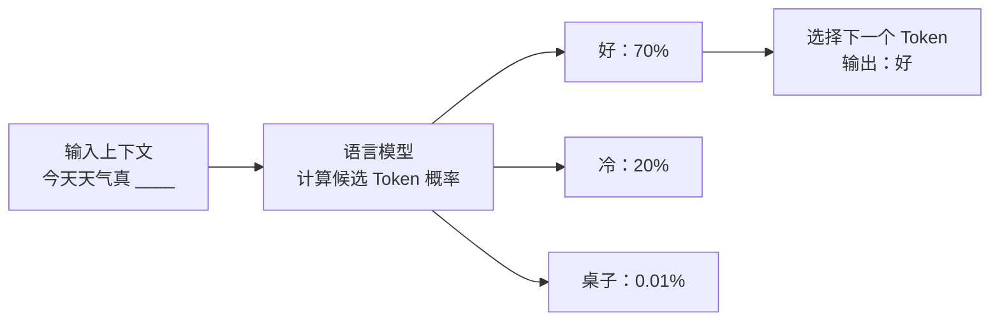
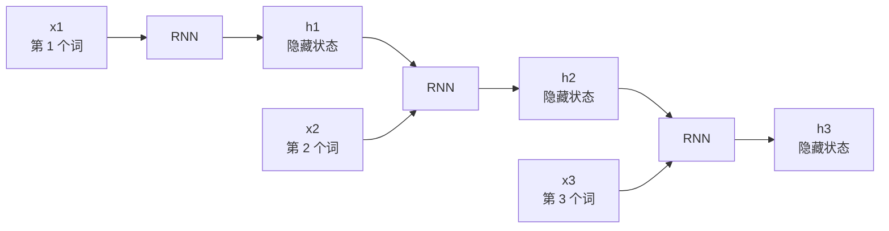
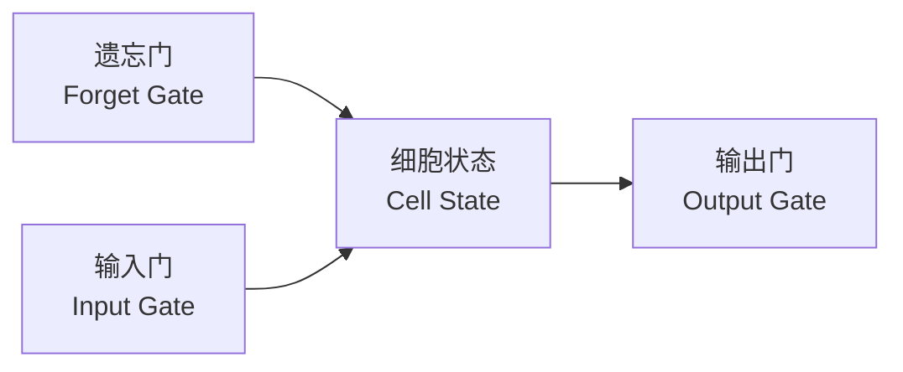
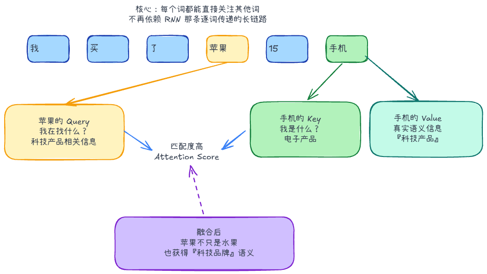

# 目录

1. LLM 是什么：下一词预测
2. N-gram：用统计做文字接龙
3. RNN/LSTM：给模型加入连续记忆
4. Transformer：把全文摊开来看
5. Decoder-Only：GPT 的生成方式
## LLM 是什么？

LLM 是 Large Language Model 的英文缩写，中文通常翻译为**大语言模型**。

这里的“大”，主要体现在三个维度：

1. **参数量大**
2. **训练数据量大
3. **训练计算量大**

虽然 LLM 看起来像是“知道很多东西”，但它的底层目标可以简单理解为 **Next-token Prediction**，也就是根据已有上下文预测下一个最可能出现的 token。

当用户输入一个问题时，模型会根据上下文和训练中学到的模式，预测下一个 token，再继续预测下下一个 token，直到生成一段完整的回答。

早期语言模型主要用于输入法联想、拼写纠错、搜索排序和推荐系统。后来，模型能力逐渐扩展到文案生成、代码生成、复杂问答，最终发展到今天的 **LLM + Agent**：它不只是帮人“打字”，而是开始帮人“完成任务”。



# 1. N-gram：用统计做文字接龙

N-gram 是最早期、也最直观的语言模型之一。它的核心思想是：把一句话切成连续包含 N 个词的滑动窗口，然后根据历史统计预测下一个词。这个假设也被称为**马尔可夫假设**：下一个词主要取决于它前面的少量词。

例如，我们想预测这句话的下一个字：

> 今天天气真____

如果我们在一个包含大量中文文本的语料库里做统计，可以得到这样的结果：

1. **Bigram（N=2）**
    - 模型只看前 1 个词，也就是“真”。
    - 它统计“真”后面最常出现什么词。
    - 可能的结果是：“好”出现 80,000 次，“冷”出现 15,000 次，“桌子”出现 10 次。
    - 因为“好”的概率最高，所以模型推荐“好”。

2. **Trigram（N=3）**
    - 模型看前 2 个词，也就是“天气真”。
    - 此时它更容易预测出“热”或“冷”。
    - 相比只看“真”，它能排除“真漂亮”“真聪明”等无关语境。

N-gram 的优点是简单、可解释、容易实现。但它也有三个明显问题：

- **数据稀疏（Sparsity）**：如果某个词序列从未在语料库中出现，模型就会把它的概率估计为 0。
- **上下文太短**：实际应用中，N 通常只能设到 3 或 5。也就是说，模型最多只记得前面几个词。
- **缺乏语义理解**：N-gram 本质上是在“数数”，不理解词义。在它眼里，“猫”和“咪”可能是两个完全无关的符号。如果语料里只有“猫吃鱼”，它未必能从“咪吃____”联想到“鱼”。

# 2. RNN/LSTM：给模型加入连续记忆

RNN（Recurrent Neural Network，循环神经网络）的核心思想是：

> 当下的状态，由过去的状态和眼前的输入共同决定。

它试图模拟一种连续性的思维过程。人类理解一句话时，不会每读一个字就清空记忆；我们会把前面的信息带到后面的理解中。RNN 也是如此：它会把上一步的隐藏状态传给下一步。



RNN 相比 N-gram 有两个重要进步：

1. **理论上支持任意长度输入**  
   N-gram 的窗口大小是固定的，而 RNN 可以沿着序列一直读下去。无论是 5 个字的短句，还是更长的文本，它都能用同一套网络结构处理。

2. **参数共享（Parameter Sharing）**  
   无论句子多长，RNN 处理每个词时使用的权重都是同一套。这让模型参数量相对可控，也让它具备处理不同长度文本的能力。

但 RNN 也有两个关键瓶颈：

1. **长期记忆很弱：梯度消失（Vanishing Gradient）**  
   虽然 RNN 理论上可以记住很久以前的信息，但在训练和计算中，信息会随着时间步不断衰减。  

2. **无法高效并行**  
   RNN 的计算有强依赖关系：要计算第 `T` 步，必须先算完第 `T-1` 步。模型只能按顺序一个词一个词地处理，很难充分利用现代 GPU 的并行能力。

为了解决长期依赖问题，LSTM（Long Short-Term Memory，长短时记忆网络）被设计出来。



LSTM 是一种特殊的 RNN。它的核心创新，是引入**细胞状态（Cell State）和一套门控机制（Gating Mechanism）**。细胞状态像一条更稳定的信息通路，让重要信息更容易跨越多个时间步保留下来；门控机制则负责决定哪些信息要保留、写入或输出。

- **遗忘门（Forget Gate）**：决定从上一时刻的细胞状态中丢弃哪些信息。
- **输入门（Input Gate）**：决定将当前输入中的哪些新信息写入细胞状态。
- **输出门（Output Gate）**：决定根据当前细胞状态输出哪些信息。

LSTM 显著缓解了 RNN 的长期依赖问题，但它仍然保留了“按顺序读”的结构，因此并行效率依然有限。

# 3. Transformer：把全文摊开来看

RNN/LSTM 的主要问题在于：必须读完前一个词，才能处理后一个词。Transformer 的想法更大胆：

> 与其一个词一个词地读，不如把整段文本同时摊开，让模型一次看到所有位置。

这带来了巨大的并行化（Parallelism）优势。模型可以同时处理一整段文本，而不必等待前一个时间步计算完成。

但这也带来一个新问题：如果所有词同时进入模型，模型怎么知道词的顺序？“猫吃鱼”和“鱼吃猫”包含同样的词，但意思完全不同。为了解决这个问题，Transformer 引入了**位置编码（Positional Encoding）**。

## 位置编码（Positional Encoding）

位置编码的作用，是在每个词进入模型之前，给它加上一个“位置标签”。

以“我喜欢你”为例：

- “我”的向量 + 表示位置 0 的编码 -> 带有位置信息的“我”。
- “喜欢”的向量 + 表示位置 1 的编码 -> 带有位置信息的“喜欢”。
- “你”的向量 + 表示位置 2 的编码 -> 带有位置信息的“你”。

有了位置编码，模型既能并行处理所有词，又能知道每个词在句子中的相对位置。

## 自注意力机制（Self-Attention）



自注意力机制是 Transformer 的核心。它解决的问题是：一句话里的每个词，应该重点关注哪些其他词？

在传统 RNN/LSTM 中，远距离词语之间的信息要经过很多步传递，中途容易衰减。而自注意力机制让每个词都可以直接和其他词建立联系，相当于给句子内部加了一张全连接的信息网络。
![[Transformer]]

自注意力里最关键的是三个向量：

- **Query（Q，查询）**：我想找什么信息？
- **Key（K，键）**：我能提供什么标签，供别人匹配？
- **Value（V，值）**：如果我被关注，我真正提供什么内容？

可以用“相亲配对”来理解它们：每个词都带着自己的择偶标准（Q）、个人标签（K）和真实信息（V）进入会场。模型会计算 Q 和 K 的匹配程度，再按匹配分数分配注意力，最后把被关注词的 V 融入当前词的表示中。

例如在句子“我买了苹果 15 手机”中，“苹果”这个词可能通过 Query 寻找“科技产品”相关信息，而“手机”的 Key 正好匹配。于是模型会把更多注意力分给“手机”，让“苹果”获得“科技品牌”的语义，而不是水果的语义。

这就是 Transformer 能处理长距离依赖的重要原因：任意两个词之间都可以直接建立联系。

## 多头注意力（Multi-Head Attention）

如果只有一组 Q、K、V，模型看一句话就只有一个角度。比如“张三打了李四”，模型可能只注意到“打”这个动作，却忽略“谁是动作发起者”“谁是受影响者”。

多头注意力的做法，是让模型同时用多个“头”观察同一句话：

- **Head 1**：关注语法结构，比如主语、谓语、宾语。
- **Head 2**：关注指代关系，比如“他”到底指谁。
- **Head 3**：关注语义或情感，比如句子的态度和语气。

最后，模型把多个头看到的信息拼接起来，得到更丰富的文本表示。

# 4. Transformer 的三种常见架构

## Encoder-Only：更擅长理解

Encoder-Only 模型只保留 Encoder，代表是 BERT。它可以同时看到输入文本的左右两侧上下文，因此很适合做文本分类、情感分析、句子匹配、语义检索等“理解型任务”。

但它通常不是按从左到右的方式生成文本，所以不适合作为聊天机器人持续续写回答。

## Encoder-Decoder：输入到输出的转换

Encoder-Decoder 模型同时使用 Encoder 和 Decoder。Encoder 负责理解输入，Decoder 负责生成输出，代表包括原始 Transformer、T5 和早期很多机器翻译模型。

它特别适合“把一种输入转换成另一种输出”的任务，例如翻译、摘要、改写：

- 输入：一段英文
- Encoder：理解英文含义
- Decoder：生成对应中文

## Decoder-Only：GPT 的生成方式

GPT（Generative Pre-trained Transformer）采用的是 **Decoder-Only** 架构。它的基本思想非常统一：

> 语言生成的核心任务，就是在已有文本后面预测下一个最可能出现的 Token。

无论是回答问题、写故事、翻译还是生成代码，本质上都可以被转化为“在当前文本后继续生成”。因此，GPT 抛弃了完整 Transformer 中的 Encoder，只保留 Decoder 部分，用自回归（Autoregressive）的方式逐步生成文本。

自回归生成过程如下：

1. 给模型一个起始文本，例如 `Datawhale Agent is`。
2. 模型预测下一个最可能的词，例如 `a`。
3. 把 `a` 加到输入末尾，得到 `Datawhale Agent is a`。
4. 模型基于新的输入继续预测，例如 `powerful`。
5. 重复这个过程，直到生成完整内容或满足停止条件。

### 掩码自注意力（Masked Self-Attention）

训练时，模型通常会一次性拿到完整文本。但如果它能看到未来词，就无法真正学习“预测下一个词”。因此，Decoder-Only 模型使用**掩码自注意力**来防止偷看答案。

具体做法是：在计算注意力分数时，把当前位置右侧，也就是未来位置的权重设为负无穷。经过 Softmax 后，这些位置的注意力权重会变成 0。这样，当前词只能关注自己和左侧已经出现的词。

```text
注意力矩阵示意：

          我   喜欢   吃   苹果
我       有    0     0     0
喜欢     有    有    0     0
吃       有    有    有    0
苹果     有    有    有    有
```

也就是说，“吃”可以看见“我、喜欢、吃”，但不能提前看到“苹果”。

### Decoder-Only 为什么成为主流

Decoder-Only 架构之所以重要，主要有三个原因。

1. **任务形式高度统一**  
   翻译、摘要、写代码、问答、推理，都可以改写成“给定上下文，继续生成文本”。这让模型结构变得简单，也让训练目标非常清晰。

2. **上下文学习能力强（In-Context Learning）**  
   当模型规模足够大时，它可以从提示词中的几个例子里归纳规律，并直接完成新任务。这种能力让 Prompt Engineering 成为使用大模型的重要方式。

3. **规模效应明显（Scaling Law）**  
   Decoder-Only 结构相对简单，适合在大量 GPU 上进行大规模分布式训练。模型规模、训练数据和计算量增加时，性能往往能持续提升。

总结来说，语言模型的发展可以看作一条不断扩大“可见范围”和“建模能力”的路线：N-gram 只能看很短的窗口，RNN/LSTM 开始引入连续记忆，Transformer 让所有词直接互相关注，而 Decoder-Only 则把生成任务统一成了强大的下一词预测。
