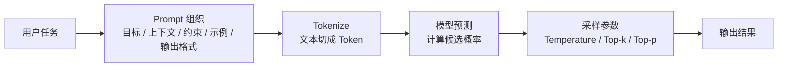
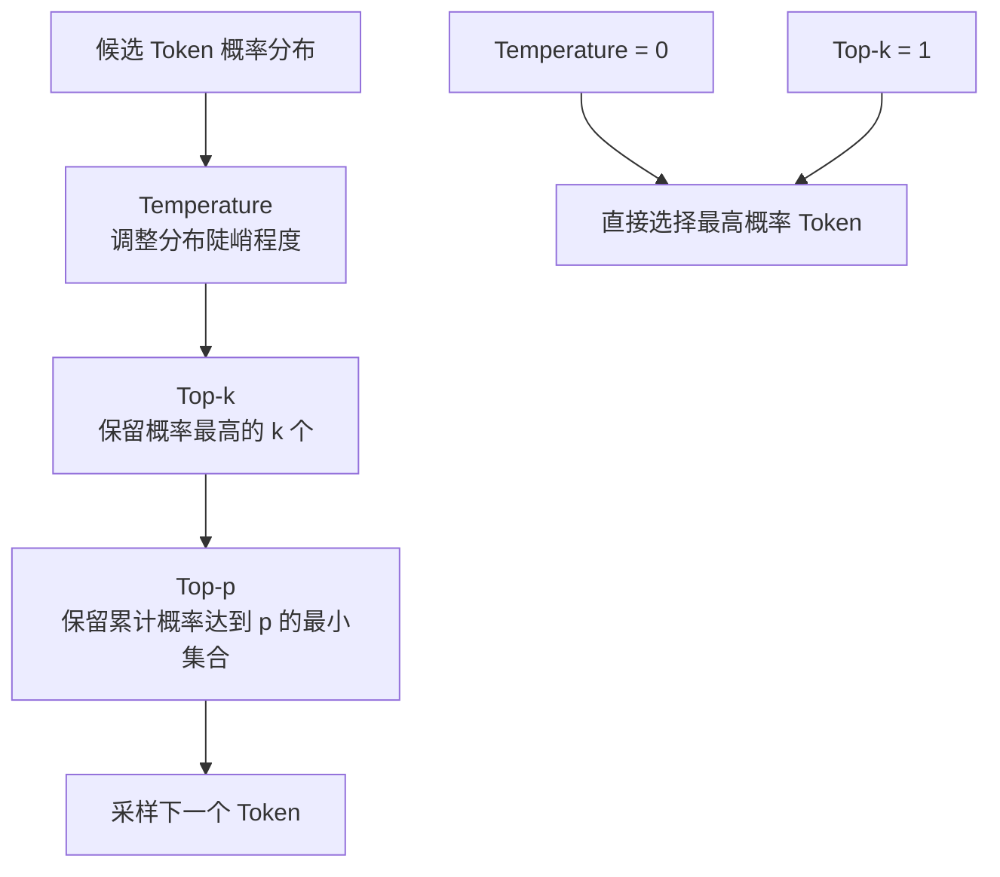
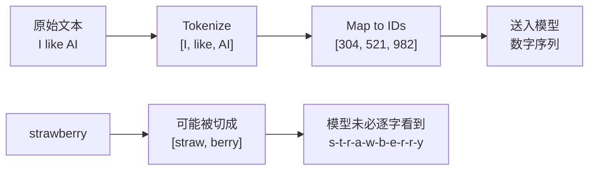

# 目录

1. 提示工程
2. 分词与 Token
3. 小结

# 交互：提示工程与 Token

和大模型交互，本质上是在做两件事：一是用提示词告诉模型“该怎么理解任务”，二是理解模型实际读到的并不是文字本身，而是一串 Token。前者决定输出方向，后者决定成本、上下文长度和一些看似奇怪的错误。



# 提示工程

**提示工程（Prompt Engineering）** 是设计输入，把目标、上下文、约束、示例和输出格式讲清楚，让模型更稳定地完成任务的方法。

## 1. 采样参数：控制随机性和候选范围

大模型每生成一个 Token，都会先给所有候选 Token 计算概率。采样参数的作用，就是调整模型从这个概率分布中“选谁”的方式。

- **Temperature**：控制输出的随机性。温度越低，模型越倾向选择高概率 Token，输出更稳定；温度越高，低概率 Token 也更容易被选中，输出更发散。
- **Top-k**：先把所有候选 Token 按概率从高到低排序，只保留前 `k` 个，再在这些候选中采样。
- **Top-p**：也叫 nucleus sampling。它会从最高概率的 Token 开始累加，直到累计概率达到阈值 `p`，然后只在这个最小候选集合中采样。

当同时设置 Temperature、Top-k 和 Top-p 时，通常可以理解为：先用 Temperature 调整概率分布，再用 Top-k 限制候选数量，最后用 Top-p 进一步收缩候选集合。

不过在实际使用中，Top-k 和 Top-p 通常二选一即可。同时设置时，最终候选范围会更窄，输出也更容易变得保守。



还需要注意两个极端情况：

- 如果 Temperature 设置为 `0`，模型会直接选择最高概率 Token，Top-k 和 Top-p 基本失去作用。
- 如果 Top-k 设置为 `1`，候选集中只剩一个 Token，Temperature 和 Top-p 也基本失去作用。

## 2. 样本提示：零样本、少样本与多样本

样本提示的核心，是通过示例告诉模型“我希望你按什么模式回答”。

- **零样本（Zero-shot）**：不给示例，只给任务说明。适合简单、明确的任务。
- **少样本（Few-shot）**：给 1 到几个示例，让模型模仿格式、风格或推理路径。
- **多样本（Many-shot）**：给更多示例，适合格式要求严格、边界情况较多的任务。

示例越贴近真实任务，模型越容易稳定复现你想要的输出方式。

## 3. 指令调优的影响

早期 GPT 模型更像“文本补全”模型。它们擅长根据前文续写，但不一定能可靠理解“请你做某件事”这样的指令。

**指令调优（Instruction Tuning）** 是一种微调技术。它使用大量“指令-回答”格式的数据继续训练模型，让模型更习惯理解人类任务，并按照要求输出答案。

这也是为什么现代对话模型更像助手：你不只是给它一段开头让它续写，而是在给它一个任务，让它尝试执行。

## 4. 基础提示技巧

常见的提示技巧包括：

- **明确角色**：例如“你是一名资深后端工程师”，用于限定模型的回答视角。
- **提供上下文**：把背景、目标、已有材料和限制条件放进提示词。
- **规定输出格式**：例如要求用 Markdown 表格、JSON、步骤列表或固定字段输出。
- **给出反例或边界**：告诉模型哪些情况不能做、哪些答案不符合要求。

好的提示词通常不是越长越好，而是信息足够、边界清楚、格式明确。

## 5. 思维链（Chain-of-Thought）

对于逻辑推理、计算或多步骤分析任务，直接让模型给最终答案往往容易出错。**思维链（Chain-of-Thought, CoT）** 的思路，是引导模型先分解问题，再逐步求解。

常见写法包括：

- “请逐步分析。”
- “先列出关键条件，再给结论。”
- “先给推理过程摘要，再给最终答案。”

需要注意的是，并不是所有任务都需要显式展开推理。对于简单分类、格式转换、摘要等任务，过度要求“逐步思考”反而可能让输出冗长。更稳的做法是根据任务复杂度决定是否引导模型分步处理。

# 分词与 Token

提示词最终不会以“自然文字”的形式直接进入模型。模型真正处理的是 Token ID。因此，理解 Token 对使用大模型非常重要。

## 1. 什么是 Token

**Token** 是大模型阅读和生成文本的最小基本单位。它可以是一个词、一个字符、一个子词，甚至是某些符号组合。

- 对于英文，1 个 Token 通常大约等于 0.75 个英文单词。
- 对于中文，1 个 Token 可能接近 0.5 到 1 个汉字，具体取决于模型使用的分词器。

例如模型要处理句子：

```text
I like AI
```

它会经历三个步骤：

1. **分词（Tokenize）**  
   分词器把句子切成 Token，例如 `["I", " like", " AI"]`。

2. **映射为 ID（Map to IDs）**  
   模型词表（Vocabulary）中，每个 Token 都有固定编号，例如：
    - `"I"` -> `304`
    - `" like"` -> `521`
    - `" AI"` -> `982`

3. **送入模型**  
   模型真正接收的不是原始英文句子，而是类似 `[304, 521, 982]` 的数字序列。



## 2. 分词器的三种思路

分词器的设计，大致经历过三种路线。

### 按词切分（Word-based）

按词切分的做法，是遇到空格就切开：

```text
I have a dog -> ["I", "have", "a", "dog"]
```

它的问题是词表会非常大。英语中有大量单词、时态、复数和派生词，如果每个词都单独编号，词表会膨胀得很厉害。同时，一旦遇到词表里没有的新词，也就是 OOV（Out of Vocabulary），模型就无法正常处理。

### 按字符切分（Character-based）

按字符切分的做法，是把单词拆成字母：

```text
dog -> ["d", "o", "g"]
```

这种方式几乎不会遇到生词问题，但单个字符携带的语义太弱，而且序列会变得很长。一篇文章如果被拆成大量字符 Token，会严重挤占上下文窗口。

### 按子词切分（Subword-based）

今天主流大模型通常采用子词切分。它的核心思想是：常见词尽量完整保留，罕见词拆成更小的、有复用价值的片段。

典型算法包括 **BPE（Byte Pair Encoding，字节对编码）** 等。比如：

- 常见词 `"the"`、`"hello"` 可以直接作为完整 Token。
- 罕见词 `"annoyingly"` 可能被拆成 `["annoying", "ly"]`。

这样，词表只需要保留有限数量的基础片段，就能组合出大量不同词形，也能减少生词问题。

## 3. 为什么开发者和用户都要懂 Token

Token 看起来是底层细节，但它直接影响成本、速度、上下文容量和模型表现。

### 按 Token 计费

大模型 API 通常按 Token 计费。你输入和模型输出的内容，都会被换算成 Token 数。

- 你以为自己只输入了 100 个字。
- 但如果分词器把它切成 300 个 Token，计费和上下文占用就按 300 个 Token 计算。

### 中文可能出现 Token 膨胀

很多早期大模型的词表对英文更友好，因此中文在某些模型中可能被切成更多 Token。

- 英文：`Hello World` 可能是 2 个 Token。
- 中文：`你好，世界` 可能是 4 到 6 个 Token。

这意味着，在部分模型上，表达同样的信息，中文可能消耗更多 Token，生成速度也可能更慢。不过，Qwen、DeepSeek 等中文优化较好的模型，通常会对中文词表做专门优化，从而降低这种损耗。

### Token 会影响模型的“细节感知”

一个经典例子是：

```text
How many r's are in "strawberry"?
```

模型可能答错，是因为它看到的未必是 `s-t-r-a-w-b-e-r-r-y` 这一串字符。分词器可能把 `strawberry` 切成类似 `["straw", "berry"]` 的 Token。模型处理的是 Token，而不是逐个字母扫描原词，所以在字符计数这类任务上容易出错。

这也提醒我们：如果任务依赖精确字符、数字、格式或代码细节，就应该把要求写得更明确，必要时让模型使用工具或逐字符检查。

# 小结

提示工程决定我们如何把任务交给模型，Token 决定模型实际读到什么、能读多少、生成多快、花费多少。理解这两层交互机制，才能更稳定地使用大模型，也能更清楚地解释它为什么有时表现聪明，有时又会在细节上出错。
