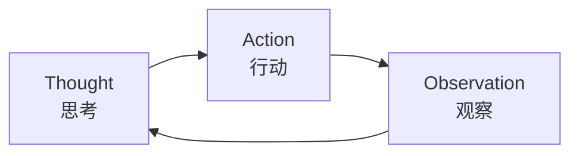
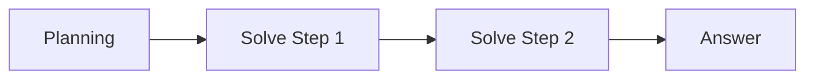
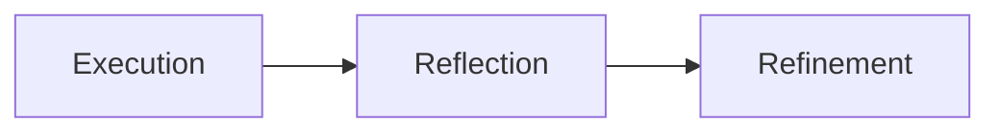

# 目录

1. ReAct
2. Plain and Solve
3. Reflection
4. 三种范式的区别与优缺点
5. 低代码平台构建

# ReAct

在ReAct诞生之前，主流的方法可以分为两类：一类是“纯思考”型，如**思维链 (Chain-of-Thought)**，它能引导模型进行复杂的逻辑推理，但无法与外部世界交互，容易产生事实幻觉；另一类是“纯行动”型，模型直接输出要执行的动作，但缺乏规划和纠错能力。

ReAct的巧妙之处在于，它认识到**思考与行动是相辅相成的**。思考指导行动，而行动的结果又反过来修正思考

ReAct 的核心是一个不断循环的“大循环”，直到问题被解决：

# Plain and Solve
现在用的很多大模型工具的Agent模式都融入了这种设计模式

思考与行动在**时间上是分离的**（分阶段进行）。  

1. **规划阶段 (Planning Phase)**： 首先，智能体会接收用户的完整问题。它的第一个任务不是直接去解决问题或调用工具，而是**将问题分解，并制定出一个清晰、分步骤的行动计划**。这个计划本身就是一次大语言模型的调用产物。
2. **执行阶段 (Solving Phase)**： 在获得完整的计划后，智能体进入执行阶段。它会**严格按照计划中的步骤，逐一执行**。每一步的执行都可能是一次独立的 LLM 调用，或者是对上一步结果的加工处理，直到计划中的所有步骤都完成，最终得出答案。
# Reflection
大语言模型（LLM）有一个致命弱点：**单向预测（Feed-forward）**。  

它们在输出内容时，就像“脱缰的野马”，字是一个个吐出来的，根本没有“回头看”的机会。一旦中间某一步说错了、代码写出 Bug 了，它就会顺着这个错误一路错下去。

在传统的开发流程中，我们写完代码需要：**运行 -> 报错 -> 看日志 -> 修改**。  
**Reflection 范式就是把“看日志、自我纠错”的这个循环，搬进了 AI 智能体的内部。**

思考是对**既成事实（过去的行为和结果）的全局复盘**。  

1. **执行 (Execution)**：首先，智能体使用我们熟悉的方法（如 ReAct 或 Plan-and-Solve）尝试完成任务，生成一个初步的解决方案或行动轨迹。这可以看作是“初稿”。
2. **反思 (Reflection)**：接着，智能体进入反思阶段。它会调用一个独立的、或者带有特殊提示词的大语言模型实例，来扮演一个“评审员”的角色。这个“评审员”会审视第一步生成的“初稿”，并从多个维度进行评估，例如：
    - **事实性错误**：是否存在与常识或已知事实相悖的内容？
    - **逻辑漏洞**：推理过程是否存在不连贯或矛盾之处？
    - **效率问题**：是否有更直接、更简洁的路径来完成任务？
    - **遗漏信息**：是否忽略了问题的某些关键约束或方面？ 根据评估，它会生成一段结构化的**反馈 (Feedback)**，指出具体的问题所在和改进建议。
3. **优化 (Refinement)**：最后，智能体将“初稿”和“反馈”作为新的上下文，再次调用大语言模型，要求它根据反馈内容对初稿进行修正，生成一个更完善的“修订稿”。

# 三种范式的区别与优缺点

ReAct、Plan-and-Solve 和 Reflection 都是在解决同一个问题：如何让大语言模型不只是一次性生成答案，而是能围绕任务进行更稳定的推理、执行和修正。

它们的核心差异在于：**ReAct 强调边想边做，Plan-and-Solve 强调先规划再执行，Reflection 强调做完之后再复盘优化**。

| 范式 | 核心思路 | 适合场景 | 主要优点 | 主要缺点 |
|---|---|---|---|---|
| ReAct | Thought、Action、Observation 交替循环 | 需要频繁调用工具、边查边判断的任务 | 反馈及时、可解释性强、能根据工具结果动态调整 | 调用次数多、延迟高、容易循环、对模型格式遵守能力要求高 |
| Plan-and-Solve | 先生成完整计划，再按步骤执行 | 目标清晰、步骤可拆解、路径相对稳定的任务 | 结构清晰、执行有序、适合复杂任务拆解 | 如果初始计划错误，后续执行容易整体跑偏；对突发反馈不够灵活 |
| Reflection | 先生成结果，再通过反思机制评估和修正 | 写作、代码生成、方案设计、需要质量优化的任务 | 能发现遗漏和逻辑问题，提升最终质量 | 需要额外模型调用，成本更高；反思本身也可能判断错误 |

从执行节奏上看，三者可以这样理解：

1. **ReAct：边走边看**
   
每一步都根据外部反馈调整下一步，适合不确定性较高的任务。

2. **Plan-and-Solve：先想清楚再动手**
   
先把任务拆成完整计划，再按计划执行，适合路径明确的任务。

3. **Reflection：做完之后再检查**
   
先得到一个初稿，再通过评审和修订提升质量，适合对结果质量要求较高的任务。

在真实 Agent 系统中，这三种范式并不是互斥的。很多复杂 Agent 会把它们组合起来使用：先用 Plan-and-Solve 制定大方向，再用 ReAct 执行具体步骤，最后用 Reflection 检查和优化结果。

# 低代码平台构建
相比于纯代码实现的智能体，低代码平台通过图形化、模块化的方式，显著降低了技术门槛、提升了开发效率，并提供了更优的可视化调试体验。

**Coze** 以其零代码的友好体验和丰富的插件生态脱颖而出。
- 你是一个**个人创作者、自媒体运营或业务人员**，不懂代码，只想快速做一个好玩、好看、实用的 AI 助理
- **闭源**（SaaS 平台，由字节跳动运营）
- 不支持 MCP 和无法导出标准化配置文件的局限性也值得注意。

**Dify** 作为开源的企业级平台，展现了全栈式开发能力。
- 你是在为**企业开发 AI 落地项目**，对数据隐私、合规性要求极高，必须私有化部署
- **开源**（Apache 2.0 协议，支持二次开发）
- 复杂
