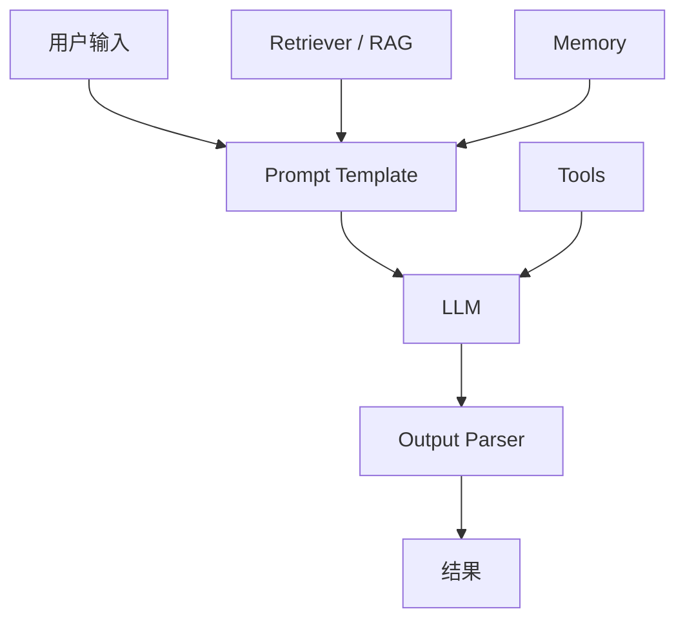
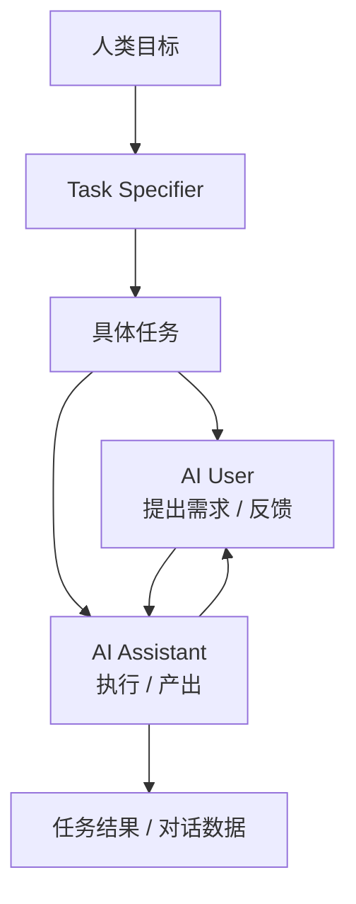
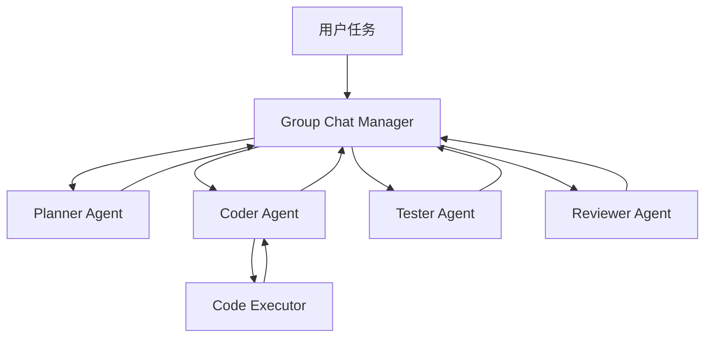
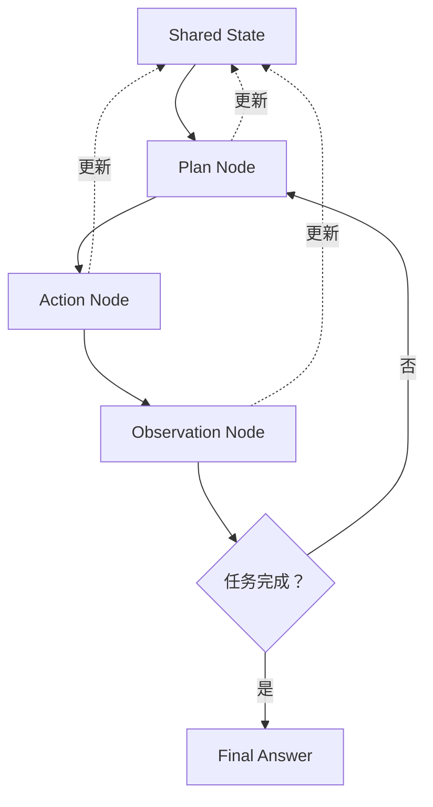
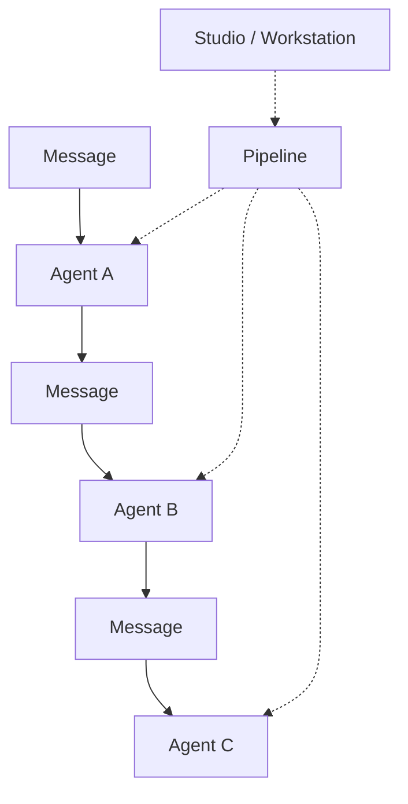

# 目录

1. 前言
2. LangChain：第一代单兵框架（2022 年 10 月）
3. CAMEL：角色扮演式多智能体（2023 年 3 月）
4. AutoGen：多智能体协同与代码执行（2023 年 9 月）
5. LangGraph：高可控状态图框架（2024 年 1 月）
6. AgentScope：工程化大规模多智能体（2024 年 2 月）
7. 框架对比与选型

# 前言

开发一个简单的 Agent，可以直接写脚本：调用模型、拼接 Prompt、执行工具、返回结果。但当任务变复杂后，代码很快会遇到一系列工程问题。

例如，模型接口需要统一，工具调用需要标准格式，历史对话和任务状态需要管理，RAG 需要接入文档和向量数据库，多轮执行过程需要调试，多 Agent 协作还需要消息协议和流程编排。

Agent 框架的价值，就在于把这些重复出现的能力抽象成标准组件，让开发者不必每次都从零实现一套完整的 Agent 运行系统。

常见框架通常会覆盖以下能力：

1. **模型接入统一**
2. **工具调用标准化**
3. **记忆与状态管理**
4. **RAG 与外部知识接入**
5. **可观测性与调试**
6. **多智能体协作**

# LangChain：第一代单兵框架（2022 年 10 月）

LangChain 是最早广泛流行的大模型应用开发框架之一。它出现时，大模型应用开发还处在比较原始的阶段：开发者需要自己处理模型接口、Prompt 模板、历史对话、文档检索和工具调用。

LangChain 的出现，就是为了把这些高频能力封装成标准模块。

## 核心思想

LangChain 的名字由 **Language（语言模型）** + **Chain（链）** 组成。它的核心思想是：**把大模型、提示词、数据库、外部工具像“链条”一样串联起来，完成复杂的任务。**

早期 LangChain 更强调 Chain，也就是把多个步骤按顺序组合起来。后来它逐渐扩展到 Agent、RAG、工具调用和状态管理等方向。

## 主要能力

1. **Models（模型接入）**：
    - 统一了所有大模型的接口。你只需要写一行代码，就能把底层模型从 GPT-4 切换到 Claude，或者本地的 Ollama。
2. **Prompts（提示词模版）**：
    - 提供了动态提示词模版。比如 `{user_name}你好，请帮我分析这份关于{topic}的报告`，方便代码动态传入参数。
3. **Chains（链）**：
    - 把多个步骤串联起来。比如：`步骤A（让大模型写个提纲）` -> `步骤B（把提纲传给第二个大模型写具体内容）` -> `步骤C（翻译成英文）`。
4. **Memory（记忆管理）**：
    - 自动帮你管理上下文对话历史，支持“滑动窗口”（只记住最近10轮对话）或“摘要记忆”（自动把前面的话缩写，省 Token）。
5. **Retrieval（RAG 知识库检索）**：
    - 提供了极其丰富的文档加载器（PDF、Word、Notion、网页）、文本分割器，以及对接各种向量数据库（Chroma、Pinecone、Milvus）的接口。
6. **Agents（智能体/代理）**：
    - 这是最酷的部分。你可以给大模型一堆工具（比如：谷歌搜索、计算器、数据库查询）。大模型会**自己思考**：第一步我该用什么工具，拿到结果后，第二步我该干什么，直到解决问题

# CAMEL：角色扮演式多智能体（2023 年 3 月）

很多复杂任务都可以被拆成不同角色之间的协作。例如一个人负责提出需求，一个人负责执行；一个人负责写作，一个人负责编辑；一个人负责规划，一个人负责质疑。

CAMEL 把这种角色分工显式写入 Agent 系统，让多个 Agent 以固定身份进行对话和协作。

## 核心思想

CAMEL 的核心思想是通过角色扮演让 Agent 协作完成任务。

在经典设定中，系统会创建两个智能体：

1. **AI Assistant**
   负责具体执行任务，例如写代码、生成方案、整理内容。

2. **AI User**
   负责提出具体要求、规划方向和给出反馈。

此外，CAMEL 还可以引入任务策划器，把人类输入的模糊需求细化成更具体、可执行的任务描述。

## 主要能力

1. **角色扮演协作**
   通过明确角色身份，让不同 Agent 按职责对话。

2. **任务细化**
   将模糊需求拆解成具体任务。

3. **自动对话**
   多个 Agent 可以在较少人工介入的情况下持续对话，推进任务。

4. **合成数据生成**
   通过不同角色的高质量对话生成训练或评估数据。

5. **学术研究与社会模拟**
   适合研究 Agent 行为、多智能体协作和社会模拟问题。

# AutoGen：多智能体协同与代码执行（2023 年 9 月）

复杂任务往往不是一个 Agent 一步完成的。比如软件开发任务可能需要规划、编码、测试、审查和修复；研究任务可能需要检索资料、筛选证据、撰写报告和校对结论。

如果所有职责都压在一个 Agent 上，任务容易混乱，也很难调试。AutoGen 的思路是把这些职责拆成多个角色，让它们通过对话协作完成任务。

## 核心思想

AutoGen 的核心思想是多智能体对话。开发者可以创建多个不同角色的 Agent，例如程序员、测试员、产品经理、审查员等，让它们在对话中互相提出任务、执行动作、反馈结果和修正方案。

这种方式更接近一个虚拟团队，而不是一个单点工具。

## 主要能力

1. **多智能体协作**
   支持多个 Agent 以不同角色参与同一个任务。

2. **代码执行**
   Agent 不仅可以生成代码，还可以在受控环境中运行代码，读取报错并尝试修复。

3. **人类在环**
   开发者可以让 Agent 自动运行，也可以在关键步骤要求人工确认。

4. **群聊与工作流对话**
   支持双人对话、群聊、群组管理器和更复杂的对话流程。

# LangGraph：高可控状态图框架（2024 年 1 月）

真实 Agent 往往不是一条线走到底，而是会反复经历这样的过程：

`规划方案 -> 执行行动 -> 观察结果 -> 发现问题 -> 重新规划 -> 再次执行`

传统 Chain 更像线性流水线，适合固定步骤任务。但 Agent 经常需要回退、重试、分支判断和长期状态管理，这时就需要更灵活的流程表达方式。

LangGraph 是围绕状态图构建 Agent 流程的框架。它解决的是传统链式结构难以表达循环、分支和状态持久化的问题。
## 核心思想

LangGraph 的核心思想是用有状态图描述 Agent 的执行流程。

图中的每个节点代表一个步骤，每条边代表步骤之间的跳转关系，而 State 保存整个执行过程中的共享状态。这样，Agent 不只可以顺序执行，也可以根据状态进行条件分支、循环和回退。

## 主要能力

1. **State**
   保存对话历史、任务进度、工具结果、结构化数据等共享状态。

2. **Nodes**
   表示具体执行步骤，可以是模型调用、工具调用、函数处理或人工确认。

3. **Edges**
   定义节点之间如何跳转。

4. **条件分支**
   根据模型判断或当前状态，动态决定下一步执行哪个节点。

5. **循环执行**
   支持重新规划、重试、修复和多轮反馈。

6. **状态持久化**
   支持长任务、中断恢复和更复杂的 Agent 工作流。

# AgentScope：工程化大规模多智能体（2024 年 2 月）

当多智能体系统规模变大后，仅靠自然语言对话很难稳定维护。开发者需要清楚知道每条消息是谁发出的、发给谁、携带什么元数据、下一步由哪个 Agent 处理，以及整个流程在哪里出错。

AgentScope 试图用更明确的抽象，把复杂的智能体交互组织起来。

## 核心思想

AgentScope 通过 Message、Agent、Pipeline 三个核心抽象，把多智能体系统标准化。

Message 负责定义消息格式，Agent 是具体执行单元，Pipeline 用来描述多个 Agent 之间的消息流转和执行顺序。

## 主要能力

1. **Message**
   定义智能体之间传递信息的标准格式，包括发送者、内容、元数据等。

2. **Agent**
   表示具体执行单元，可以是 LLM Agent，也可以是用户或其他系统组件。

3. **Pipeline**
   定义消息如何在多个 Agent 之间传递，例如串行、并行或更复杂的工作流。

4. **可视化调试**
   提供 AgentScope Studio 和 Workstation 等工具，帮助开发者观察、调试和搭建多智能体流程。

5. **分布式支持**
   支持智能体运行在不同机器上，通过网络进行通信和协作。

# 框架对比与选型

不同 Agent 框架关注的问题不同。选型时，不应该只看哪个框架更流行，而要看它和当前任务的复杂度、协作方式、工程要求是否匹配。

| 框架         | 适合场景                           | 主要优点                       | 主要局限                           |
| ---------- | ------------------------------ | -------------------------- | ------------------------------ |
| LangChain  | 快速搭建 LLM 应用、RAG 应用、基础 Agent 原型 | 生态丰富，资料多，组件覆盖面广            | 封装较重，版本变化快，复杂场景下调试成本较高         |
| CAMEL      | 角色协作、自动对话、合成数据生成、多智能体研究        | 角色分工清晰，适合自动协作和研究场景         | 工程落地能力相对弱，复杂企业应用通常需要额外适配       |
| AutoGen    | 多 Agent 协作、代码执行、人类在环、团队式任务分工   | 对话协作能力强，内置代码执行，适合复杂任务拆分    | 对话式流程不确定性高，复杂任务调试困难，容易跑偏或循环    |
| LangGraph  | 需要状态、循环、分支、回退和长期流程控制的 Agent    | 流程可控性强，适合构建稳定、可恢复的复杂 Agent | 更偏底层编排，开发者需要自己设计状态结构和节点逻辑      |
| AgentScope | 可视化调试、多智能体编排、分布式部署、大规模协作       | 工程化能力强，适合复杂多智能体系统          | 学习成本更高，需要理解消息流、Pipeline 和分布式协作 |

总体来说，如果目标是快速搭建 RAG 或简单 LLM 应用，可以从 LangChain 入手；如果目标是角色协作、合成数据或研究，可以看 CAMEL；如果目标是多 Agent 协作和代码执行，可以关注 AutoGen；如果目标是构建稳定、可控、可恢复的复杂 Agent 流程，LangGraph 会更合适；如果目标是工程化大规模多智能体系统，可以关注 AgentScope。
