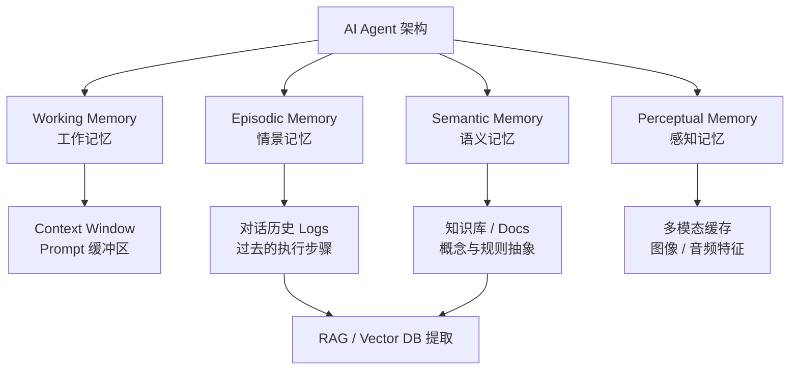

# 目录

1. 为什么需要记忆模块
2. 对照
3. 记忆
4. RAG

## 为什么需要记忆模块

LLM 本身是**无状态**的：每一次调用都只理解当前传入的 Prompt，不会天然记住用户偏好、历史任务、长期事实或上一次工具执行结果。

如果没有记忆模块，Agent 就会退化成“单轮问答器”：

- 每次都要重新提供背景信息，交互成本很高。
- 长链路任务中断后难以恢复，容易从头再来。
- 无法沉淀用户偏好、项目知识和历史经验。
- 只能依赖当前 Context Window，超过 Token 限制的信息会被丢失。

记忆模块的作用，就是把值得复用的信息从一次性上下文中沉淀出来，在需要时再通过检索、摘要或状态恢复的方式放回当前 Prompt。

## 对照

## 记忆

### ① Working Memory（工作记忆 / 短期记忆）

- **人类大脑：** 你此时此刻正在思考的内容、大脑里临时占用的“内存区”（比如背一个刚看到的电话号码，几秒后就忘）。
- **AI 落地：** 就是 **LLM 的 Context Window（上下文窗口）** 和当前系统的 Prompt 缓冲区。
- **特点：** 读写极快，但容量有限，一旦对话重置（Clear Context）或者超出 Token 限制，这段记忆就消失了。
    

### ② Episodic Memory（情景记忆 / 经历记忆）

- **人类大脑：** 关于**特定时间、地点发生的具体事件/经历**的记忆（例如：“我昨天下午在咖啡馆和张三讨论了项目，他穿了一件蓝色衬衫”）。
- **AI 落地：** **Agent 的历史交互日志（Interaction Logs / Trajectories）**。
- **特点：** 记录“过去发生过什么”。当用户问“我上周让你帮我写的那个 Go 函数改好了吗？”时，Agent 必须去翻查过去的**情景记忆**。
    

### ③ Semantic Memory（语义记忆 / 知识记忆）

- **人类大脑：** 脱离了特定时间地点的事实、概念、规则和通用知识（例如：“Go 语言的 GMP 模型是什么”、“水在 100 度沸腾”）。
    
- **AI 落地：**
    - **静态知识：** 大模型预训练阶段写入参数（Weights）里的知识；
    - **动态/领域知识：** **知识库（Knowledge Base）**，例如存储在向量数据库或图数据库（Neo4j）中的 Markdown 文档、规章制度等。

### ④ Perceptual Memory（感知记忆 / 瞬时感知）

- **人类大脑：** 视觉、听觉、触觉在极短时间内留下的物理信号残影（比如闪光灯在你眼前闪过后的余晖）。
- **AI 落地：** 在多模态 AI（Vision-LLM、语音 Agent）中，**原始图像帧、音频信号特征（Embeddings）、传感器原始数据流**在被转化为文本标号之前的缓存区域。

## RAG

RAG（Retrieval-Augmented Generation）不是记忆本身，它是一种“桥梁”和“检索机制”。

**情景记忆**（历史日志）和 **语义记忆**（私有文档）因为太庞大，**放不进** 工作记忆（Context Window）里。
    
当需要用到它们时，系统就通过 **RAG 技术**：

- 把这两个分段，使用专门的Embedding模型，把这些文本段落转化成一串数字（向量），存入**向量数据库（Vector DB，如 Milvus, Pinecone, Chroma）**
- 当用户提问时，把该问题也转化为向量，在数据库寻找相似的文本段落
- 系统把找到的段落和用户的问题拼接在一起，组成一个新的 Prompt 发给 LLM，生成更准确的答案

### RAG评价指标怎么设计

1. 检索阶段指标（评估 Retriever）
    - 上下文相关性：检索出来的文档片段（Chunks）里，有多少是真正对回答问题有用的？
    - 上下文召回率：回答问题所需的关键事实，有多少被检索出来了？

2. 生成阶段指标（评估 Generator）
    - 忠实度 / 抗幻觉：生成的答案（A）中提到的所有事实，是否完全来自于检索到的上下文（C）？
    - 答案相关性：生成的答案（A）是否直接、准确地回答了用户的提问（Q）？
