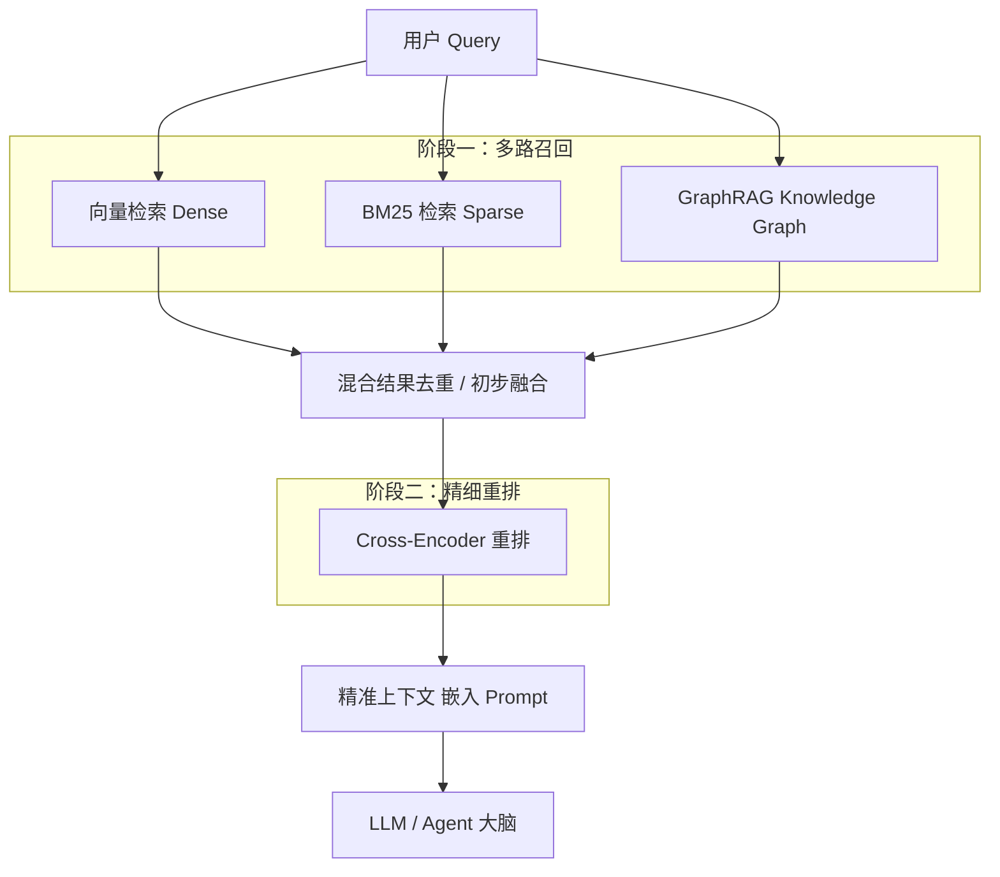
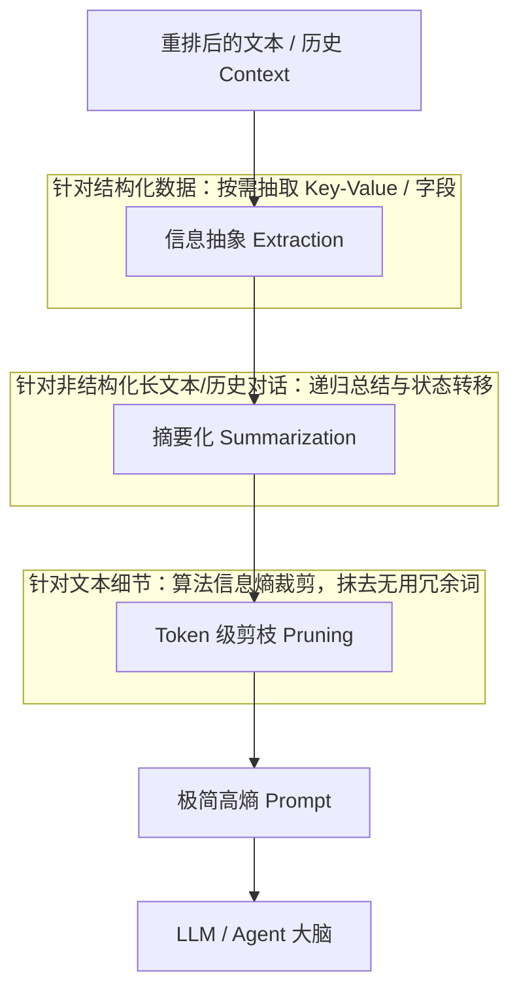
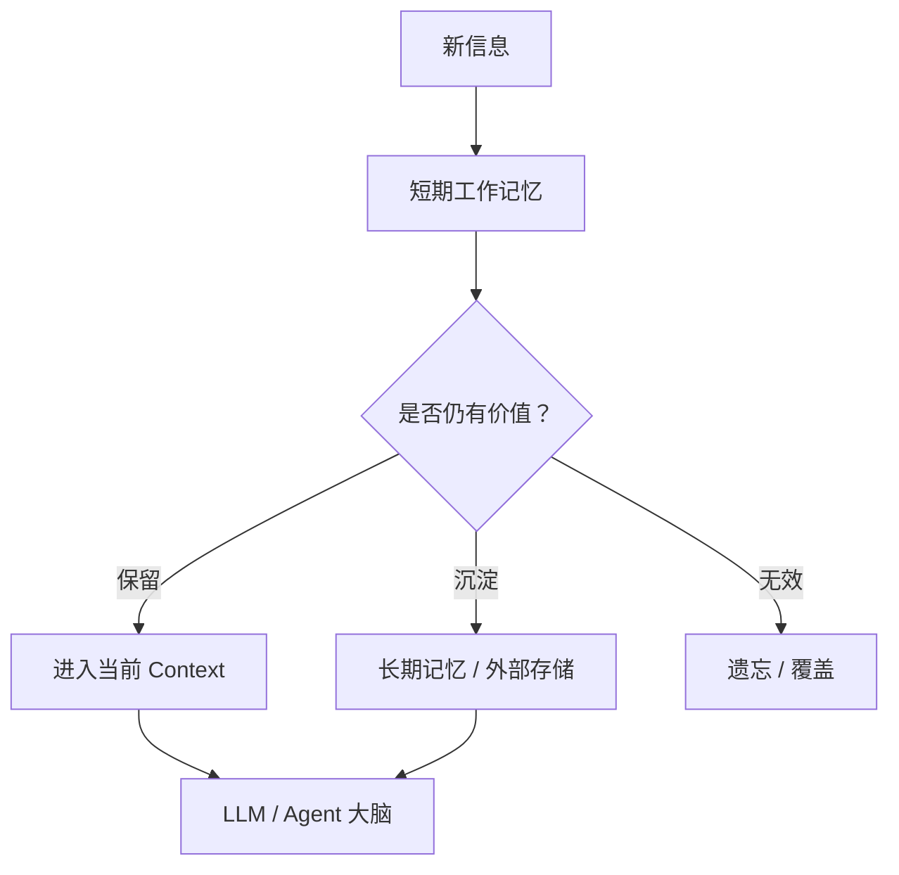
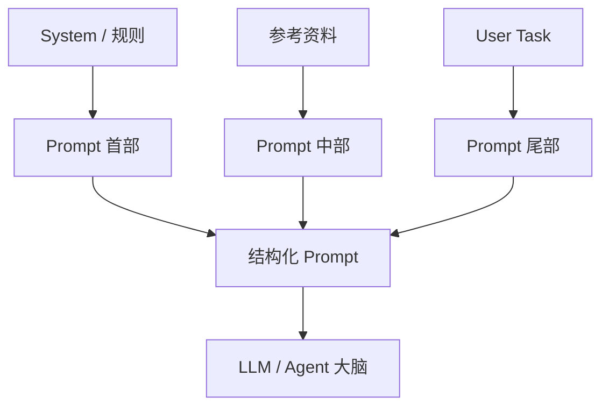
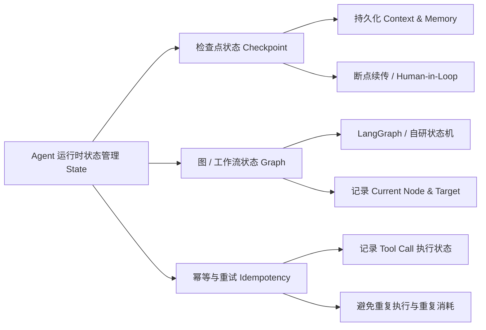
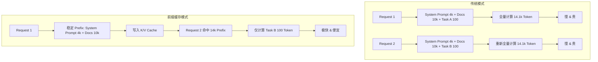

## 目录

1. 为什么需要上下文工程
2. 上下文工程

## 为什么需要上下文工程

Prompt 决定了模型的起点，而上下文工程（Context Engineering）决定了模型的上限

**上下文工程**更像“当前这一轮，给模型喂什么、怎么喂、喂多少、放哪里”。

随着大模型上下文窗口（Context Window）从最初的 4K/8K 发展到 128K、1M 甚至更高，看似“把所有资料直接扔给模型”就够了，但实际上面临着三大硬伤：

1. **大海捞针问题（Needle In A Haystack）：** 上下文越长，模型越容易产生“注意力分散”或“中间失忆（Lost in the Middle）”，关键信息如果放在 Prompt 中间，召回率会明显下降。
    
2. **Token 成本与延迟飙升：** 每次请求传输和处理海量 Token，不仅 API 费用成倍增加，首次 Token 输出延迟（TTFT）也会让人无法忍受。
    
3. **噪声干扰与幻觉：** 引入无关或过期的信息，会直接降低大模型的逻辑推理质量，导致回答偏离预想轨道。
    

上下文工程就是为了解决这些矛盾而生的**动态信息调度学科**。

## 上下文工程

### ① 动态检索与筛选（Retrieval & Filtering）

根据当前任务，从庞大的外部世界中精确提取**最相关**的信息切片。

#### 1. **多路召回：**

没有任何单一的检索方式能完美胜任所有场景。多路召回的精髓在于**优势互补**：

- 向量语义检索（Dense Retrieval）：利用 Encoder-only 模型将 Query 和文档切片（Chunk）映射到高维向量空间，通过计算余弦相似度（Cosine Similarity）或内积来匹配

- 关键词/BM25 检索（Sparse Retrieval）：基于传统倒排索引和词频算法

- 图数据库路径（GraphRAG）：通过 LLM 提前将非结构化文档抽取为“实体-关系-实体”的图结构，并在检索时基于实体节点沿着图路径深度挖掘

怎么把不同来源的分数合并？最工业级且高效的处理方案是 **RRF (Reciprocal Rank Fusion，倒数排名融合)** 算法：它**不看绝对分值，只看相对排名**。
    
#### 2. **重排（Reranking）：**

使用 Cross-Encoder 等重排模型对召回结果进行二次打分，确保最优质的信息排在最前面。
    

### ② 上下文压缩与精炼（Context Compression）

在不丢失核心语义的前提下，大幅削减进入 Context Window 的 Token 数量。

#### 1. **摘要化（Summarization）：** 

针对长文档（RAG 场景）或长轮次对话历史（Agent 场景），直接拼接原文会导致 Token 迅速爆满：

- 分块递归摘要（Recursive Summarization）**处理长文档**：
	- 当文本超过单次处理上限时，将其按段落/章节切分为树状结构（Map-Reduce 思路）。底层节点先生成局部摘要，上一层节点对多个局部摘要进行二次融合作总结，最终生成一份层级清晰的全局摘要。
        
- 滑动窗口与增量记忆状态机（Incremental Memory）**处理对话历史**：
	1. **热记忆（滑动窗口）：** 始终保留最新的 NN 轮原始对话（比如 5 轮）。这保证了 AI 能够精确理解当前的指代关系和聊天语气。
	2. **冷记忆（增量更新）：**
	    - 当对话进行到第 6 轮时，第 1 轮就滑出了窗口。
	    - **异步线程启动：** 系统在后台启动一个便宜的小模型（如 `GPT-4o-mini` 或 `Qwen-2.5-7B`，不需要用昂贵的主模型）。
	    - **增量写入：** 小模型读取“现有的长期总结” + “刚刚滑出窗口的那一轮对话”，生成**新的长期总结（New Memory State）**，覆盖掉旧的状态。
	    - 这个过程是**增量（Incremental）**的，类似于：新记忆 = 压缩算法(旧记忆 + 新流出的碎片)。
    
#### 2. **Token 级剪枝：**

使用 LLMLingua 等算法，剔除自然语言中的冗余词（如介词、过渡词），仅保留关键语法主干。
    
#### 3. **信息抽象（Extraction）：** 

遇到长表格或复杂 JSON 时，仅抽取与当前问题匹配的键值对或特定字段。
    

### ③ 动态生命周期管理（Lifecycle & Decay）

模拟人脑的“工作记忆”与“遗忘曲线”，决定哪些信息该留、哪些该丢、哪些该沉淀到外部存储。

- **滑动窗口（Sliding Window）：** 仅保留最近 $N$ 轮对话，保证短期记忆不溢出。
    
- **记忆分级：** 将信息明确划分为**短期工作记忆**（当前 Task 状态）、**长期情景记忆**（用户偏好/历史事实）和**外部语义知识**（知识库/文档）。
    
- **遗忘与更新（Forget & Overwrite）：** 当用户修正偏好或任务状态改变时，及时在 Context 中覆盖旧规则，防止产生逻辑冲突。
    

### ④ 结构化装配与布局优化（Structuring & Placement）

“信息放在哪”和“信息怎么排”对模型理解效率影响极大。

1. **首尾重装策略（Front/Back Loading）：** 
	1. 大模型（Decoder-only 架构的 Transformer）在处理长上下文时，其 Attention 权重的分配并不是均匀的，而是呈现明显的 **U 型分布**——即**开头和结尾的注意力权重最高，中间的注意力权重会急剧衰减**（这就是著名的 _Lost in the Middle_ 现象）。
	2. 将关键指令（System Prompt）和用户当前请求（User Task）放在最前和最后，将检索到的参考资料（Context Docs）夹在中间，利用模型的“首因效应”与“近因效应”。
    
2.  **语义标签隔离：** 使用清晰的 XML 标签（如 `<context>`、`<rules>`、`<history>`）或 Markdown 标记严格区分不同来源的信息，避免模型产生“把参考文档当成用户指令”的伪造攻击（Prompt Injection）。
    

### ⑤ 状态与缓存管理（State & Caching）

#### 1. 状态管理

- **检查点机制 (Checkpointing)**：
    
    - 在 Multi-Agent 或长链条任务执行时，每当一个 Tool 执行成功或一个 Agent 完成局部思考，就将当前的 Context 与 State 归盘（如存储至 Redis / PostgreSQL）。
        
    - **好处**：一旦发生网络中断或 API 报 5xx 错误， Agent 无需从头完全重试，直接加载最新 Checkpoint 恢复现场。
        
- **状态图驱动 (State Graph Pattern)**：
    
    - 在类似 LangGraph 或自研 Agent 引擎中，将 Agent 抽象为一个有限状态机（FSM）。Context 被当作全局 State 字典在节点间流转，每个 Node 只修改属于自己的状态片段（如 `state.messages`、`state.next_actor`）。
        
- **工具调用的幂等缓存 (Tool Response Caching)**：
    
    - 如果 Agent 需要频繁调用外部 API（如查询 SQL、抓取网页），后端可对 Tool 执行结果进行 Key-Value 缓存（基于 `Tool_Name + Input_Params` 的 Hash）。
        
    - 即使 LLM 重新生成了相同的 Tool Call，也可以直接返回缓存好的 Tool 结果，避免重复调用外部开销大或有侧副作用的接口。

#### 2. 缓存

- **上下文缓存（Context Caching）：** 针对多轮对话中不常变动的高频信息（如大型系统提示词、长知识库文档），利用 API 厂商提供的 Prefix Caching（前缀缓存）机制，既降低 50%+ 的 Token 费用，又提升响应速度。
