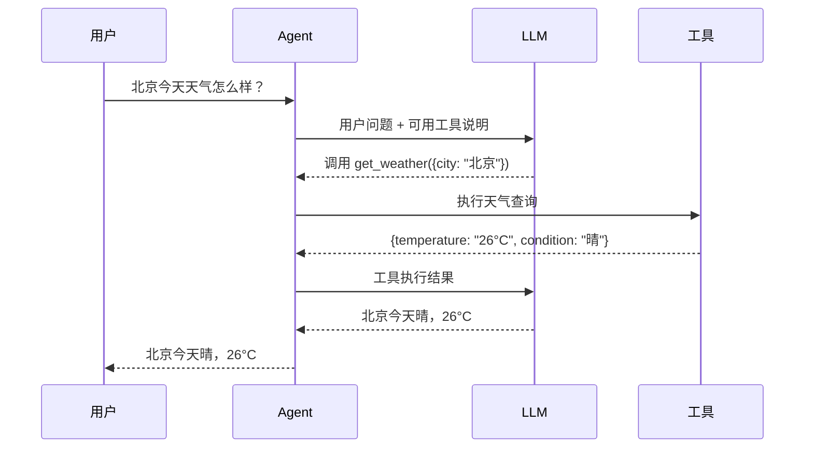

# 通信协议（Communication Protocol）

通信协议（Communication Protocol）是指 Agent 与用户、工具、其他 Agent 或外部系统之间交换信息时遵循的规则和格式。

在简单聊天场景中，通信可以只是自然语言。但在 Agent 系统中，模型经常需要调用工具、接收结构化结果、与多个模块协作，甚至参与多 Agent 任务分工。因此，通信协议决定了信息如何被表达、传递、解析和执行。

## 目录

1. Tool Calling：让 Agent 调用工具
2. Skill：告诉 Agent 应该怎样做事
3. MCP：让 Agent 接入外部能力
4. Tool Calling、Skill 与 MCP 的区别

## 1. Tool Calling：让 Agent 调用工具

### Tool Calling 是什么

Tool Calling（也常被称为 Function Calling）让模型不只输出一段文字，还能提出一个结构化的“调用请求”。例如用户问“北京今天天气怎么样”，模型可以决定调用 `get_weather`，并给出参数 `{"city":"北京"}`。

模型本身不会真的访问天气服务。它只负责选择合适的工具和填写参数；真正执行调用的是 Agent 程序，执行结果再作为一条新消息交回给模型。

### 调用过程：模型选择工具 → 传入参数 → 工具返回结果



这个过程可以分为四步：

1. **注册工具：** Agent 把工具名称、用途和参数格式告诉模型。
2. **模型决策：** 模型根据用户问题，决定直接回答，还是请求调用某个工具。
3. **程序执行：** Agent 校验参数并执行真正的函数、API 或命令。
4. **结果回填：** 工具结果回到模型上下文中，由模型整理成用户能理解的回答。

### 简单示例：查询天气

假设 Agent 有下面这个工具：

```json
{
  "name": "get_weather",
  "description": "查询指定城市的实时天气",
  "parameters": {
    "city": "城市名称"
  }
}
```

当用户问“上海要带伞吗？”时，模型可以生成：

```json
{
  "name": "get_weather",
  "arguments": {
    "city": "上海"
  }
}
```

Agent 执行后得到天气数据，再交给模型回答。这里的关键是：**模型负责决定和组织参数，程序负责执行，工具返回事实结果。**

## 2. Skill：告诉 Agent 应该怎样做事

### Skill 是什么

Skill（技能）是一份给 Agent 阅读的操作说明。它不直接执行操作，而是告诉 Agent：遇到什么任务时应该做什么、按什么顺序做、有哪些限制。

例如，“代码审查” Skill 可以规定：先查看当前改动，再检查测试和边界条件，最后按严重程度输出问题。Agent 仍然要靠读取文件、运行测试等工具完成实际操作。

### Skill 中通常有什么：适用场景、操作步骤、注意事项

一个 Skill 通常保存为 `SKILL.md`，内容可以很简单：

- **适用场景：** 什么请求应该使用它。
- **操作步骤：** 要先做什么、后做什么。
- **约束：** 哪些事不能做，哪些结果必须验证。
- **可用资源：** 需要参考的文档、脚本或模板。

Agent 不必一开始就把所有 Skill 的完整内容放进上下文。常见做法是先让模型看到每个 Skill 的名称和简介；当模型决定使用某个 Skill 时，再加载它的完整说明。这样既保留了可扩展性，也不会占满上下文。

### Skill 和工具的关系

可以把它们理解成“说明书”和“工具箱”的关系：

- **Skill** 说明这件事应该怎样完成。
- **Tool Calling** 让模型请求使用某个具体工具。
- **工具** 才是真正执行读取文件、查询数据或修改内容的执行者。

因此，Skill 可以引导 Agent 多次使用工具，但 Skill 本身不等于一个工具。

### 简单示例：代码审查 Skill

用户说：“帮我审查这次改动。”

代码审查 Skill 可以给出如下步骤：

1. 查看当前 Git diff。
2. 阅读改动附近的调用路径。
3. 检查错误处理、边界条件和测试覆盖。
4. 只报告问题，不直接修改代码。

随后 Agent 会根据这些步骤，通过 `git_diff`、`read_file`、`run_test` 等工具完成工作。Skill 负责方法，工具负责动作。

## 3. MCP：让 Agent 接入外部能力

### MCP 是什么

MCP（Model Context Protocol）是一套让外部能力以统一方式接入 Agent 的开放协议。

没有统一协议时，不同 Agent 想接 GitHub、数据库或本地文件，往往都要分别编写一套适配代码。MCP 把这些能力包装成标准接口：支持 MCP 的 Agent 可以连接支持 MCP 的服务端，并发现和使用它提供的能力。

### MCP 能提供什么：工具、资源和提示词

一个 MCP Server 可以向 Agent 提供三类内容：

- **Tools（工具）：** 可以执行的操作，例如创建 Issue、查询数据库。
- **Resources（资源）：** 可读取的上下文，例如文件内容、数据库 Schema、项目文档。
- **Prompts（提示词）：** 可复用的任务模板，例如“生成代码审查报告”。

其中 Tools 最接近前面讲的 Tool Calling：MCP 定义了外部工具怎样被发现和调用；模型仍通过 Tool Calling 决定要不要调用它。

### 简单示例：通过 MCP 读取本地文件或查询 GitHub

例如，一个本地文件 MCP Server 可以提供 `read_file` 工具；一个 GitHub MCP Server 可以提供 `search_repositories` 或 `create_issue` 工具。

当用户说“看看这个项目最近的 Issue”时，Agent 先连接 GitHub MCP Server，获得它提供的工具说明；模型再通过 Tool Calling 请求调用查询工具；MCP Server 最后把查询结果返回给 Agent。这样，Agent 不需要为每一个 GitHub 操作重新定义私有接口。

## 4. Tool Calling、Skill 与 MCP 的区别

| 概念 | 它关注的重点 | 例子 |
| --- | --- | --- |
| Tool Calling | 这一次要调用什么工具、传什么参数 | 按下工具按钮，例如调用天气查询 |
| Skill | 面对一类任务时应该怎样做 | 操作说明书，例如代码审查步骤 |
| MCP | 外部能力如何被标准化地提供给 Agent | 工具插座标准，例如接入 GitHub |

一句话记忆：**Tool Calling 是一次调用动作，Skill 是做事方法，MCP 是接入外部能力的统一协议。**
