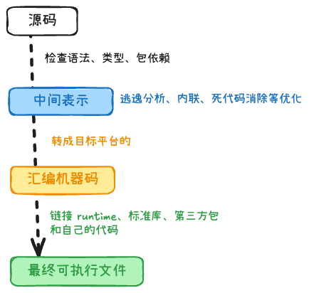

## Go 优点 / 与 C++、Java 区别 +2

1. Go语言简洁，相对与其他语言好上手
2. Go没有继承，用的是组合
3. Go、Java自动垃圾回收；C++需手动
4. Go编译快，Java需要JVM启动慢，C++性能快
5. Go支持协程，并发性更好；Java是Thread和Runnable；C++有Thread，也有无栈协程，使用门槛比较高

## Go 代码到可执行程序会经历哪些步骤



1. 编译器先解析 `.go` 源码，检查语法、类型、包依赖是否正确。

2. 然后生成中间表示，做一些逃逸分析、内联、死代码消除等优化。

3. 再把中间表示转成目标平台的汇编和机器码。

4. 最后链接 runtime、标准库、第三方包和自己的代码，生成最终可执行文件。

## init 函数初始化顺序 +1

1. 同一文件内，是从上到下
2. 同一包不同文件内，是文件名ascii字典序

## 闭包

**闭包** = 函数 + 它所捕获的外层变量环境。

**用途**：

1. 封装状态（类似私有字段）

```go
func createCounter() func() int {
	count := 0
	return func() int {
		count++
		return count
	}
}
```

2. 工厂/生成器/固定当前上下文

```go
func NewLogger(prefix string) func(string) {
    return func(message string) {
        fmt.Printf("[%s] %s\n", prefix, message)
    }
}

func makeAdder(base int) func(int) int {
	return func(x int) int {
		return base + x
	}
}
```

## 协程使用场景 +1

1. 后台任务
    - 定时、周期性的任务
    - 探测与保活
2. 生产者和消费者
3. 并行计算的任务
4. I/O 并发
    - HTTP/RPC 服务端：每个请求一个 goroutine
    - 批量 IO：并发读多个文件、多条 DB/Redis 查询
5. 带超时、可取消的长操作

## 协程池

协程池的核心思想就是：控制上限，循环复用。

它通常由两个核心部分组成：

1. 任务队列（Task Queue）：一个通道（Channel），用来存放等待执行的任务。
2. 工作协程（Workers）：一组固定数量的 Goroutine（比如限制为 10 个）。它们启动后永远不退出，而是不停地从任务队列里拿任务出来执行。

```go
// 任务结构体
type Task struct {
	ID int
}

// Worker 逻辑：每个 Worker 都是一个常驻协程，不停地从任务通道里拿任务
func worker(id int, taskQueue <-chan Task, wg *sync.WaitGroup) {
	defer wg.Done()
	for task := range taskQueue {
		time.Sleep(500 * time.Millisecond) // 模拟耗时任务
	}
}

func main() {
	taskCount := 10               // 总共有 10 个任务
	workerCount := 3              // 限制：协程池里最多只有 3 个协程在工作
	
	taskQueue := make(chan Task, taskCount)
	var wg sync.WaitGroup

	// 1. 启动 3 个工作协程（Workers）
	for i := 1; i <= workerCount; i++ {
		wg.Add(1)
		go worker(i, taskQueue, &wg)
	}

	// 2. 投放 10 个任务到队列中
	for i := 1; i <= taskCount; i++ {
		taskQueue <- Task{ID: i}
	}
	close(taskQueue) // 投放完毕后关闭通道，告诉 workers 没任务了，执行完手里剩下的就退出吧

	// 3. 等待所有 worker 执行完毕
	wg.Wait()
	fmt.Println("🎉 所有任务执行完毕!")
}

```

## API 版本化 +1

多端并行使用、要做不兼容改动时，常见三种放法：

1. URL Path：/api/v1、/api/v2
    - 直观，调试、文档、日志、网关路由都好做
    - Gin 里用路由组拆开：V1/V2 各一套 handler
    - 缺点：URL 变了，缓存和监控要按版本隔离
    - 最常见
2. Header：Api-Version: 2  
    - URL 不变，资源路径稳定
    - 需在中间件或网关按 header 分流（if/switch 或转发到不同 handler）
    - 缺点：不直观，curl/浏览器不好测
    - 想保持 URL 干净、B 端 SDK 只改配置不改路径、有 API Gateway 统一路由
3. Media Type（内容协商）：Accept: application/vnd.mycompany.user.v2+json
    - 符合 HTTP 内容协商，REST 规范性强
    - 缺点：实现和联调成本最高
    - 对外公开 API、规范要求严、同一资源多种表示
