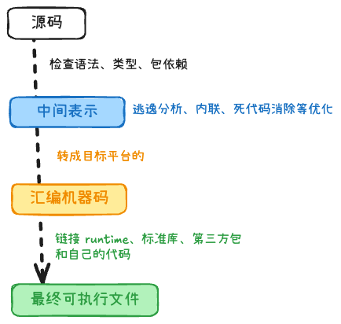

## Go 优点 / 与 C++、Java 区别 +2

1. Go语言简洁，相对与其他语言好上手；Python也简单，并且表达力丰富、语法糖多
2. Go没有继承，用的是组合；其它都是继承
3. Go、Java、Python自动垃圾回收；C++需手动
4. 编译：
	- Go 编译成原生二进制极快，运行性能高，单文件部署零依赖；
	- C++ 性能最高但编译最慢，部署也需要处理动态库依赖；
	- Java 需要 JVM 启动慢、占内存大；
	- Python 是解释执行，性能最慢，且环境依赖复杂。
5. 并发模型：
	- Go支持协程，并发性更好；
	- Java是Thread和Runnable；
	- C++有Thread，也有无栈协程，使用门槛比较高；
	- Python 受 GIL（全局解释器锁） 限制，无法通过原生多线程利用多核，高并发往往依赖多进程或复杂的异步框架（asyncio）
6. Go、Java、C++ 是静态；Python 是动态类型，重构风险高

## Go 代码到可执行程序会经历哪些步骤



1. 编译器先解析 `.go` 源码，检查语法、类型、包依赖是否正确。

2. 然后生成中间表示，做一些逃逸分析、内联、死代码消除等优化。

3. 再把中间表示转成目标平台的汇编和机器码。

4. 最后链接 runtime、标准库、第三方包和自己的代码，生成最终可执行文件。

## init 函数初始化顺序 +1

1. 依赖包先 init：
	- 如果当前包导入（import）了其他包，Go 会递归先去初始化那些被依赖的包。依赖包会先初始化自己的全局变量，再执行它的 init() 函数。
2. 本包变量：
	- 依赖包全部分配/初始化完毕后，才回到当前包，优先声明并初始化全局变量。
3. 本包 init：
	- 本包的全局变量都赋值完成后，才会自动调用本包的 init() 函数。
	- 同包按文件名：同一个包如果分散在多个 .go 文件里，各个文件的 init 会按照文件名 ASCII 排序依次执行（例如 a.go 比 b.go 先执行）。
	= 同文件从上到下：如果同一个 .go 文件里写了多个 init() 函数，它们会按照在代码中从上到下的编写顺序依次调用。
4. main：
	- 所有依赖包和本包的变量、init() 全部跑完后，程序才会正式进入 main.main() 函数入口。

## 闭包

**闭包** = 函数 + 它所捕获的外层变量环境。

**用途**：

1. 封装状态（类似私有字段）

```go
func createCounter() func() int {
	count := 0
	return func() int {
		count++
		return count
	}
}
```

2. 工厂/生成器/固定当前上下文

```go
func NewLogger(prefix string) func(string) {
    return func(message string) {
        fmt.Printf("[%s] %s\n", prefix, message)
    }
}

func makeAdder(base int) func(int) int {
	return func(x int) int {
		return base + x
	}
}
```

## 协程使用场景 +1

1. 后台任务
    - 定时、周期性的任务
    - 探测与保活
2. 生产者和消费者
3. 并行计算的任务
4. I/O 并发
    - HTTP/RPC 服务端：每个请求一个 goroutine
    - 批量 IO：并发读多个文件、多条 DB/Redis 查询
5. 带超时、可取消的长操作

## 协程池

协程池的核心思想就是：控制上限，循环复用。

它通常由两个核心部分组成：

1. 任务队列（Task Queue）：一个通道（Channel），用来存放等待执行的任务。
2. 工作协程（Workers）：一组固定数量的 Goroutine（比如限制为 10 个）。它们启动后不停地从任务队列里拿任务出来执行，任务跑完退出

```go
// 任务结构体
type Task struct {
	ID int
}

// Worker 逻辑：每个 Worker 都是一个常驻协程，不停地从任务通道里拿任务
func worker(id int, taskQueue <-chan Task, wg *sync.WaitGroup) {
	defer wg.Done()
	for task := range taskQueue {
		time.Sleep(500 * time.Millisecond) // 模拟耗时任务
	}
}

func main() {
	taskCount := 10               // 总共有 10 个任务
	workerCount := 3              // 限制：协程池里最多只有 3 个协程在工作
	
	taskQueue := make(chan Task, taskCount)
	var wg sync.WaitGroup

	// 1. 启动 3 个工作协程（Workers）
	for i := 1; i <= workerCount; i++ {
		wg.Add(1)
		go worker(i, taskQueue, &wg)
	}

	// 2. 投放 10 个任务到队列中
	for i := 1; i <= taskCount; i++ {
		taskQueue <- Task{ID: i}
	}
	close(taskQueue) // 投放完毕后关闭通道，告诉 workers 没任务了，执行完手里剩下的就退出吧

	// 3. 等待所有 worker 执行完毕
	wg.Wait()
	fmt.Println("🎉 所有任务执行完毕!")
}

```
