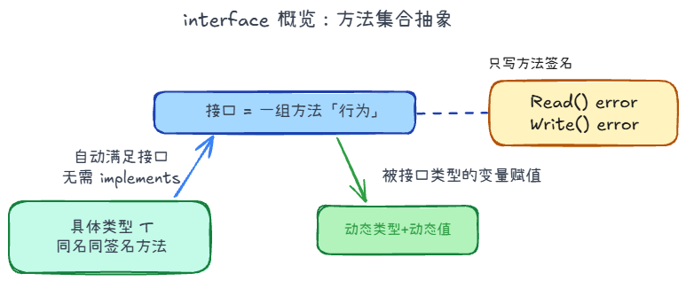

## interface +1



分为两种：

1. **空接口** `eface`：`(_type, data)`，比如`any` / `interface{}`
2. **非空接口** `iface`：`(itab, data)`，`itab` 含方法表 + 类型

### 接口 nil

在 Go 里，`error` 大致等价于下面这样的接口：

```go
type error interface {
	Error() string
}
```

结合 `error`，看清为什么 `err == nil` 有时会误判。

```go
type MyError struct{ msg string }

func (e *MyError) Error() string { return e.msg }

var e1 error
var p *MyError
var e2 error = p

fmt.Println(e1 == nil) // true：接口值「类型、值」都空
fmt.Println(e2 == nil) // false：动态类型已是 *MyError，只是 data 为 nil
```

## WaitGroup +1


sync.WaitGroup 只有三个方法：

1. Add(delta int)：把计数器加上 delta。通常用来设定要等待的协程数量。
2. Done()：把计数器减 1。相当于 Add(-1)。通常在子协程结束时（利用 defer）调用。
3. Wait()：阻塞当前协程，直到计数器变成 0。

```go
var mutex sync.Mutex

func f() {
    gnum := 0
    wg := sync.WaitGroup{}
    count := 10000

    wg.Add(1)
    for i := 0; i < count; i++ {
        go func() {
            defer wg.Done()
            
            mutex.Lock()
            gnum++
            mutex.Unlock()
        }()
    }
    wg.Wait()
    fmt.Println(gnum)
}
```

`Add(1)` 只把计数设为 1，却启动了 `count` 个 goroutine 各自 `Done()`，第二个及之后的 `Done()` 会让计数变负，**panic: sync: negative WaitGroup counter**，通常还来不及打印 `gnum`。

正确写法是循环前 `wg.Add(count)`（或每次 `go` 前 `Add(1)`），使 `Add` 与 `Done` 次数一致；配合 `mutex` 保护共享变量，稳定输出 **10000**。

## 限制并发、等待、取消 +2

三件事正交，先拆开再组合：

| 问题 | 手段 | 不管什么 |
|---|---|---|
| 同时最多跑几个 | 工人池 / 信号量 | 不负责超时、不负责取消 |
| 主流程等到什么时候 | WaitGroup / select / errgroup | 不负责限制并发 |
| 中途通知停 | `context` 或 `close(done)` | 不杀 G，也不让 `Wait()` 提前返回 |

`cancel()` 只广播「该停了」。工人必须自己听 `ctx.Done()`；`do()` 要把 `ctx` 传到 HTTP/DB，进行中的调用才能停。

### 1. 限制并发

**工人池**：固定起 `x` 个 G，循环从任务通道取活。并发上限 = 工人数，多出来的任务堵在 channel 里，**不会创建 1000 个 G**。

```go
tasks := make(chan int)
var wg sync.WaitGroup
for i := 0; i < x; i++ {
    wg.Add(1)
    go func() {
        defer wg.Done()
        for t := range tasks { // 通道关闭且读完才退出
            do(t)
        }
    }()
}
for _, t := range jobs {
    tasks <- t
}
close(tasks) // 只有生产者关
wg.Wait()
```

**信号量**：`sem := make(chan struct{}, x)`，循环里先占槽再 `go`。并发上限 = 缓冲大小。**`sem <-` 必须在 `go` 之前**，否则会先拉起 1000 个 G，只是其中 `x` 个在跑、其余堵在 `sem <-`。

```go
sem := make(chan struct{}, x)
var wg sync.WaitGroup
for i := 0; i < 1000; i++ {
    wg.Add(1)
    sem <- struct{}{} // 满了就阻塞主循环，不再多起 G
    go func(i int) {
        defer wg.Done()
        defer func() { <-sem }()
        do(i)
    }(i)
}
wg.Wait()
```

| | 工人池 | 信号量 |
|---|---|---|
| 同时跑的任务 | `x` | `x` |
| goroutine 数量 | 恒为 `x` | 约 `x`（占槽在 `go` 前） |
| 适合 | 任务流长、复用工人 | 一次性 N 个任务、写法简单 |

### 2. 等待

三种语义，不要混：

1. **WaitGroup**：等**全部**结束。`Wait()` 不能取消、不能超时，计数到 0 才返回。
2. **select + 结果通道**：等**一个事件**（成功 / 失败 / `ctx.Done()`），主流程可以先返回。结果通道必须缓冲（容量 1），否则超时后无人接收，工人卡在发送上泄漏。
3. **errgroup.WithContext**：要「全部结束 + 谁先错谁取消其余」。内部仍是 WaitGroup + ctx。

主流程 `select` 先返回，不等于工人已经停。要确认收干净，`cancel()` 之后还是 `Wait()`。

```go
ctx, cancel := context.WithTimeout(parent, 100*time.Millisecond)
defer cancel()

resCh := make(chan string, 1) // 必须带缓冲，防泄漏
go func() {
    v, err := do(ctx)
    if err != nil {
        return
    }
    resCh <- v
}()

select {
case v := <-resCh:
    return v, nil
case <-ctx.Done():
    return "", ctx.Err() // 主流程先走；工人靠 ctx 自己退
}
```

### 3. 取消怎么接到两种限流模型上

信号都是 `WithCancel` / `WithTimeout`，差别只在工人从哪退出。

**工人池**：在「取任务」处 `select`，否则通道里剩下的任务还会做完。主循环同时停投递。`close(tasks)` 只表示没有新任务，不是取消正在执行的 `do()`。

```go
for {
    select {
    case <-ctx.Done():
        return
    case t, ok := <-tasks:
        if !ok {
            return
        }
        do(ctx, t)
    }
}
```

**信号量**：每个任务一个 G，各自听 `ctx`。主循环占槽时也要 `select` `ctx.Done()`，否则已经超时还在往 `sem` 里塞。已经拉起的 G 必须响应 `ctx`，否则 `Wait()` 会等死。`Wait()` 只出现在提前返回和循环结束两处，不要写进每一轮。

```go
func runWithSem(parent context.Context, jobs []int, x int) error {
    ctx, cancel := context.WithTimeout(parent, time.Second)
    defer cancel()

    sem := make(chan struct{}, x) // 并发上限
    var wg sync.WaitGroup

    for _, job := range jobs {
        select {
        case <-ctx.Done():
            wg.Wait() // 不再起新 G，等已经拉起的退完
            return ctx.Err()
        case sem <- struct{}{}: // 占槽在 go 之前
        }

        wg.Add(1)
        go func(job int) {
            defer wg.Done()
            defer func() { <-sem }() // 释放槽

            select {
            case <-ctx.Done():
                return
            default:
            }
            do(ctx, job) // 进行中的活也要能停
        }(job)
    }

    wg.Wait()
    return ctx.Err() // 全部投完后也可能已经超时
}
```