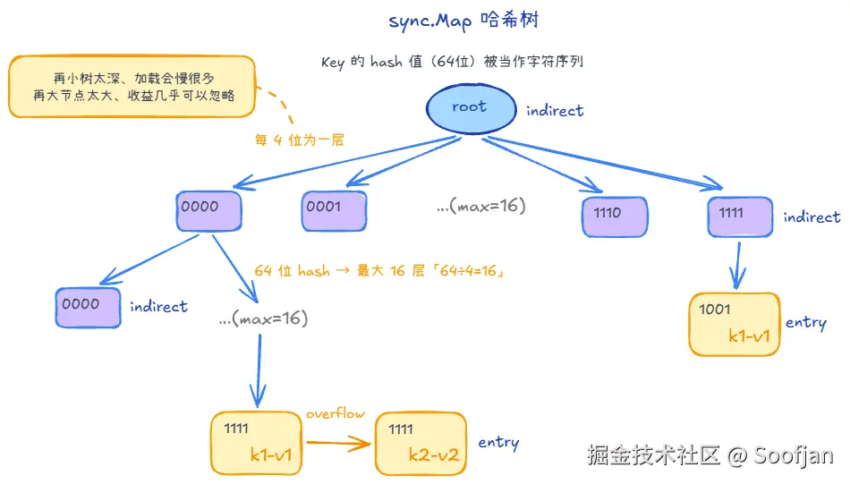

# 结构

本文以 Go 1.26 为准。Go 1.24 起，`sync.Map` 默认使用并发哈希 Trie，不再使用旧版的 `read`/`dirty` 双层结构。

## 字典树是什么

哈希 Trie 借鉴了字典树（Trie）按前缀逐层分叉的思想。先看普通字典树如何工作。

字典树（Trie）是一种通过前缀逐层匹配的结构。就像在字典里查“Apple”，先找 A，再找 p；查找路径取决于 key 的长度，而不是字典里有多少条目。

## sync.Map 的新结构

`sync.Map` 按 key 的**哈希位**而不是字符串字符分叉：

- 分层规则：每次取哈希值的 4 位，选择下一步的位置。
- 分支结构：4 位对应 16 种组合，所以每个内部节点有 16 个子位置，但不一定都存有子节点。
- 树的深度：64 位平台最多取 16 组 4 位；32 位平台最多取 8 组。

Go 1.26 源码注释指出：少于 16 个子位置会明显增加查找开销，而增加到 32 个子位置带来的收益很小。

树中主要有两种节点：
- 内部节点（indirect）：保存 16 个原子子指针，并有一把用于修改其子位置的锁。
- 叶子节点（entry）：保存 key 和 value。叶子上还有溢出链，用于处理不同 key 拥有完全相同哈希值的情况。

## 新结构是完整的 16 叉树吗？

这棵树不是预先分配好的完整 16 叉树：

1. 一个位置原本为空时，可以直接放叶子；
2. 只有新旧 key 在已使用的哈希位上仍走同一分支，才继续增加内部节点。比如两个哈希的前 4 位相同、接下来的 4 位不同，它们先共用根节点的一个位置，再在下一层分开。
3. 若完整哈希值也相同，仅靠哈希位无法分开，就在叶子的溢出链中逐个比较真实 key。

因此，哈希值负责缩小查找范围，key 比较负责确认命中。

# 增删改查

## 查找

`Load(key)` 的过程可以概括为：

1. 计算 key 的哈希值，从根节点开始。
2. 取当前层对应的 4 位，原子读取那个子位置。
3. 子位置为空，返回 `ok == false`；是内部节点，就进入下一层；是叶子，就比较真实 key，必要时继续查溢出链。
4. 找到相同 key，返回保存的 value 和 `ok == true`。

`Load` 的第二个返回值不能省略：即使读出的 value 是 `nil`，`ok == true` 仍表示这个 key 存在，因为 `sync.Map` 可以存储 `nil` 值。完成首次初始化后，`Load` 沿原子指针查找，不获取修改节点的锁。

## 写入

无论新增还是覆盖，它先按哈希路径找到目标位置，然后锁住**该位置所属的内部节点**，重新检查位置是否仍然有效，再修改它。

重新检查是必要的：查找结束到拿到锁之间，别的 goroutine 可能已经改变了树。

- **位置为空**：创建叶子，将叶子指针放入该位置。
- **已有相同 key**：替换这个 key 对应的叶子内容，并把新指针发布到原位置。
- **已有不同 key**：根据后续哈希位创建分叉；若完整哈希相同，则使用溢出链。

## 删除

`Delete` 通过 `LoadAndDelete` 完成：先沿哈希路径查找目标，再锁住相应的内部节点并移除 entry。若同一位置还有哈希冲突链中的其他 entry，就保留它们；若删除后内部节点变空，还会向上清理空节点。

# 特点

## 与 read/dirty 实现相比

1. **不同分支的写入更少争锁**：
    - 旧版在访问 `dirty` 等慢路径时会争用 Map 的互斥锁。
    Go 1.26 的写入仍要加锁，但锁位于相关内部节点。
2. **不再需要 `dirty` 晋升**：
    - 旧版在 `misses` 达到阈值时把 `dirty` 晋升为 `read`
    - 哈希 Trie 按需创建分叉，删除后可清理空节点，不再有这套双层表的晋升与重建流程。
3. **新 key 的读取无需等待晋升**：
    - 旧版新 key 可能先留在 `dirty`，查找需要经过慢路径；哈希 Trie 中新 entry 发布后即可沿哈希路径读取。Go 1.24 发布说明将其概括为不再需要等待低争用读取的“预热期”。

## 选型与使用建议

1. **优先考虑官方推荐的访问模式**：一个 key 写入一次、之后被反复读取；或多个 goroutine 主要操作互不重叠的 key。如果需要静态键值类型，或要维护多个 key 之间的业务约束，普通 `map` 配合 `Mutex` / `RWMutex` 通常更合适。
2. **需要单次原子操作时，使用对应 API**：`Load` 后再 `Store` 不是一个原子操作。“不存在才写入”用 `LoadOrStore`；“当前值等于旧值才更新”用 `CompareAndSwap`。跨多个 key 的事务仍需额外同步。
3. **理解 `Range` 的语义**：遍历不是一致性快照，回调可以调用同一个 Map 的方法；即使回调很早返回 `false`，遍历仍可能是 O(N)。
4. **按实际负载决定 value 的表示方式**：传入大结构体可能产生拷贝或装箱成本；传指针也会带来间接访问，以及对指向对象的并发修改风险。