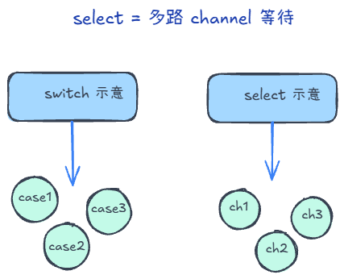
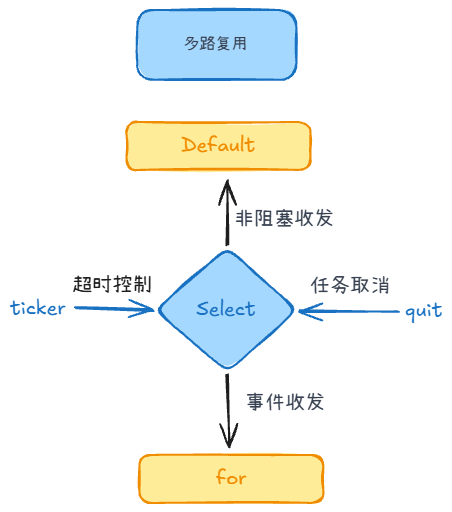
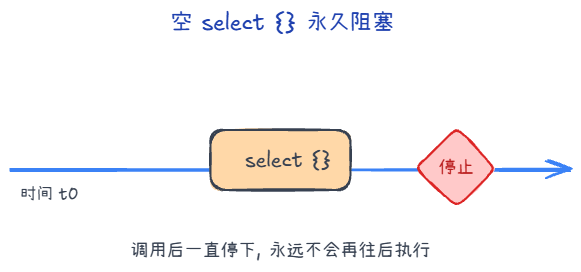
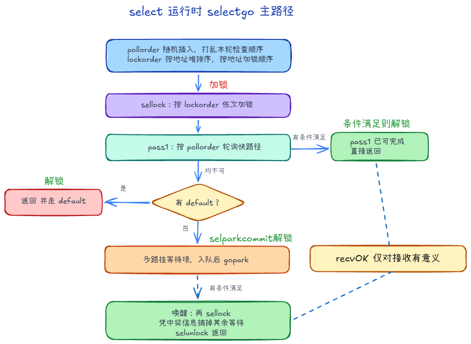

`select` 只用于 channel 的多路收发；与 `switch` 语法像，语义完全不同。

## 随机选择 +3

有多个channel时，select会随机选择一个channel进行处理。

### 为什么需要 pollorder 

**饿死与公平性**：若总是按固定顺序检查 case，长期可能让排在后面的 case 很少被轮到。runtime 用 pollorder 随机插入打乱本轮检查顺序，使各 case 在「先被尝试」上更均匀，减轻饥饿。

### 为什么需要 lockorder

加锁顺序：selectgo 按 lockorder 顺序加锁，**避免死锁**。同一 channel 连续出现时只加一次锁，避免重复加锁。

## select的用途

1. **多路复用（Multiplexing）**：同时监听多个 channel 的读写状态，谁先准备好就处理谁。
2. **非阻塞收发**：配合 `default` 分支，当所有 channel 都未就绪时立即执行 `default`，避免协程由于等待 channel 而阻塞。
3. **超时控制**：结合 `time.After(duration)` 使用，为某个操作设置生命周期，防止程序永久阻塞。
4. **取消/停止信号监听**：配合 `context.Done()` 或自定义的 `quit` channel 实现 goroutine 的优雅退出。
5. **事件循环**：常驻 `for { select { ... } }` 模式中，作为消息中心的处理器（Dispatcher）。

## 空 select 与死锁

对于空的 select {}（没有任何 case），当前 goroutine 会一直阻塞，没有可等待的 channel、定时器等。

Go 运行时有死锁检测：当所有 goroutine 都无法再取得进展（例如全部阻塞且没有任何东西能唤醒它们）时，会 runtime.throw 报致命错误，典型输出是：

fatal error: all goroutines are asleep - deadlock!

## 流程

编译器把各 case 编成 scase 数组并调用 selectgo。匹配分两类：

- 快路径：在已持有各 channel 锁的前提下，按随机打乱后的 pollorder 依次尝试。谁能立刻收发（对端在等待、缓冲区可读写、或读到关闭）就选中谁并做完，返回该 case 下标。
- 阻塞路径：无 default 且快路径都失败时，当前 G 在每个 case 对应的 channel 上各挂一个 sudog，再 gopark。将来任一路被唤醒时，把 gp.param 置为中奖的 sudog，唤醒后沿 lockorder 摘掉其余队列上的 sudog，返回对应下标。

因此「匹配」要么是第一轮扫描到的第一个可执行 case，要么是多路等待里先被唤醒的那一路。

> 每个 sudog 里有一个 g 指针，指向正在阻塞在这条路上的那个 G（goroutine）