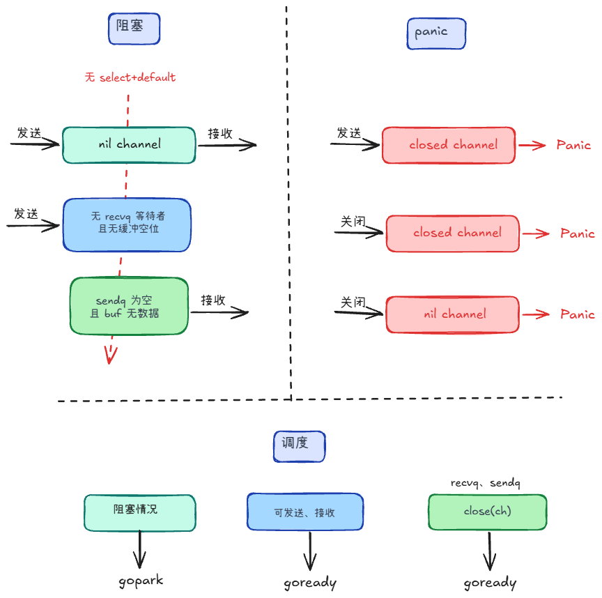

## 常见情况 +2

### 阻塞
- 在 **nil channel 上发送和接收**，并且没有select+default，就会进入阻塞流程：
- **发送**：源码会先确认通道没关闭，然后如果门口没有等待接收者（`recvq` 没人），同时缓冲条件也不满足（无缓冲等价于“没人接收”，有缓冲则是 `buf` 满了），就阻塞。
- **接收**：同理，如果此刻拿不到（门口没有等待发送者：`sendq` 为空，且缓冲里也没有数据：`buf` 为空），就阻塞

### panic
- panic 主要发生在“向已关闭通道发送”的场景里：当你执行 `ch <- x` 时，源码会在加锁后检查 `c.closed != 0`，如果发现通道已经关闭，就直接 `panic("send on closed channel")`，不会走等待队列。
- 关闭未初始化的channel，关闭已关闭的通道也会panic

### 调度
**发送、接收**
- `ch == nil` 且本次必须阻塞：`gopark`，会一直睡下去。
- 发送的时候可能会对接收者 `goready`，反之亦然
- 发不出去或接不到，且允许阻塞：入队列后 `gopark`。

**close(ch)**  
在锁内把 `recvq`、`sendq` 里挂着的 G 全部摘出放入列表，**解锁后**再逐个 `goready`

## 补充
### sudog是什么？

一个 Goroutine 同一时间可能在等待多个事件，或者在多个等待队列中排队；但一个 g 结构体在内存中只有一份，无法同时塞进多个链表里。

为了解决这个问题，Go 引入了 sudog 作为中间商（或者叫中间节点）。

针对 ch1，创建一个 sudogA，里面包裹着这个 g，放进 ch1 的队列；针对 ch2，创建一个 sudogB，里面同样包裹着这个 g，放进 ch2 的队列。

**包含**

1. 数据传输指针 (elem)
    - 当 G 因为 ch <- v 阻塞时，elem 指向 v 的地址。
    - 当另一个 Goroutine 来接收时，它不需要通过 Channel 的环形缓冲区，而是直接利用 sudog.elem，通过 memmove 把数据从发送方 G 的栈，直接拷贝到接收方 G 的栈。
    - 这就是 Go channel 著名的“零拷贝（内存直接复制）”优化。
2. 双向链表指针 (next 和 prev)
3. Select 相关的控制字段
4. 树形结构指针
    - 在某些复杂同步原语中，sudog 不仅能组成链表，还能组合成平衡二叉树

### 为什么每次操作都需要加锁？

如果没有锁，在多协程并发读写时，hchan 内部的上述核心数据会陷入严重的竞态条件

比如两个协程同时发送数据，都检测到有空位（最后一个空位），可能A成功，B覆盖了未读的数据

### close(ch) 时，为什么要在锁内把等待队列里的 G 摘出来，解锁后再 goready？如果在锁内直接 goready 会有什么问题？

1. 锁内停留时间过长
    - goready 要和本地队列打交道，甚至去加全局队列锁
    - 如果当前有空闲的 P，goready 还会触发 wakep() 动用系统调用去唤醒新的 M 来干活。
    - 锁被持有时间就拉长了
2. 可能会死锁

### 如果有多个发送方，谁来 close？

sync.WaitGroup：专门起一个哨兵协程，利用wait()等待所有发送完工，由它来安全得close

### 用 channel 实现限制并发数时，为什么用 struct{}{} 而不是其他类型

在 Go 语言中，绝大多数类型都是要占用内存空间的，而 struct{}（空结构体）是 Go 语言里的一个特例：它的内存大小是 0 字节。

### 用关闭 channel 来做任务取消广播和用 context cancel 相比，各有什么优缺点？

直接用原生 chan struct{} 广播简单

使用 context.Context 取消，能层级控制，自动取消子context；可以做超时功能；生态链接GORM、go-redis

### 生产者-消费者模式中，生产完不 close 会怎样？

不关闭的话 接收方会阻塞 久了可能会导致内存泄漏

但如果生产者和消费者都在同一个函数生命周期里，并且在完成之后，没有任何地方再引用这个 Channel 和这群协程了，Go 的全局死锁检测器在 main 协程里会直接抛出 panic。

### select 同时监听多个 channel，其中一个是 nil channel，会怎样？

这个 nil channel 对应的 case 分支会被永久无视

可用 nil channel 实现动态开关，比如我们接到想要的效果或数据，可以置通道为nil
