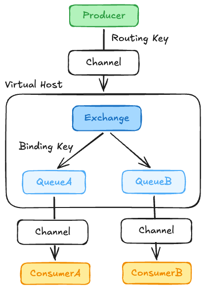
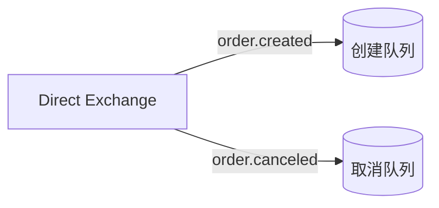
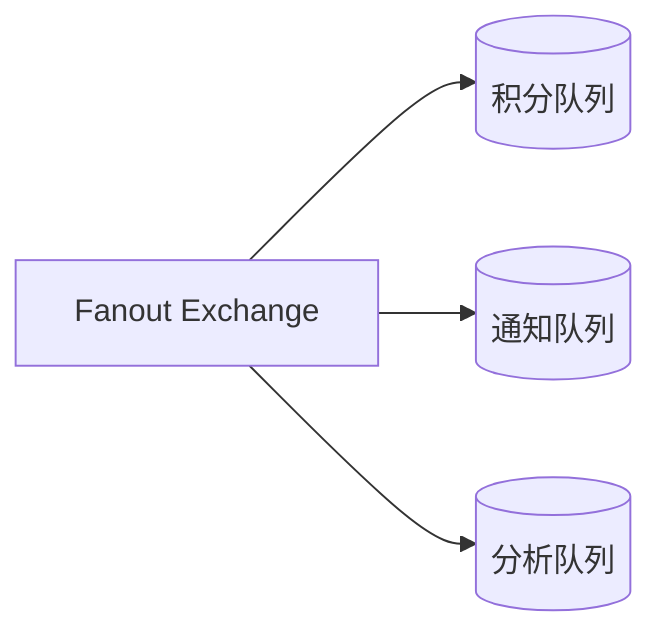
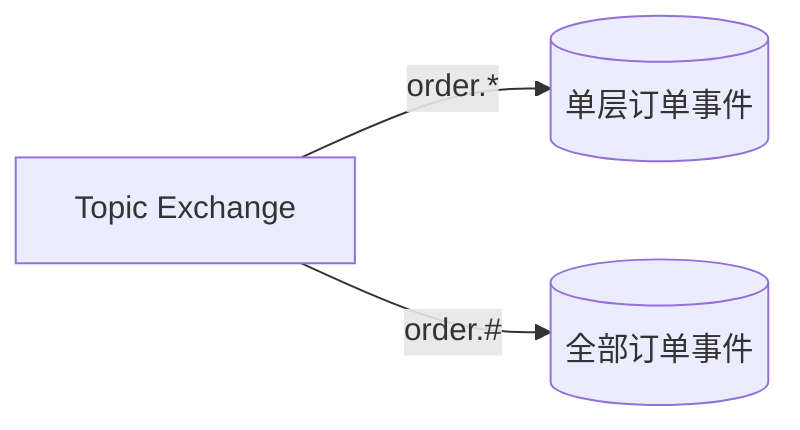
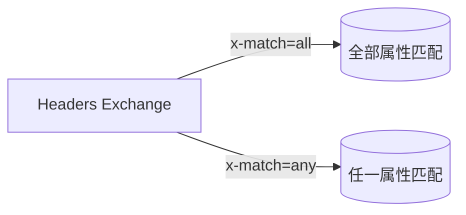

# RabbitMQ 基础

## 一、RabbitMQ、Kafka、RocketMQ 对比

RabbitMQ、Kafka 和 RocketMQ 都能传递消息，但设计目标不同，不能只根据吞吐量选择。

| 对比项   | RabbitMQ              | Kafka             | RocketMQ              |
| ----- | --------------------- | ----------------- | --------------------- |
| 消息模型  | Exchange + Queue，路由灵活 | Topic + Partition | Topic + Message Queue |
| 吞吐量   | 万到十万级，取决于持久化和确认策略     | 通常最高，适合海量数据       | 较高，适合大规模业务消息          |
| 消息顺序  | 单队列、单消费者下有序           | Partition 内有序     | Queue 内有序，支持顺序消息      |
| 运维复杂度 | 中等，小规模使用方便            | 较高，需要规划分区和存储      | 中等到较高                 |

选择建议：
1. 需要灵活路由、低延迟、死信机制，优先考虑 RabbitMQ。
2. 需要海量吞吐、长期保存、事件回放，优先考虑 Kafka。
3. 需要事务、延迟消息，业务以订单和交易为主，优先考虑 RocketMQ。

RabbitMQ 的优点是功能完整、路由灵活、上手快；缺点是消息堆积能力和吞吐量通常不如 Kafka，也不适合将消息长期当作事件日志保存。

---

## 二、RabbitMQ 基础概念



RabbitMQ 不会让生产者直接把消息发送到队列。生产者先把消息发送给交换机，再由交换机根据路由规则将消息投递到一个或多个队列。

| 概念          | 作用                         |
| ----------- | -------------------------- |
| Exchange    | 接收生产者的消息，并根据规则进行路由         |
| Queue       | 保存消息，等待消费者处理               |
| Binding     | 建立 Exchange 与 Queue 的关系    |
| Routing Key | 生产者发送消息时携带的路由标识            |
| Binding Key | Queue 绑定 Exchange 时声明的匹配规则 |
| Connection  | 客户端与 RabbitMQ 之间的 TCP 长连接  |
| Channel     | Connection 内的逻辑通信通道        |

### Connection 和 Channel

建立 TCP 连接的成本较高，所以 RabbitMQ 在一个 Connection 中复用多个 Channel。发布消息、消费消息、声明队列等操作通常都在 Channel 上完成。

常见做法：

1. 一个应用维护少量长连接。
2. 每个线程或协程使用独立 Channel，不要并发共享非线程安全的 Channel。
3. Channel 出现协议错误时只会关闭当前 Channel，通常不需要断开整个 Connection。

需要注意：

- Exchange 本身一般不存储消息，只负责路由。
- 如果消息没有匹配到任何 Queue，默认会被丢弃。
- 如果 Queue 没有消费者，消息可以继续保存在 Queue 中，但是否能在重启后保留取决于持久化配置。
- Consumer 收到消息不等于消费成功，是否删除消息取决于 ACK。

生产者可以设置 `mandatory=true`。当消息无法路由到任何 Queue 时，RabbitMQ 会将消息返回给生产者，而不是直接丢弃。

---

## 三、Exchange 的四种类型

### 1. Direct Exchange

Direct Exchange 要求 Routing Key 与 Binding Key 完全一致。



生产者发送 `order.created`，消息只会进入绑定键为 `order.created` 的队列。

适合根据明确的业务类型进行精确路由，例如订单创建、订单取消、支付成功。

### 2. Fanout Exchange

Fanout Exchange 不检查 Routing Key，而是把消息复制到所有与它绑定的 Queue。



例如订单完成后，积分系统、通知系统和数据分析系统都需要收到消息，可以分别创建队列并绑定到同一个 Fanout Exchange。

Fanout 是广播，不是多个消费者竞争一条消息：

- 多个 Queue：每个 Queue 都会获得一份消息。
- 同一个 Queue 下的多个 Consumer：只有其中一个 Consumer 获得该消息。

### 3. Topic Exchange

Topic Exchange 根据带层级的 Routing Key 进行模式匹配，单词之间通常用 `.` 分隔。



通配符规则：
- `*`：匹配恰好一个单词。
- `#`：匹配零个或多个单词。

例如：
```text
order.*       可以匹配 order.created，不能匹配 order.created.cn
order.#       可以匹配 order、order.created、order.created.cn
*.created     可以匹配 order.created、user.created
```

Topic Exchange 适合事件类型多、订阅规则灵活的场景。

### 4. Headers Exchange

Headers Exchange 不使用 Routing Key，而是根据消息 Headers 是否满足绑定条件进行路由。



匹配方式：

- `x-match=all`：所有指定 Header 都要匹配。
- `x-match=any`：任意一个 Header 匹配即可。

Headers Exchange 表达能力强，但使用和维护成本更高。大多数业务使用 Direct 或 Topic Exchange 就足够了。

---
