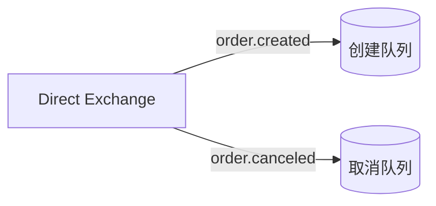
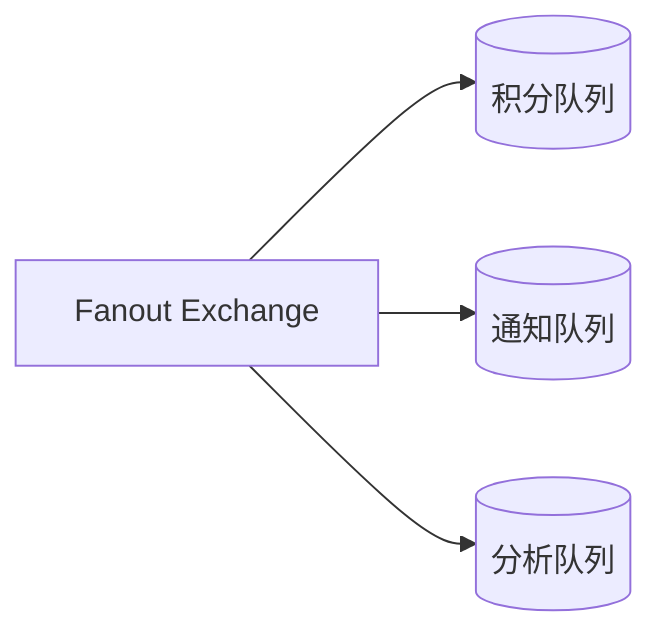
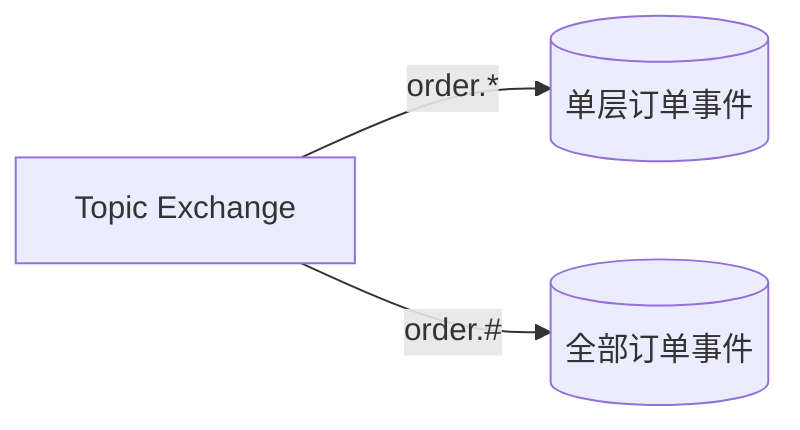
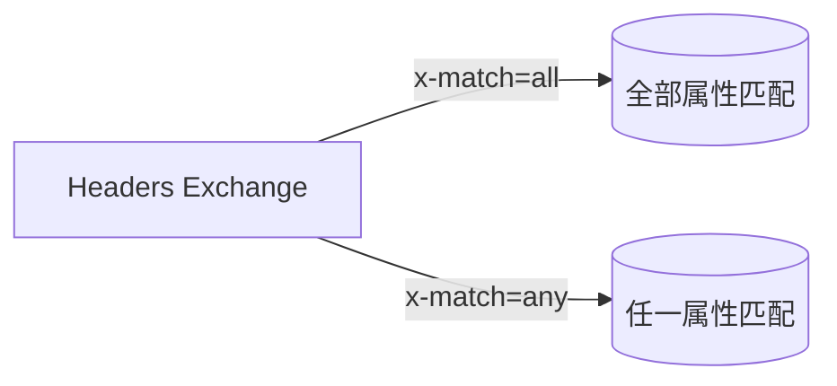
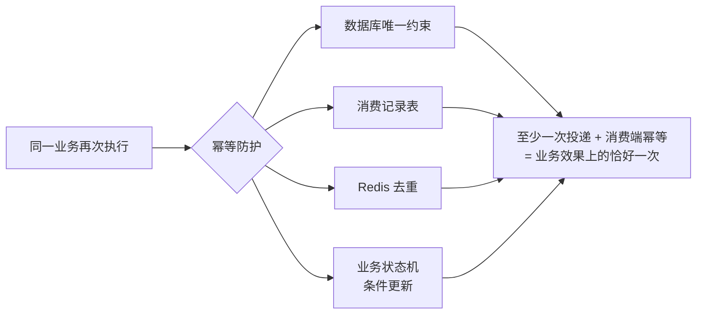
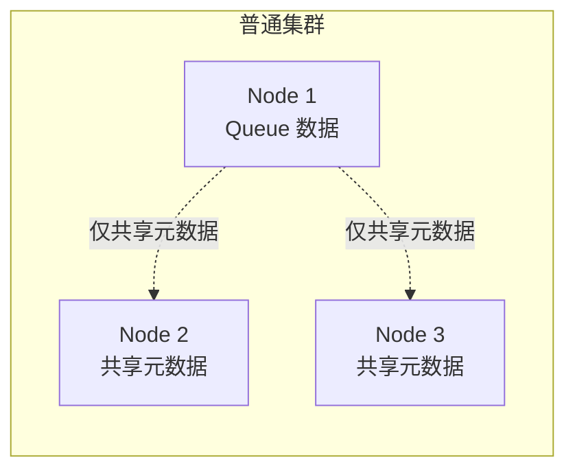
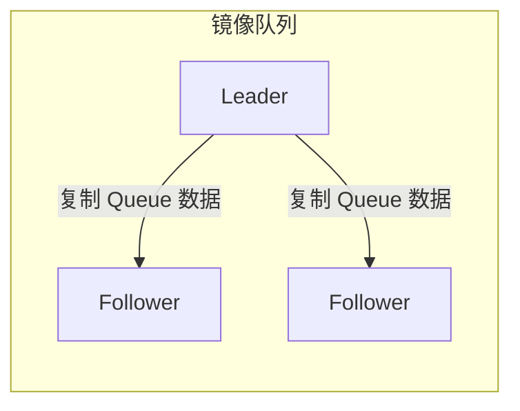
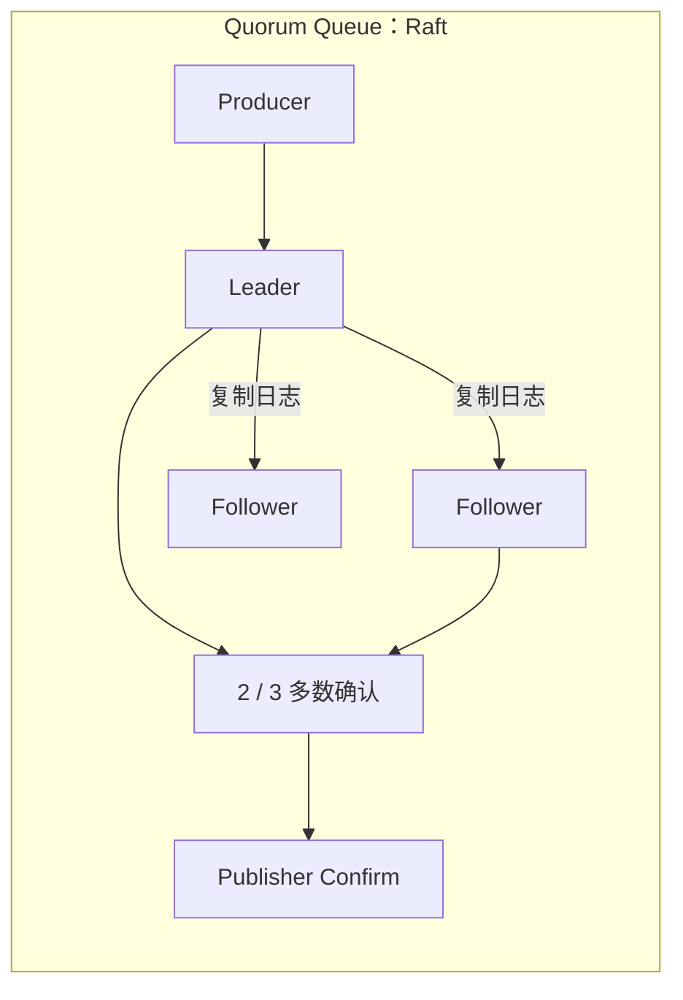

# RabbitMQ

## 一、RabbitMQ、Kafka、RocketMQ 对比

RabbitMQ、Kafka 和 RocketMQ 都能传递消息，但设计目标不同，不能只根据吞吐量选择。

| 对比项   | RabbitMQ              | Kafka             | RocketMQ              |
| ----- | --------------------- | ----------------- | --------------------- |
| 消息模型  | Exchange + Queue，路由灵活 | Topic + Partition | Topic + Message Queue |
| 吞吐量   | 万到十万级，取决于持久化和确认策略     | 通常最高，适合海量数据       | 较高，适合大规模业务消息          |
| 消息顺序  | 单队列、单消费者下有序           | Partition 内有序     | Queue 内有序，支持顺序消息      |
| 运维复杂度 | 中等，小规模使用方便            | 较高，需要规划分区和存储      | 中等到较高                 |

选择建议：
1. 需要灵活路由、低延迟、死信机制，优先考虑 RabbitMQ。
2. 需要海量吞吐、长期保存、事件回放，优先考虑 Kafka。
3. 需要事务、延迟消息，业务以订单和交易为主，优先考虑 RocketMQ。

RabbitMQ 的优点是功能完整、路由灵活、上手快；缺点是消息堆积能力和吞吐量通常不如 Kafka，也不适合将消息长期当作事件日志保存。

---

## 二、RabbitMQ 基础概念


RabbitMQ 不会让生产者直接把消息发送到队列。生产者先把消息发送给交换机，再由交换机根据路由规则将消息投递到一个或多个队列。

| 概念          | 作用                         |
| ----------- | -------------------------- |
| Exchange    | 接收生产者的消息，并根据规则进行路由         |
| Queue       | 保存消息，等待消费者处理               |
| Binding     | 建立 Exchange 与 Queue 的关系    |
| Routing Key | 生产者发送消息时携带的路由标识            |
| Binding Key | Queue 绑定 Exchange 时声明的匹配规则 |
| Connection  | 客户端与 RabbitMQ 之间的 TCP 长连接  |
| Channel     | Connection 内的逻辑通信通道        |

### Connection 和 Channel

建立 TCP 连接的成本较高，所以 RabbitMQ 在一个 Connection 中复用多个 Channel。发布消息、消费消息、声明队列等操作通常都在 Channel 上完成。

常见做法：

1. 一个应用维护少量长连接。
2. 每个线程或协程使用独立 Channel，不要并发共享非线程安全的 Channel。
3. Channel 出现协议错误时只会关闭当前 Channel，通常不需要断开整个 Connection。

需要注意：

- Exchange 本身一般不存储消息，只负责路由。
- 如果消息没有匹配到任何 Queue，默认会被丢弃。
- 如果 Queue 没有消费者，消息可以继续保存在 Queue 中，但是否能在重启后保留取决于持久化配置。
- Consumer 收到消息不等于消费成功，是否删除消息取决于 ACK。

生产者可以设置 `mandatory=true`。当消息无法路由到任何 Queue 时，RabbitMQ 会将消息返回给生产者，而不是直接丢弃。

---

## 四、Exchange 的四种类型

### 1. Direct Exchange

Direct Exchange 要求 Routing Key 与 Binding Key 完全一致。



生产者发送 `order.created`，消息只会进入绑定键为 `order.created` 的队列。

适合根据明确的业务类型进行精确路由，例如订单创建、订单取消、支付成功。

### 2. Fanout Exchange

Fanout Exchange 不检查 Routing Key，而是把消息复制到所有与它绑定的 Queue。



例如订单完成后，积分系统、通知系统和数据分析系统都需要收到消息，可以分别创建队列并绑定到同一个 Fanout Exchange。

Fanout 是广播，不是多个消费者竞争一条消息：

- 多个 Queue：每个 Queue 都会获得一份消息。
- 同一个 Queue 下的多个 Consumer：只有其中一个 Consumer 获得该消息。

### 3. Topic Exchange

Topic Exchange 根据带层级的 Routing Key 进行模式匹配，单词之间通常用 `.` 分隔。



通配符规则：
- `*`：匹配恰好一个单词。
- `#`：匹配零个或多个单词。

例如：
```text
order.*       可以匹配 order.created，不能匹配 order.created.cn
order.#       可以匹配 order、order.created、order.created.cn
*.created     可以匹配 order.created、user.created
```

Topic Exchange 适合事件类型多、订阅规则灵活的场景。

### 4. Headers Exchange

Headers Exchange 不使用 Routing Key，而是根据消息 Headers 是否满足绑定条件进行路由。



匹配方式：

- `x-match=all`：所有指定 Header 都要匹配。
- `x-match=any`：任意一个 Header 匹配即可。

Headers Exchange 表达能力强，但使用和维护成本更高。大多数业务使用 Direct 或 Topic Exchange 就足够了。

---

## 五、如何保证消息可靠性

可靠消息需要同时考虑三段链路：

```text
Producer -> RabbitMQ -> Consumer
```

只开启消息持久化，不能解决所有消息丢失问题。

### 1. Producer 到 RabbitMQ

生产者把消息写入网络后，不能仅根据发送方法没有报错就认为 RabbitMQ 已经接收。

可以开启 Publisher Confirm：

- `ack`：RabbitMQ 已接收该消息。
- `nack`：RabbitMQ 无法完成接收。

Confirm 可以同步等待，也可以异步批量处理。生产环境通常使用异步 Confirm，并记录尚未确认的消息，超时或收到 `nack` 后进行重试。

Confirm 只说明消息到达 RabbitMQ，不保证消息一定路由到了 Queue。还需要：

1. 设置 `mandatory=true` 并处理 Return 回调。
2. 或者为 Exchange 配置 Alternate Exchange，接收无法路由的消息。

### 2. RabbitMQ 内部持久化

要让消息在 RabbitMQ 重启后尽可能保留，需要同时满足：

1. Exchange 设置为 durable。
2. Queue 设置为 durable。
3. Message 设置为 persistent。

三者缺一不可：

- Queue 不持久化，重启后 Queue 和其中消息都会消失。
- Message 不持久化，即使 Queue 还在，消息也可能丢失。

持久化消息从进入内存到写入磁盘仍有时间窗口，因此应配合 Publisher Confirm。需要更强数据安全时，可以使用 Quorum Queue，让消息复制到多个节点后再确认。

### 3. RabbitMQ 到 Consumer

消费者确认分为：

- 自动 ACK：消息发送给消费者后立即认为成功。
- 手动 ACK：业务处理成功后由消费者主动确认。

自动 ACK 下，Consumer 收到消息后如果立即宕机，消息可能已经从 Queue 删除。因此重要业务应该使用手动 ACK。

手动确认常用操作：

| 操作 | 含义 |
| --- | --- |
| `ack` | 消费成功，删除消息 |
| `nack(requeue=true)` | 消费失败，重新入队 |
| `nack(requeue=false)` | 消费失败，不重新入队 |
| `reject` | 拒绝一条消息，可选择是否重新入队 |

正确顺序通常是：

```text
收到消息 -> 执行业务 -> 业务提交成功 -> ACK
```

如果数据库已经提交，但 ACK 在网络中丢失，RabbitMQ 会重新投递消息，所以消费者仍然必须实现幂等。

---

## 七、重复消费与幂等性

RabbitMQ 通常提供的是“至少一次”投递，而不是“恰好一次”。

重复消费的典型过程：

1. Consumer 在返回 ACK 前宕机，或者 ACK 丢失。
2. RabbitMQ 没有收到 ACK，将消息重新投递。
3. 同一个业务操作被执行第二次。

消息队列很难独立实现端到端的 Exactly Once。工程上通常通过“至少一次投递 + 消费端幂等”达到业务效果上的恰好一次。



常用方案：

### 1. 数据库唯一约束

消息携带业务唯一键，例如订单号。插入消费记录或业务记录时建立唯一索引，重复插入会失败。

这是最可靠的方案之一，因为幂等判断和业务写入可以放在同一个数据库事务中。

### 2. 幂等记录表

消费者处理前检查 `message_id` 是否已经存在，处理成功后写入消费记录。

关键是“检查、执行业务、记录已消费”要保证原子性。若分别执行，仍可能出现并发重复消费。

### 3. Redis 去重

使用 `SET key value NX EX` 标记消息是否处理过，性能较高。

但需要处理 Redis 标记成功、业务执行失败，或者业务成功、Redis 标记丢失的问题。Redis 去重更适合允许一定误差的场景，强一致业务应优先依赖数据库事务或业务状态机。

### 4. 根据业务状态判断

例如订单只有处于“待支付”状态时才能执行支付成功逻辑：

```sql
UPDATE orders
SET status = 'paid'
WHERE id = ? AND status = 'pending';
```

通过受影响行数判断是否真正发生状态迁移，可以自然抵抗重复消息。

---

## 八、消息积压与消费能力

消息积压说明生产速率持续大于消费速率，或者消费者出现故障。

排查时先区分 Ready 和 Unacked：

1. Ready：消息仍在 Queue 中，还没有发送给消费者。
	1. 消费者离线
	2. 消费者正常但消费慢，看瓶颈在哪：下游数据库、缓存、第三方接口变慢
2. Unacked：消息已经发送给消费者，但尚未确认。
	1. 业务阻塞或死锁
	2. 漏ACK
	3. Prefetch 设置过大，大量消息停留在 Unacked 状态。

扩容消费者并不是无限有效。所有消费者共同竞争数据库时，盲目扩容可能先把数据库打垮。扩容前要确认瓶颈在消费者 CPU，还是在共享的下游资源。

RabbitMQ 不适合长期堆积海量消息。持续积压会占用内存和磁盘，触发内存或磁盘告警后，RabbitMQ 可能阻塞生产者。若业务需要长期保存和反复回放大量事件，Kafka 往往更合适。

---

## 九、死信队列与延迟消息

### 1. 死信队列

消息在以下情况下会成为死信：

1. Consumer 使用 `reject` 或 `nack` 拒绝消息，并设置 `requeue=false`。
2. 消息超过 TTL。
3. Queue 达到最大长度，旧消息被淘汰。
4. Quorum Queue 中消息超过配置的投递次数限制。

RabbitMQ 不存在一种特殊类型的“死信队列”。实现方式是给原 Queue 配置 Dead Letter Exchange（DLX），消息成为死信后会被重新发布到 DLX，再由 DLX 路由到普通 Queue。

```text
业务队列 -> 消息成为死信 -> DLX -> 死信队列
```

死信队列常用于：

- 保存最终处理失败的消息。
- 记录异常消息并触发告警。
- 人工排查后重新投递。
- 配合 TTL 实现延迟消息。

不要只把消息放进死信队列而不监控，否则只是把故障藏到了另一个 Queue。

### 2. TTL + DLX 实现延迟消息

可以创建一个没有消费者的延迟 Queue：

1. 消息进入延迟 Queue。
2. 消息达到 TTL 后成为死信。
3. 消息被转发到 DLX。
4. DLX 将消息路由到真正的业务 Queue。

这种方案不需要插件，但存在“队头阻塞”问题：RabbitMQ 通常只检查队头消息是否过期。如果同一 Queue 中第一条消息 TTL 很长，后面的短 TTL 消息可能无法按时转发。

常见改进方式是按固定延迟时间创建不同 Queue，例如 5 秒、1 分钟、10 分钟各一个 Queue。

### 3. 延迟消息插件

安装 `rabbitmq_delayed_message_exchange` 插件后，可以使用延迟交换机，并通过 `x-delay` 指定消息延迟时间。

插件使用更简单，也能处理不同延迟时间，但需要额外安装和维护，超大规模定时任务还要考虑存储压力。订单长时间定时关闭等场景，也可以使用专门的时间轮、定时任务系统或延迟任务平台。

---

## 十、消息顺序问题

RabbitMQ 可以保证消息进入同一个 Queue 时有顺序，但不能无条件保证业务最终严格有序。

导致乱序的常见原因：

1. 同一个 Queue 有多个消费者，并发处理速度不同。
2. 单个消费者内部开启多线程并发处理。
3. 某条消息失败后重新入队，位置发生变化。
4. 网络重连或生产者并发发送。
5. 消息被路由到不同 Queue。

如果业务要求严格顺序，可以采用：

1. 同一业务键的消息发送到同一个 Queue。
2. Queue 只使用一个 Consumer。
3. Consumer 内部串行处理。
4. 失败消息不要直接重新入队，而是暂停后续消费或进入专门的重试流程。

这种方案会明显降低吞吐量。

更常见的做法是按业务键分片：

```text
queue_index = hash(order_id) % queue_count
```

同一个订单始终进入同一个 Queue，每个 Queue 内串行消费，不同订单可以并行处理。这与 Kafka 按 Key 路由到 Partition 的思想类似。

如果业务只关心最终状态，也可以让消息携带版本号，在消费端拒绝旧版本，避免为了全局顺序牺牲吞吐。

---

## 十一、重试机制的正确设计

消费失败后直接执行 `nack(requeue=true)` 很危险。异常消息可能被立即重新投递、再次失败，形成高频死循环，占满消费者和 CPU。

重试应该具备：

1. 最大重试次数。
2. 重试间隔。
3. 指数退避或分级延迟。
4. 最终失败去向。
5. 告警和人工补偿能力。

推荐流程：

```text
业务队列
  -> 消费失败
  -> 5 秒重试队列
  -> 1 分钟重试队列
  -> 10 分钟重试队列
  -> 最终死信队列
  -> 告警/人工处理
```

可以通过消息 Header 或独立字段记录重试次数。RabbitMQ 在死信过程中也会维护 `x-death` 信息，但业务仍应明确自己的重试策略。

错误可以分为两类：

- 可重试错误：网络超时、下游临时不可用、数据库瞬时故障。
- 不可重试错误：参数错误、数据格式错误、业务状态不允许。

不可重试错误应直接进入死信队列，避免无意义重试。重试次数也不能仅放在消费者内存中，否则消费者重启后计数会丢失。

---

## 十二、RabbitMQ 高可用

### 1. 普通集群

RabbitMQ 集群中的 Exchange、Binding 等元数据可以在节点间共享，但 Queue 中的数据不会因为组成集群就自动复制到所有节点。



因此普通集群解决的是统一管理和一定程度的负载分布，不等于消息高可用。Queue 所在节点宕机后，该 Queue 可能暂时不可用。

### 2. 镜像队列

Classic Mirrored Queue 会把 Queue 数据复制到多个节点，通过主从方式提供高可用。



但镜像队列在网络分区、节点恢复和大规模同步时存在一致性与性能问题，较新的 RabbitMQ 版本更推荐使用 Quorum Queue。

### 3. Quorum Queue

Quorum Queue 基于 Raft 协议，将消息复制到多个节点。只有多数副本确认后，写入才算成功。



特点：

- 数据安全性和故障恢复能力更强。
- 适合重要、持久化的业务消息。
- 通常使用奇数个副本，例如 3 个或 5 个。
- 写放大和磁盘开销更高，性能通常低于非复制的 Classic Queue。

Quorum Queue 依赖多数派。3 个副本最多容忍 1 个副本不可用；如果只剩 1 个副本，Queue 会停止服务，而不是冒险接受可能造成数据冲突的写入。

### 4. 生产环境建议

1. 至少部署 3 个 RabbitMQ 节点，并分布在不同故障域。
2. 重要业务使用 Quorum Queue。
3. 客户端配置多个节点地址、自动重连和拓扑恢复。
4. 不要只依赖负载均衡器判断 RabbitMQ 是否真正可用。
5. 合理设置内存高水位和磁盘剩余空间阈值。
6. 避免所有 Queue 的 Leader 都集中在同一节点。
7. 定期演练节点宕机、网络分区和磁盘写满。

高可用只能减少 RabbitMQ 自身故障导致的消息丢失，Producer Confirm、Consumer ACK 和业务幂等仍然不能省略。


