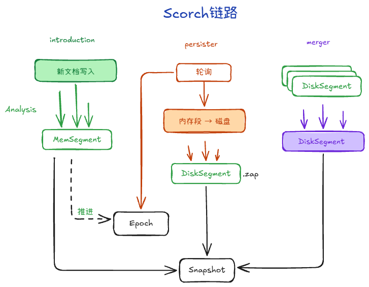

# Bleve 写入链路

Mapping 决定“字段怎么建”，Scorch 决定“这些字段怎么批量写进段并变成可查询数据”。

可以把 Scorch 理解成一条索引写入流水线：上游把字段准备好，它负责分析字段、生成新段、接入索引视图，并在后台持久化和合并。



---

## Scorch：`Batch` 主流程

核心流程在 `index/scorch/scorch.go` 的 `Scorch.Batch`，按一批文档写入可以理解为：

1. **先收单**
    - 统计这批是新增还是删除
    - 给文档补 `_id` 字段，内部检索和去重会用到

2. **并发分析**
    - 文档进入 `analysisQueue`
    - 对可索引字段做分词、词频、位置信息计算
    - 如果开了 `_all`，还会把词项 compose 到 composite 字段

3. **做出新段**
    - `s.segPlugin.New(analysisResults)` 把这批分析结果做成一个内存段
    - 这个段里已经是可查询的倒排结构雏形

4. **把新段接入当前索引视图**
    - `prepareSegment` 会算旧段里哪些文档要作废，也就是 obsolete 位图
    - 把引入任务发到 `introductions` 队列
    - 等这次引入应用到 root，新快照可见
    - 默认配置下还会等持久化回调后再返回

---

## Segment 是什么

可以把 segment 理解成：**一小批文档对应的一份倒排索引快照**。

Bleve 底层不是不断修改一个巨大的索引文件，而是把索引拆成多个 segment：

```text
Segment A
├── Term Dictionary     词典：有哪些词？
├── Inverted Index      倒排索引：这个词在哪些文档里？
├── Stored Fields       存储字段：这篇文档原始字段是什么？
└── Doc Values          列式数据：这个字段在各文档中的值是什么？
```

### Term Dictionary：词典

假设 Segment A 里只有三篇文档：
```
Doc1: "go is fast"
Doc2: "go is simple"
Doc3: "java is fast"
```
分词以后得到 go、is、fast、simple、java。Term Dictionary 保存的核心信息可以理解成：
```
fast   -> 倒排数据位置 X
go     -> 倒排数据位置 Y
is     -> 倒排数据位置 Z
java   -> 倒排数据位置 ...
simple -> 倒排数据位置 ...
```
所以它解决的是：我要搜索 go，首先去哪里找到 go 对应的倒排索引？

### Inverted Index：倒排索引

Term Dictionary 解决「有没有这个词、去哪里找」，真正保存这个词出现在哪些文档中的是 Inverted Index。
```
go ->
    Doc1: freq=1, position=[0]
    Doc2: freq=1, position=[0]
```
可能包含 docID、词频 frequency、位置 position 等信息

### Stored Fields：拿回原始数据

这和数据库里的「先通过索引找到主键，再根据主键回表」有一点相似

### Doc Values：为排序和聚合准备的列式数据
```
modifiedAt:
Doc1 -> 2026-01-01
Doc2 -> 2026-03-01
Doc3 -> 2026-02-01

size:
Doc1 -> 100
Doc2 -> 300
Doc3 -> 200
```


---

## 为什么不直接改老索引

新增文档时，Bleve 更偏向追加生成新的 segment，而不是原地改旧 segment。

在搜索引擎里，数据是按“词 -> 文档列表”存的，也就是倒排索引，不是按“文档行记录”存的。

比如：

```text
编程 -> [1, 5, 100, ...]
健身 -> [2, 5, 88, ...]
```

如果新文档 `2001` 也包含“编程”，它不是在文件末尾追加一行，而是要把 `2001` 插进 `编程` 的 posting list。

而 posting list 为了查询快，通常要保持有序、连续编码。中间频繁插入会触发大量重写，写放大非常严重。

所以搜索引擎采用 segment：

1. **旧段只读，不改历史**
2. **新数据写成新段**，先内存，后持久化
3. **查询时同时查多段再合并结果**

这样做的核心收益：

- 写入快：避免频繁重写大文件
- 并发友好：读旧快照，写新段，互不强阻塞
- 可维护：后台再 merge 小段，逐步整理成大段

---

## Persister 与 Merge

- **`index/scorch/persister.go`**：像“落盘线程”。新段先在内存里引入，persister 再按策略把段和元信息写到磁盘，并推进 epoch/root。它和前台查询快照解耦，避免读写互相卡死。

- **`index/scorch/merge.go`**：像“后台整理线程”。运行一段时间后会有很多小段，merge 会把它们合成更大的段，减少查询时要扫的段数；代价是会额外吃 CPU、磁盘 IO，以及一段时间内的内存。

可以把它理解成三条并发链路：

```text
引入新段 introduction -> 持久化 persist -> 后台合并 merge
```

查询看到的是某个 snapshot；旧文件能不能删，由 epoch + 引用计数一起决定。
