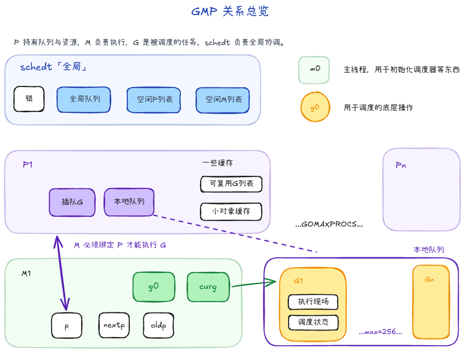
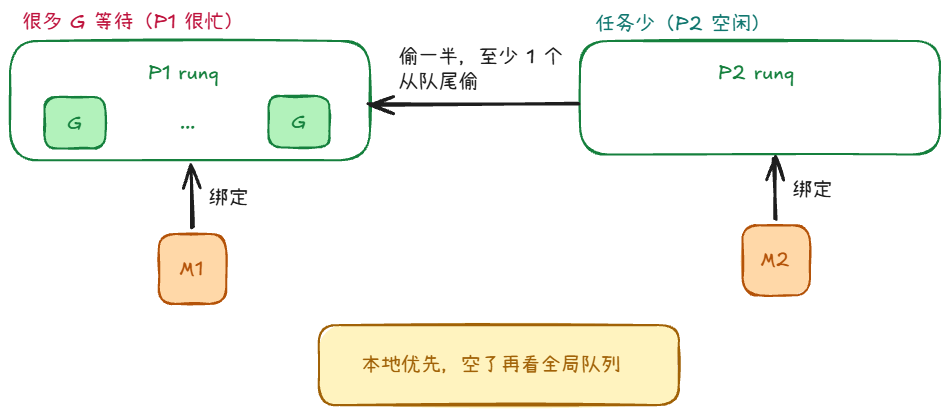
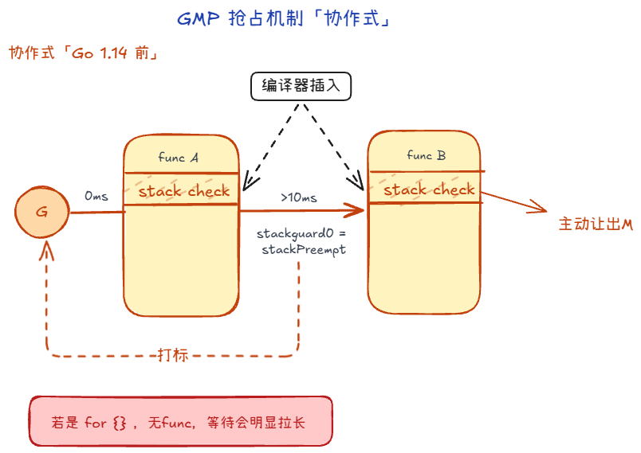
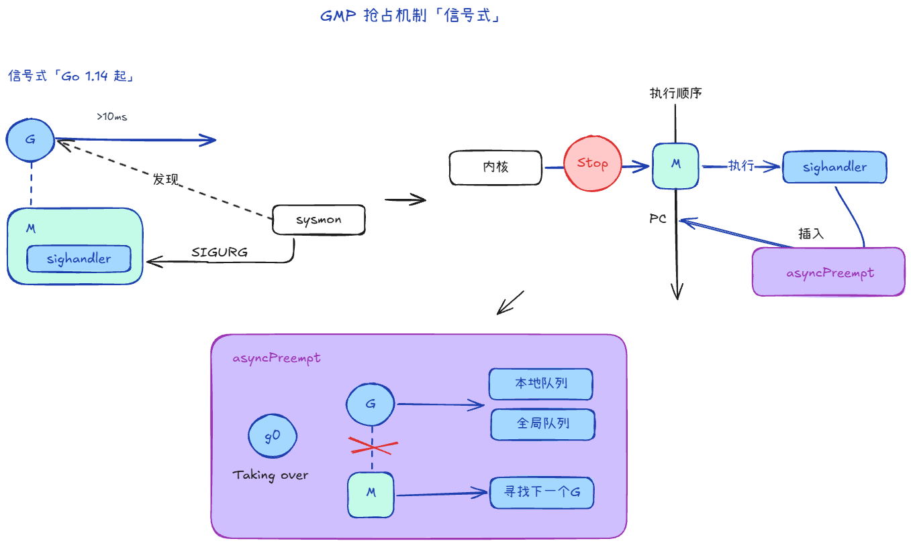
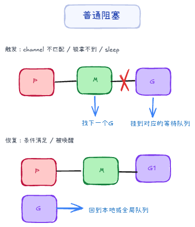
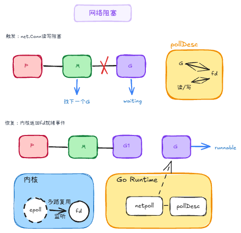
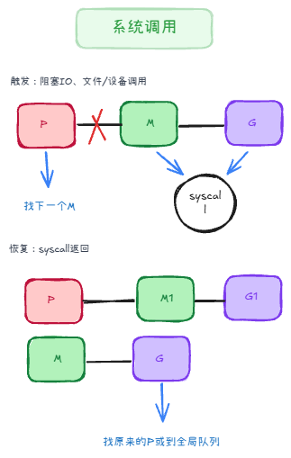

## 调度结构 +999
GMP 可以先理解成一句话：**M 是工人，G 是任务，P 是工位与资源包，schedt 是全局调度中心。**

### 1. G：真正要跑的任务 +1

`G`（goroutine）本质是“可调度的执行单元”，它同时带着两类信息：

1. **执行现场**：栈、PC、SP、上下文等（切回来能接着跑）。
2. **调度状态**：它现在是可运行、运行中、等待中，还是在系统调用中。

从写业务的角度，G 就是你 `go func(){...}` 出来的那个任务。
从 runtime 角度，G 是一份“可挂起、可恢复、可迁移”的执行快照。

### 2. M：真正干活的内核线程

`M`（machine）就是操作系统线程，它负责把 G 真正跑在 CPU 上：

1. 每个 M 有 `g0`（调度专用栈）和 `curg`（当前业务 G）。
2. M还存有P的指针，表示当前M绑定的P，`nextp`表示即将绑定的P（避免“抢 P 竞争”），`oldp`表示进系统调用前绑定的P。

可以把 `g0` 理解成“后台工作台”：调度、切换、运行时内部操作尽量在这里做，避免污染业务 G 的执行栈。

### 3. P：最容易被低估的角色

`P`（processor）是资源管理器，是运行 goroutine 需要的一组逻辑资源。

最关键的是它管理了本地运行队列：

- `runnext`：下一跳优先执行位（“插队位”）。
- `runq`：本地普通队列。（**固定长度 256，多数访问无锁**）

还有一些缓存，比如：
- `gFree`：可复用的 G 缓存池。
- `mcache`：小对象缓存。
- `pcache`：页级缓存。

### 4. schedt：全局调度中心

可以把 `schedt` 看成“总控室”，它主要存全局共享资源：

- **全局可运行 G 队列**
- **空闲 M、P 列表**

当本地队列不够用，或者需要全局协调（比如唤醒更多工作线程），都会走到这个层面。

### 5. 其它

**全局私有变量**

1. `m0`：
   - 程序启动时的**初始 M**（主线程对应的 runtime 线程）。
   - 它不是“唯一的 M”，只是第一个 M；后续 runtime 会按需创建更多 M。

2. `g0`：
   - 调度切换、系统栈上的 runtime 操作（如 `mcall` 进入调度路径）通常在 `g0` 上完成。
   - 常说的“`m0.g0`”是启动阶段最先出现的那对；后续新建的 M 也各自有自己的 `g0`。

**GMP 关系**

1. M 必须先拿到一个 P，才有资格执行 G。
2. 拿到 P 后，优先从 P 的本地队列找 G。
3. 本地没有，再看全局队列，或者去别的 P 那里偷任务。
4. G 阻塞时会让出执行机会，等待被唤醒后重新入队。

如果只记一句：**“M-P 绑定后跑 G，本地优先，全球兜底，窃取均衡。”**

## 抢占机制：防止一个 G 独占 CPU +4

即使有 GMP，如果某个 G 是长循环、长计算，不主动让出 CPU，其他 G 还是会饿。

Go 的抢占演进有两步：

### 协作式抢占（Go 1.14 前）

1. 编译器会在**函数入口相关的栈检查路径**偷偷插入几行汇编代码，叫 `stack check`
2. 调度器发现 G1 跑了太久（比如 **10ms**），就给这个 G1 打个标记：`stackguard0 = stackPreempt`
3. G1 继续跑，当它运行到下一个函数调用时，会执行那段秘密的 `stack check` 代码
4. G1 一看，内存检测发现我不该继续跑了，于是它会主动调用 `runtime.goschedImpl`，自己把自己搬下台，把 M 让出来

问题是：如果代码是 `for {}` 这种没有函数调用的死循环，它就不容易被及时抢占。

### 信号抢占（Go 1.14 起）

1. Go给 M 注册了一个 `sighandler`
2. 监控者（sysmon）发现 M 上的 G 运行超过 10ms 了，且这哥们一直没下台，向 M 发送一个信号：SIGURG。
3. 只要信号一到，**操作系统内核**会立刻暂停 M1 的当前工作。
4.  M1 会被迫跳转去执行 `sighandler`。在这个函数里，会直接操作 M1 的**寄存器（PC 等）**，在当前的执行位置强行塞进一个叫 `asyncPreempt` 的函数调用。
5. 当内核恢复 M1 的执行时，M1 以为自己还在接着刚才的代码跑，结果跑的第一行代码就是被塞进去的 `asyncPreempt`
6. `asyncPreempt` 会通过mcall切换到 g0 栈（这是 Go 调度器的专属后台通道）。在 g0 栈里，它运行 `gopreempt_m`，正式把 G1 踢走。M1 找 G2 干活去了。

## 阻塞与唤醒、网络 +4

#### 普通阻塞（G 级别）

**触发情况**：`channel` 收发对不上、锁拿不到、`time.Sleep` 等待计时器到期等。

**流程**
1. G 在等待条件满足
2. M 和 P 不解绑，继续去跑别的 G 
3. 条件满足后，等待队列会把该 G 唤醒
4. G 被标记回 runnable，通过 ready/runqput 回到可运行队列
5. 调度器后续在 findRunnable 取到它并继续执行

#### 网络阻塞

**触发情况**：net.Conn 去 Read/Write 时，如果内核判断“现在还不能读/写”，G进入等待。

**流程**
1. G 在 Read/Write 里试了一下，发现现在搞不定
2. G 会进入等待，并把 「这个 G ↔ 这个 fd ↔ 关心的事件（读/写）」 记到 pollDesc 一类结构里
3. M 去跑别的 G 
4. 内核通过 epoll 等机制报告 fd 就绪
5. netpoll 处理结果，把 G 设回 runnable，返回本地或全局
6. 之后 G 再被调度，重试 Read/Write，这时再做系统调用把 I/O 做完

**补充知识**
- fd: file descriptor，文件描述符，是操作系统用来标识一个文件的抽象概念。在网络里，一个 socket 就对应一个 fd。
- pollDesc：Go runtime 里“某个 fd 的等待说明书/挂钩对象”，哪个 G 在等这个 fd
- netpoll：Go runtime 里负责「网络 I/O 就绪」的那一层，把很多个 fd 交给操作系统提供的 多路复用机制（Linux 上主要是 epoll，macOS 常见 kqueue，Windows 上有别的封装），在「内核说有 fd 可读了/可写了」时把 对应的 G 重新放进可运行队列

#### 系统调用阻塞（syscall 级别）

触发场景：
当 G 执行可能阻塞较久的 syscall 时，例如阻塞文件 I/O、设备调用、某些系统调用等，当前执行它的 M 会随 G 一起陷入内核阻塞。

流程：
1. G 在用户代码中调用 syscall，runtime 在进入 syscall 前执行 entersyscall。
2. G 状态从 _Grunning 变为 _Gsyscall。
3. 当前 M 会释放绑定的 P，使这个 P 可以被其他 M 接管，继续调度其他 runnable G，避免因为一个阻塞 syscall 浪费 P。
4. syscall 返回后，runtime 走 exitsyscall 路径，G 会优先尝试快速重新获取一个可用的 P。
5. 如果获取 P 成功，G 继续执行用户代码。
6. 如果暂时获取不到 P，G 会被标记为 _Grunnable，并放入全局运行队列，等待后续调度。
