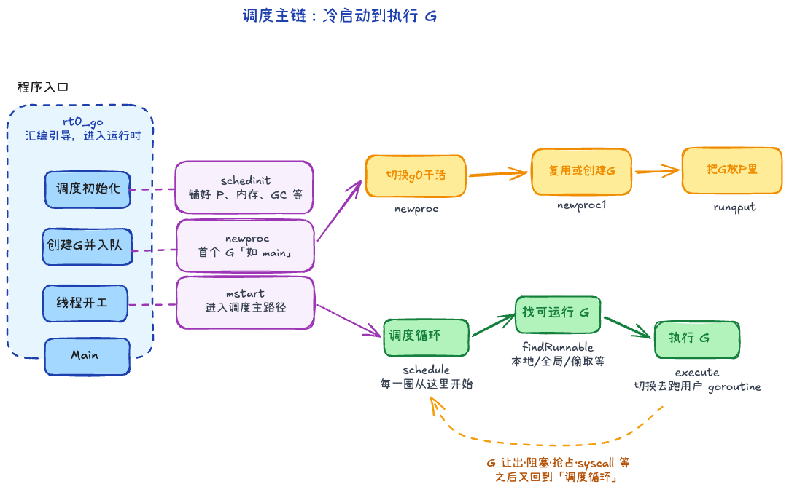
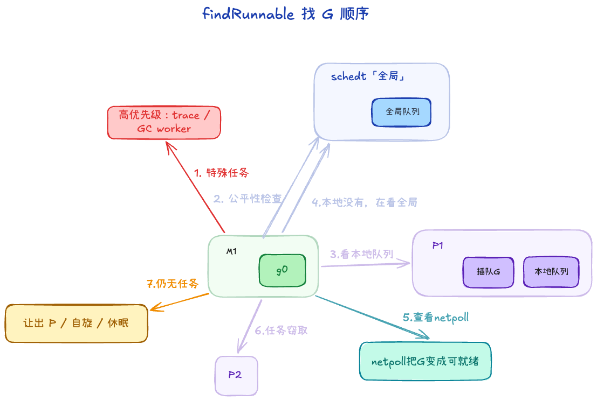

## 调度流程 +2

### 1. GMP 调度流程（主循环在干什么）

主流程可以先记这条链：

`rt0_go -> schedinit -> newproc -> mstart -> schedule -> findRunnable -> execute`

用大白话按顺序过一遍：

1. **程序刚起来**先进 `rt0_go`（入口汇编/引导）。
2. 接着 **`schedinit` 把调度器、P 的数量、内存/GC 等「场子」铺好**。
3. 再用 **`newproc` 捏出第一个要跑的 goroutine（比如 main）并塞进队列**。
4. 当前线程 **`mstart`，相当于「我开始上班」**：此后长期在调度逻辑里转。
5. 进入 **`schedule` 这个无限循环**：每一圈先 **`findRunnable` 找一个能干活的 G**，找到了就 **`execute` 真正去跑它**。跑不下去（让出、阻塞、被抢占、syscall 等）又会回到 **`schedule`**，周而复始。

### 2. 创建G的流程

当你写下 `go f()`，大致会走这条路：

1. `newproc` 在用户 G 上用 `systemstack` 切到 **g0 栈**，避免在用户栈上做复杂调度逻辑。
2. `newproc1` 里通过 `gfget` **优先复用** P 本地 / 全局 `gFree` 中的 G，不够再新建；把状态设为 `_Grunnable`（少数 parked 路径为 `_Gwaiting`）。
3. `runqput` 把新 G 放进当前 P 的队列（常优先 `runnext`）

## 查找g的流程 +2

1. 先看**特殊任务**：比如 trace reader、GC worker（这些是运行时的高优先级内部活）。
2. 然后做一次**公平性检查**：不是每次都看全局队列，但会按节拍（如每隔一段 tick）看一眼，避免本地队列长期“自嗨”把全局任务饿死。
3. 接着看本地队列：`runqget` 内部先看 `runnext`，再看普通 `runq`。
4. 本地没有，再看全局 runq。
5. 再看 netpoll：有没有网络事件刚好把某些 G 变成可运行。
6. 还没有，就进入 stealWork，去别的 P 试着“借/偷”任务（通常是忙闲不均时触发）。
7. 仍然没活：让出 P，M 进入自旋或休眠，等后续 `wakep`/事件唤醒。

**为何「全局队列」会在叙述里出现两次？** 
前者是 **公平性**：避免某个 P 本地一直有活、全局里的 G 长期饿死；后者是 **前面几步都落空后的兜底**：集中从全局再取一轮。

## g的优点 +1

goroutine 轻量主要来自：

1. 初始栈小（KB 级），并且可动态增长/收缩。
2. 主要在用户态调度，减少内核切换。
3. GMP 让任务分发更高效（本地优先 + 全局兜底 + 窃取均衡）。
4. 抢占机制避免长任务长期霸占 CPU。
5. 数量上可以远高于线程，适合高并发模型。

## 为什么 P 重要？ +1

1. 把“队列和资源”从 M 身上分离出来，M 可以换，P 的本地上下文还在。
2. 本地优先，降低全局锁竞争。
3. 更容易做工作窃取和负载均衡。

## P、M的数量 +1

P的数量通常是机器CPU核数，可以通过环境变量`GOMAXPROCS`设置。

go 程序启动时，会设置 M 的最大数量，默认 10000. 但是内核很难支持这么多的线程数，所以这个限制可以忽略。

M 的数量不固定，runtime 会按需创建/回收：
1. **并行度上限主要看 P（`GOMAXPROCS`）**。  
2. **M 可以多于 P，但跑用户 G 时 M 必须先绑定 P**。

## 假设 GOMAXPROCS=4，创建1000个go协程，会发生什么 +1

首先一个M1创建1000个协程，会一直放到本地队列，直到本地队列满。

本地队列满之后，取出前一半（128 个）G，还有第257个G加起来

打乱顺序，为了防止某些 G 长期饿死或连续执行，放入全局队列

其他三个M运行时，会去全局队列拿G

### 原因

1. 利用 CPU 缓存：因为“新协程”刚创建，它所需要的内存数据（比如它的栈帧、关联的变量等）极大概率还热乎地保存在当前 CPU 核心的 L1/L2 高速缓存（Cache）中
2. 如果 P1 此时非常繁忙（因为正在源源不断地产生 1000 个协程），说明 P1 的任务已经严重积压，如果把旧协程推到全局队列：由于它们是“最老”的，把它们推向全局队列后，其他处于空闲状态的 M（比如 M2、M3）就可以立刻从全局队列中把它们捞走并执行

## GMP学了之后对于实践有什么好处

1. 理解 goroutine 为什么可以大量创建，但也不能无限创建：它还是有栈和调度成本
2. 理解为什么 Go 很适合写大量并发 I/O 的服务器：对于某些真正阻塞 M 的系统调用，runtime 也可以让 P 与这个 M 分离，再交给其他 M 继续运行 G。
3. 线上排障：通过pprof能够知道协程的状态，有了这些知识，更能明白如何排查

## 设计 Goroutine 的主要目的

让开发者用接近同步代码的方式编写高并发程序，由 Runtime 负责异步化、调度、栈管理和多核执行