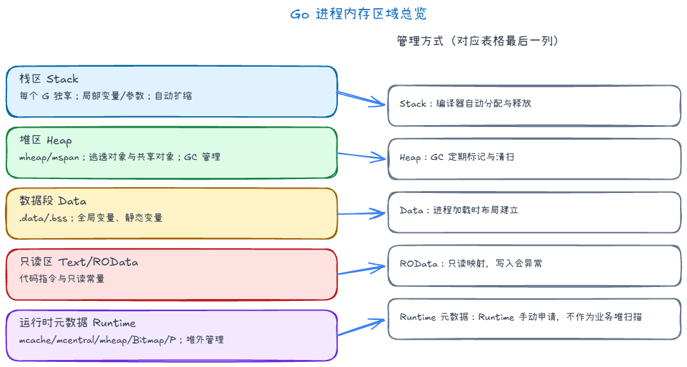
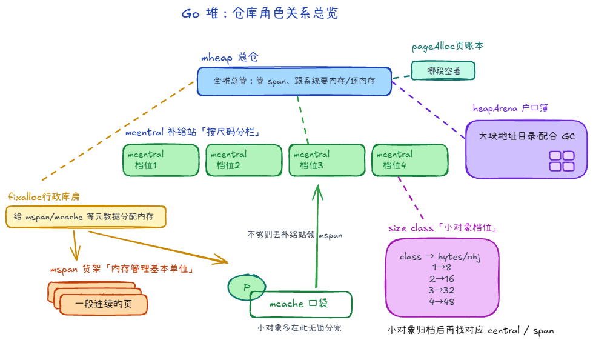

## 内存分配区域 +1

1. 栈：每个G独享一个，局部变量，动态扩容缩容，先进后出
2. 堆：大对象，逃逸对象、new/make、扩容后的 slice，需要gc介入
3. 全局变量区、静态变量区
4. 只读区
5. Go runtime区：runtime申请，无需gc介入

## 堆相关结构 +1

可以把堆想象成一座高效仓库：

货架长什么样？
- **货架 (mspan)**：**内存管理的基本单位**。一段**连续多页**，要么切成同一档的小格子装小对象，要么**整段**给一件大对象。挂在口袋、补给站、总仓之间流转的

货架内部如何切分？
- **尺码表 (size class)**：仓库不按精确字节划分，而是统一划分为 67 种固定档位（如 S/M/L）；每种补给线只发同一档位的货
  - 一整架货被切成等大的格子；例如 16B 档，每一格都是 16B，拿取快、碎片可控。

货物怎么放？
- **口袋 (mcache)**：每个工人口袋里都有最常用的货，拿取无需排队。
  - 每个调度用的 P 自带一份。
  - Tiny 对象：< 16B 且无指针。
  - Small 对象：16B ~ 32KB。

- **补给站 (mcentral)**：口袋空了才去对应**尺码**的补给站补货；同码补给站有很多，减少全厂抢一把锁。

- **大宗区域 (mheap)**：超大件不占小件那条流水线，直接在总仓空地上按**连续页**划；也统管从操作系统要来的页。
  - Large 对象：> 32KB。

仓库怎么维持运转？
- **页账本 (pageAlloc)**：总仓里按**页**记「哪段地址空着、能连续划给新货架」。

- **街区 / 户口簿 (heapArena)**：堆地址按大块切成很多「街区」，每个街区一本户口簿：**这一页归哪个 span**、配合 GC 标记等，方便分配器和回收器查。

- **行政库房 (fixalloc)**：给 **mspan、mcache** 等的简单分配器，**不放你的业务对象**。

## 内存分配流程

想象你是一个 Go 程序，现在执行了 `obj := new(Object)`（且它走的是**典型小对象**那条线）：

1. **「口袋」是否有货？（mcache）**
  你要领一个 16 字节的对象。你先翻自己的口袋（mcache）。
   **动作：** 看看口袋里有没有对应「16 字节档位」的货架（mspan）。
   **为什么快：** 因为口袋是绑在「当前干活的 P」上的，你拿东西不用跟全厂排队（常见路径无锁）。
2. **「口袋」空了，去「补给站」批发（mcentral）**
  口袋里对应的 16 字节货架用完了。你得跑去中心补给站（mcentral）。
   **动作：** 你说：「给我来一整个满载 16 字节槽位的货架（mspan）！」
   **代价：** 补给站是公用的，这里要排队（加锁）。但你一次批发一整块货架回去，够你用好久，减少了下次排队的机会。
3. **「补给站」也没货了，去「总仓」拆页（mheap）**
  补给站发现 16 字节的货架全卖光了。它转身找总仓（mheap）。
   **动作：** 总仓翻开页账本（pageAlloc），找一段连续的空闲内存（比如 8KB 的一页），把它切成几十个 16 字节的小格子，拼成一个新的货架（mspan）给补给站。
4. **「总仓」没地了，找「地主」圈地（OS）**
  如果总仓连 8KB 的空闲页都找不到了。
   **动作：** 总仓向操作系统（OS）申请新的连续地址空间（运行时再按规则切成街区、登记到页账本；有时一次会多要一些，摊薄跟系统打交道的次数）。
   **登记：** 拿地之后，要在户口簿（heapArena）上记下来：这一块地怎么切页、每个页对应谁管，方便分配和 GC 查。

还有三类常见例外：

**1. size == 0**

所有「零大小对象」（Zero-Sized Objects）在内存中的统一居住地

**2. 极小、且不含指针的分配（tiny）**

特别小的、回收时不需要顺着里面去扫指针的那类，有时会先塞进一个 **16 字节的微盒**里，好几个极小对象拼成一盒，再占「一整格货架」。所以你看到源码里 tiny 相关逻辑时，要知道：**它是在「拼单」**，不一定一上来就对应「某一档尺码的一整格」那条典型故事。

**3. 大对象**

尺寸超过「小对象」上限的，**不再进每个 P 的口袋、也不进按尺码分的补给站**，而是直接在总仓按**连续页**划一整段，这一整段通常只装这一件大货。可以理解为：大件不走小件流水线，避免占满一整个货架却只放一样东西还要反复协调。
