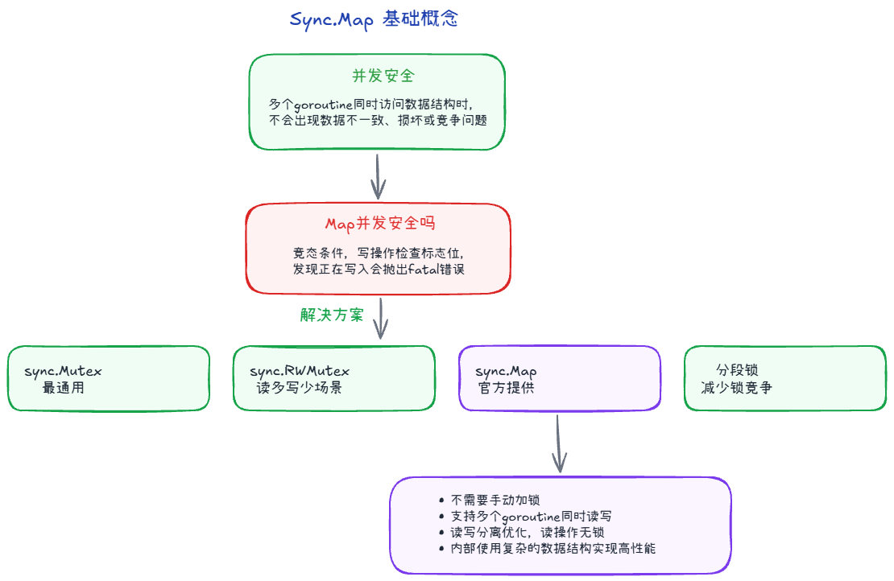

## 并发安全 +999



不是。有个标志位Writing。

操作之前会检查是否为1，为1则抛出fatal("concurrent map xxx")

concurrent map writes/concurrent map read and map write / concurrent map iteration and map write

解决方法有：

1. sync.Mutex
    - 实现最简单、类型安全，适合绝大多数业务
    - Go 官方文档明确写了：绝大多数情况应该使用普通 map + 锁。
2. sync.RWMutex
    - 读远多于写，比如配置中心、黑名单、白名单
3. sync.Map
    - 没有类型安全
    - 读多写少；每个协程有自己的key
4. 分段锁
    - 一个map分成多个段，每段各持有一个锁
    - 百万 Key、高频读写、高并发缓存

### 为什么不把Map设计成支持并发读写呢？ +1

1. 为了效率，读写不加锁
2. 并发策略没有唯一答案，我们可以根据场景选择不同的锁
3. 简单比自动更重要

## 竞态和数据竞争 

竞态 Race Condition 是更大的问题，指程序结果依赖并发操作的执行顺序；

数据竞争 Data Race 是更底层的问题，指多个 goroutine 同时访问同一内存，至少一个是写，并且没有同步。

## 竞态是如何产生的 

竞态通常来自三个条件同时出现：

1. **共享状态**：多个 goroutine 能看到同一份数据，比如全局变量、map、切片、结构体字段、数据库记录、缓存状态。
2. **并发执行**：这些 goroutine 的执行顺序不固定，调度器、I/O、GC、系统调用都可能改变实际顺序。
3. **缺少同步或同步范围不对**：没有锁、channel、原子操作等同步手段，或者只保护了单次读写，没有保护完整业务不变量。


## 如何检测竞态 

推荐用 Go 的 race detector，比如 go test -race ./...，它能发现内存层面的数据竞争；

但业务竞态不一定能被它发现，所以还需要压力测试、日志、断言、数据库唯一约束、条件更新和状态机校验等手段

## 如何消灭竞态 +3

### 1. 不共享：每个 goroutine 只处理自己的数据

最好的同步，是尽量不共享。

```go
func worker(nums []int) int {
	sum := 0
	for _, n := range nums {
		sum += n
	}
	return sum
}
```

如果每个 goroutine 只处理自己的局部变量，天然就没有数据竞争。

### 2. 用 Mutex 保护临界区

共享状态必须读改写时，用锁把完整临界区包起来。

```go
var (
	mu      sync.Mutex
	counter int
)

func inc() {
	mu.Lock()
	defer mu.Unlock()

	counter++
}
```

### 3. 用 channel 串行化所有权

如果一个状态只允许一个 goroutine 修改，可以把它放到专门的 goroutine 里，通过 channel 发送请求。

```go
type req struct {
	delta int
	done  chan int
}

func counterLoop(ch <-chan req) {
	n := 0
	for r := range ch {
		n += r.delta
		r.done <- n
	}
}
```

这类写法的核心是：**状态属于一个 goroutine，其他 goroutine 只能发消息，不能直接改状态**。

### 4. 用 atomic 处理简单数值

如果只是计数器、开关位这类简单状态，可以用 `sync/atomic`。

```go
var n atomic.Int64

func inc() {
	n.Add(1)
}

func value() int64 {
	return n.Load()
}
```

atomic 适合很小的、独立的状态。只要涉及多个字段之间的一致性，比如“余额和流水要一起更新”，通常还是应该用锁或事务。

### 5. 用不可变对象和拷贝

读多写少时，可以让读者永远读不可变快照，写者创建新对象再替换。

```go
type Config struct {
	Timeout time.Duration
	Addr    string
}

var current atomic.Value

func loadConfig() Config {
	return current.Load().(Config)
}

func storeConfig(c Config) {
	current.Store(c)
}
```

读取方拿到的是一个值拷贝，不会和写入方同时修改同一个对象。

### 6. 在外部系统里用事务和约束兜底

很多竞态不是发生在 Go 进程内，而是发生在多个请求、多个服务、多个实例之间。

比如扣库存、抢优惠券、任务领取，不能只靠进程内 `sync.Mutex`，因为请求可能落在不同机器上。

常见兜底方式：

- 数据库事务
- 乐观锁版本号
- 唯一索引
- 条件更新：`UPDATE ... WHERE stock > 0`
- 分布式锁
- 幂等键
