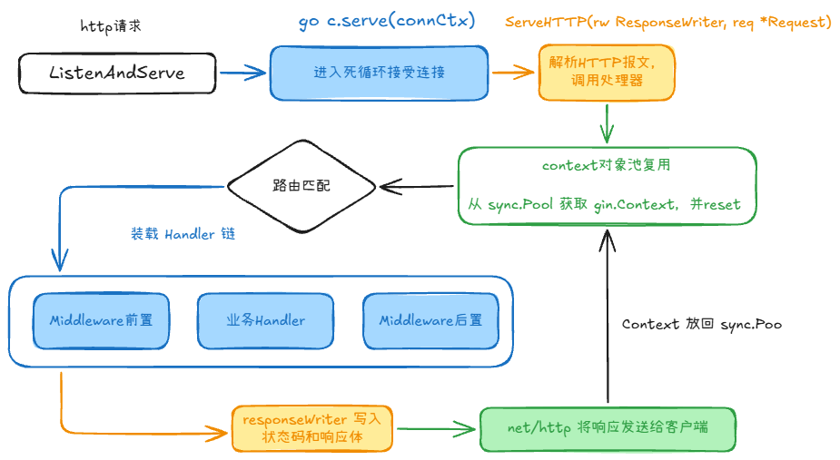

## gin/beego/echo 框架对比 +2

Gin简洁，性能好，按需引入工具

Beego是一个 MVC 框架，自带 ORM、日志、缓存等，适合中大型系统，新项目很少选 Beego

Echo和Gin差不多，在设计上其实比 Gin 还要精致一些，API 设计更符合直觉，但社区活跃度少

Fiber 是基于 Go 社区大名鼎鼎的 valyala/fasthttp 重新重写了底层的 HTTP 协议栈，舍弃了与标准库 net/http 的兼容性

### 选择

1. 写 API、写微服务、找工作、求稳： 闭眼选 Gin。它是行业的绝对标杆，面试出镜率 95% 以上。
2. 写企业级中后台管理系统、喜欢全家桶、快速开发单体项目： 选 Beego（或 Go-Zero / Layotto）。
3. 追求极致性能、想写高性能网关或高并发 API、且熟悉 Node.js： 尝试 Fiber。

## 一次请求进入 Gin 框架后的完整处理流程是什么 +2

一次请求进入 Gin 框架后，会依次经历 **底层网络接收 → Context 对象池复用 → Radix 树路由匹配 → 洋葱模型执行链 → 响应写入 → Context 回收** 6 个核心阶段。

### 全流程执行架构图



### 1. 底层接收阶段（`net/http` 监听）

1. 客户端发起 HTTP 请求，Go 标准库 `net/http` 的 `ListenAndServe` 监听并接收连接。
2. `net/http` 使用 Goroutine 处理连接，解析 HTTP 报文并生成 `*http.Request` 和 `http.ResponseWriter`。
3. 随后调用 Gin 的入口方法 `Engine.ServeHTTP(w, r)`，因为 `gin.Engine` 实现了 `http.Handler` 接口。

### 2. Context 对象池分配（`sync.Pool`）

为了避免高并发场景下频繁创建对象带来的内存分配和 GC 压力，`Engine.ServeHTTP` 会：

1. 从 Gin 内部维护的 `sync.Pool` 中获取一个可复用的 `gin.Context`。
2. 绑定本次请求的 `http.ResponseWriter` 和 `*http.Request`。
3. 执行 `c.reset()`，重置 `handlers`、`Params`、`Keys`、执行下标等上一次请求遗留的状态。

### 3. 路由匹配与 Handler 链装载（Radix Tree）

Gin 为不同的 HTTP Method（如 `GET`、`POST`）分别维护一棵 **Radix Tree（压缩前缀树）**：

1. **寻找节点**：根据请求的 Method 选择路由树，再根据 Path 查找匹配节点。
2. **解析参数**：如果路由包含动态路径，例如 `/user/:id` 或 `/files/*filepath`，则提取参数并存入 `c.Params`。
3. **装载执行链**：匹配节点中已经保存了注册路由时合并好的 Handler 链，包括全局中间件、路由组中间件和最终业务 Handler；匹配成功后将其赋给 `c.handlers`。
4. **处理异常路径**：未找到路由时，执行 `NoRoute`（404）处理链；开启 `HandleMethodNotAllowed` 且存在其他 Method 的同路径路由时，可执行 `NoMethod`（405）处理链。

### 4. 中间件与 Handler 执行（`c.Next()` 洋葱模型）

Gin 将 `c.index` 初始化为 `-1`，然后从第一个 Handler 开始执行。中间件可以通过 `c.Next()` 继续执行剩余的 Handler：

```go
func (c *Context) Next() {
    c.index++
    for c.index < int8(len(c.handlers)) {
        c.handlers[c.index](c)
        c.index++
    }
}
```

- **前置逻辑**：按照注册顺序执行各中间件中 `c.Next()` 之前的代码。
- **业务逻辑**：执行 Handler 链末端的业务 Handler。
- **后置逻辑**：业务 Handler 返回后，沿调用栈逆序执行各中间件中 `c.Next()` 之后的代码，例如记录耗时和访问日志。
- **中断执行链**：中间件调用 `c.Abort()` 后，`c.index` 会被设置为 `abortIndex`，尚未执行的 Handler 将被跳过；但当前 Handler 中 `Abort()` 后面的普通代码仍会继续执行，除非显式 `return`。

### 5. 响应处理与数据写入

1. 业务 Handler 或中间件调用 `c.JSON()`、`c.String()`、`c.Protobuf()` 等方法生成响应。
2. Gin 使用自定义的 `responseWriter` 包装原生 `http.ResponseWriter`，在写入过程中记录响应状态码和响应体大小。
3. Gin 将数据写入底层 `http.ResponseWriter`，最终由 `net/http` 通过网络连接发送给客户端；需要流式响应时可以显式调用 `Flush()`。

### 6. Context 回收阶段

1. Handler 链执行完毕后，控制权回到 `Engine.ServeHTTP`。
2. Gin 将当前 `gin.Context` 放回 `sync.Pool`，等待后续请求复用。
3. 下一次从池中取出该 Context 时，会再次执行 `c.reset()` 清除请求级状态。因此不能在请求结束后继续持有或使用原始 `gin.Context`；如果需要在 Goroutine 中读取数据，应使用 `c.Copy()` 创建只读副本。

## gin路由 +2


内部结构是字典树，查找次数只和路由长度有关，和个数无关：
1. root：根节点
2. static：静态节点，默认类型，路由 /user、/home 中的 user 和 home 部分。
3. param：参数节点，对应路由中的 :id 这种形式。
4. catchAll：通配符节点，对应路由中的 *path 这种形式。必须位于路径末尾。

## gin参数检验 +1

Gin 内置了 `go-playground/validator`，通过在结构体上打 `binding` 标签即可实现自动校验。

```go
type User struct {
    Username string `json:"username" binding:"required,min=3"`
    Email    string `json:"email" binding:"required,email"`
}
```

`required` 的本质是检查字段是否为 **Go 类型的零值**。

- **String**: `""` 报错。
- **Integer**: `0` 报错（如果你想允许用户传 0，请使用 `*int` 指针）。
- **Boolean**: `false` 报错（如果你想允许用户传 false，请使用 `*bool` 指针）。
- **Slice/Map**: 长度为 0 报错。

**最佳实践**：
对于可选字段，使用 `binding:"omitempty"`；
对于必填但可能为 0 或 false 的基础类型，务必使用 **指针** 形式。

### 如何拦截纯空格输入？

有时候 `required` 无法拦截纯空格字符串，我们可以注册自定义校验函数。

```go
func InitValidator() {
    if v, ok := binding.Validator.Engine().(*validator.Validate); ok {
        // 注册名为 "notblank" 的自定义校验规则
        v.RegisterValidation("notblank", func(fl validator.FieldLevel) bool {
            // 将字符串两端的空格去掉后，判断长度是否大于 0
            return strings.TrimSpace(fl.Field().String()) != ""
        })
    }
}

// 使用方式：binding:"required,notblank"
type UserRequest struct {
    // 同时使用 required（保证传了字段）和 notblank（保证不是纯空格）
    Nickname string `json:"nickname" binding:"required,notblank"`
}

// 注意：必须手动调用一次 InitValidator()，后续具体的校验过程是自动的
InitValidator()
```

## 优雅退出 +1

1. 将Gin路由挂载到标准的http.Server
2. 在一个独立的 Goroutine 中启动 Web 服务:srv.ListenAndServe()
3. 创建一个通道，用来接收系统退出信号
4. 监听特定的系统信号:signal.Notify(quit, syscall.SIGINT, syscall.SIGTERM)
5. 阻塞等待信号
6. 调用 srv.Shutdown 优雅关闭

## gin.Context 和 context.Context 的区别

1. 本质与定位：HTTP 业务上下文，处理 Request/Response；请求链路传递信号与元数据
2. 核心职责：获取路由参数、Body 解析、设置 Header、响应 JSON/HTML、控制中间件执行流（Next()/Abort()；
3. 生命周期：短生命周期，随单个 HTTP 请求建立而创建，请求结束立即销毁/回收；可跨协程/跨层级，由开发者显式创建和控制撤销
4. 对象池复用：是（Gin 底层基于 sync.Pool 复用 gin.Context 实例）；否（按需创建，不可复用）
5. 并发安全性：非线程安全，严禁直接跨协程共享；线程安全，支持多个 Goroutine 并发读取
