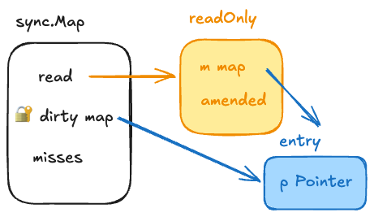
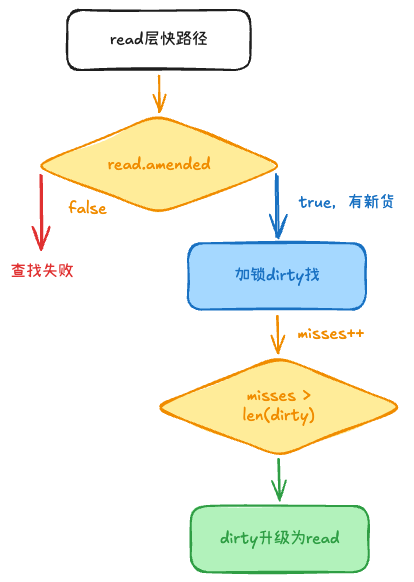
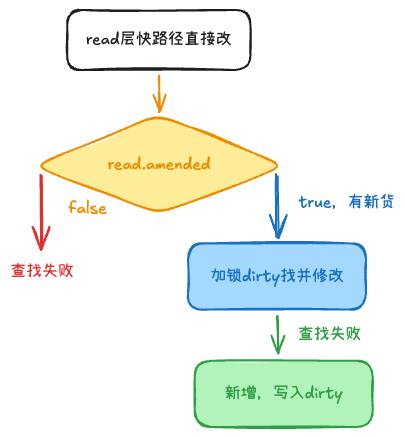

## sync.Map最佳实践、优化手段 +1

1. 用于多读少写、每个 goroutine 维护自己的 key的情况
2. 用LoadOrStore、LoadAndDelete、CAS系列方法，避免并发冲突
    - 比如热路径上，先load判断再store，中间可能被插队
3. 热路径少 Range、少 Delete
    - Range 要遍历全表，实现里通常会长时间持锁，阻塞其它读写
4. 大 value 用指针
    - sync.Map的类型是interface{}，所以大值会拷贝，增加成本

## 结构



```go
type Map struct {
	mu Mutex            // 互斥锁，用来保护 dirty 树的写操作
	read atomic.Value   // 💡 只读数据层（核心安全区），存的是 readOnly 结构体
	dirty map[any]*entry // 💡 脏数据层（写缓冲层），一个原生的 Go map
	misses int          // 计数器，记录从 read 穿透到 dirty 的次数
}
```
我们可以把这两个核心层画成一张逻辑卡片：

### 1. `read` 层（只读无锁区）

* **类型：** `atomic.Value`，底层包装了一个 `readOnly` 结构体。
* **特点：** **完全无锁**。对它的读取和部分更新操作全都是通过 `sync/atomic` 包的原子操作完成的，速度达到了极致（跟普通指针操作一样快）。
* **内部结构：**
```go
type readOnly struct {
    m       map[any]*entry
    amended bool // 标记位：如果 dirty 里面有 read 没有的新 key，它就为 true
}
```

### 2. `dirty` 层（脏数据写区）

* **类型：** 原生 `map[any]*entry`。
* **特点：** **有锁保护**。所有的**新增 Key** 都会优先写入这里。操作这里必须先抢上面的 `mu` 锁。

### 3. 指针纽带：`*entry`

无论是 `read` 还是 `dirty`，它们内部的原生 map 存的 **Value 并不是真实的数据，而是一个指向 `entry` 结构体的指针**：

```go
type entry struct {
	p unsafe.Pointer // 指向真正业务数据的指针
}

```

由于两边存的都是同一个 `*entry` 指针，这就意味着：**如果一个 Key 同时存在于 `read` 和 `dirty` 中，只要通过原子操作修改 `entry.p`，两边的数据会瞬间同步，不需要加锁！**

---

## 🔄 核心数据流转（增删改查）

### 1. 查 (Load)



* 优先去 `read` 层找，如果找到了，利用原子操作把数据读出来（无锁，极快）。
* 如果 `read` 没找到，且 `read.amended == true`（说明 dirty 里面有新货），那就加锁，去 `dirty` 里找。
* **穿透计数 (`misses`)：** 只要去 `dirty` 找了一次，`misses` 计数器就 `+1`。当 `misses` 的数量**大于或等于 `dirty` 的长度**时，就会触发“脏数据晋升”：直接把 `dirty` 升级为 `read` 层，然后把旧 `dirty` 置为空，`misses` 清零。

### 2. 增/改 (Store)



* 如果这个 Key 在 `read` 里**已经存在**了，且没有被标记为删除，直接通过 `atomic` 强行修改 `entry.p` 的指针（无锁更新）。
* 如果 `read` 里没有，或者被删了，那就加锁进入 Slow Path：
* 去 `dirty` 里找，找到了就修改 `dirty`。
* 如果 `dirty` 里也没有，说明是**纯新增的 Key**，直接写入 `dirty`，并把 `read.amended` 设为 `true`。

### 3. 删 (Delete)

* `sync.Map` 的删除非常温柔，叫**软删除（Lazy Delete）**。
* 如果 Key 在 `read` 里，它连锁都不加，直接用原子操作把 `entry.p` 指针置为 **`nil`**（或者是专门的删除标记 `expunged`）。
* 真正的硬物理删除，会等到下一次 `dirty` 被晋升清空、或者重新从 `read` 复制构建 `dirty` 的时候才会彻底被刷掉。

