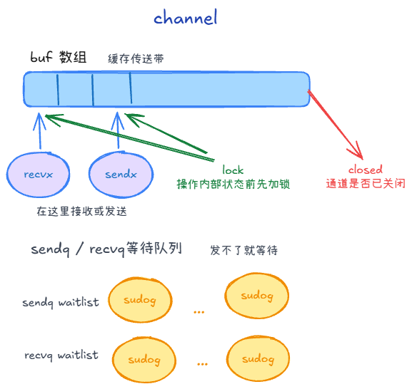
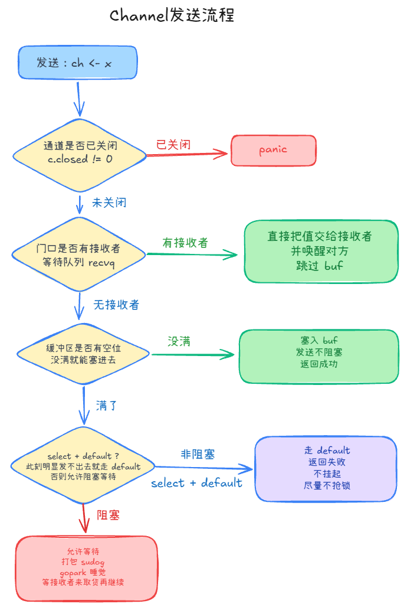
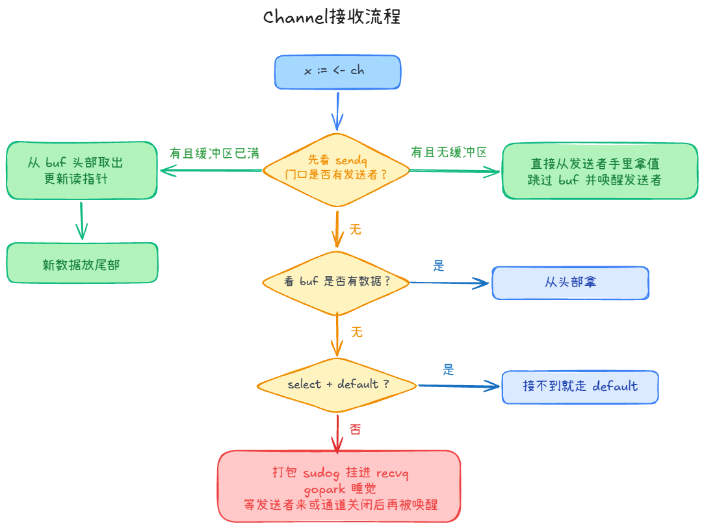
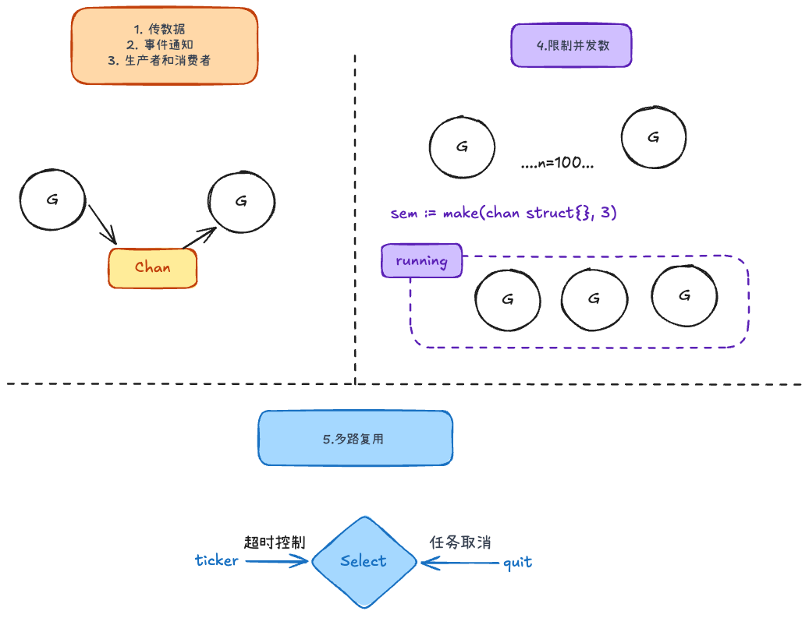
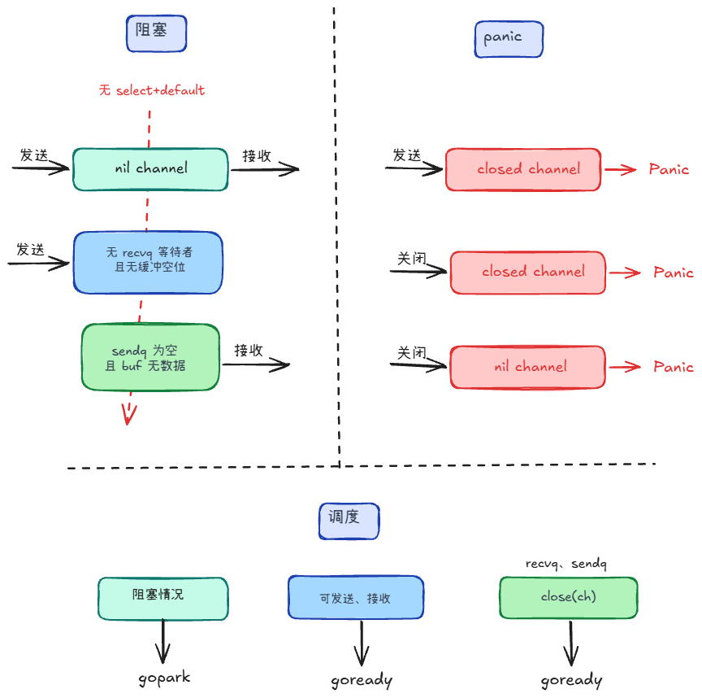

## Channel的结构 +3

可以把 `channel` 想成一个“带缓冲的传送带”：

- `buf`数组：如果 channel 有缓冲，它就是传送带本体（满了/空了就会影响发送/接收能不能立刻完成）。
- 读写位置：通过 `sendx/recvx` 这些指针在传送带上“循环走”（走到头会绕回去）。
- `lock`：每次操作通道内部状态（比如改指针、改计数）前先加锁，防止并发把结构弄乱。
- 等待队列：当“送不进去/拿不到货”时，就把等着的人挂到 `sendq/recvq` 里；每个等待者用 `sudog` 这个小包表示。
- `closed`：通道有没有被关闭（关闭后发送会 panic，接收则通过 `ok=false` 告诉你没数据了）。




## 发送和接收 +2

### 发送



1. **先判断通道是否已经关闭**：如果 `ch` 已关闭，你继续发送就会立刻 panic。
2. 通道没关之后，再**看有没有接收者**在门口等（等待队列 `recvq`）：
   - 有：直接把值交给接收者（跳过 `buf`），并唤醒对方。
   - 没有：再看缓冲区有没有空位（没满的话就能塞进去）。
3. 最后才**区分“非阻塞”还是“阻塞”**：
   - 非阻塞（`select + default`）：如果此刻明显发不出去（例如通道满了、或无法立刻完成），就直接返回“失败”，让 `select` 走 `default`，不会把当前 goroutine 挂起、也尽量不去抢锁。
   - 阻塞：如果你允许等（没有 `default` 兜底），而且确实发不出去，就把当前 goroutine 打包成 `sudog`，挂到 `sendq` 上，然后 `gopark` 睡觉；等接收者来取货，再被唤醒继续把值送出去。

### 接收



1. 先看有没有**等待发送者**（队列 `sendq`）：
   - 有：
     - **无缓冲 channel**：从发送者直接交接值（不经过 `buf`），再唤醒发送者。
     - **有缓冲且缓冲区已满**：发送者是因为 `buf` 满了才睡在 `sendq` 里。接收方会先从 `buf` **头部**取出一个元素（腾出位置），再把发送者要发的值 **拷贝进 `buf` 尾部**，然后唤醒发送者。
   - 没有：再看缓冲区有没有数据（`buf` 里是否有货）。
2. 有货：从 `buf` 头部取出，并更新读指针。
3. 没货：
   - 非阻塞（`select + default`）：立刻返回“接不到”，让 `select` 走 `default`。
   - 阻塞：把当前 goroutine 打包成 `sudog`，挂进 `recvq`，然后 `gopark` 睡觉；等有发送者来送值，或通道关闭后再被唤醒。

接收不会 panic。

## 使用场景 +2



1. 数据传递：两个协程之间传数据
2. 事件通知：等待某个任务完成
3. 生产者 / 消费者：是持续的，不是一次；生产、消费速度可能不一样
```go
producer -> channel -> consumer，用 WaitGroup 等待结束，生产完 close(ch)。
```

4. 限制并发数
```go
sem := make(chan struct{}, 3)

for i := 0; i < 10; i++ {
    sem <- struct{}{} // acquire
    go func(i int) {
        defer func() { <-sem }() // release
        fmt.Println(i)
        time.Sleep(time.Second)
    }(i)
}
```

5. 多路复用与超时控制
```go
ticker := time.NewTicker(time.Second)
defer ticker.Stop()

for {
    select {
    case <-ticker.C:
        fmt.Println("tick")
    case <-quit:
        return
    }
}
```

6. 任务取消：用“关闭一个 channel”来把取消通知广播给一堆正在工作的 goroutine
```go
done := make(chan struct{}) // 取消信号

go func() {
    for {
        select {
        case <-done:
            return // 收到取消：立刻退出
        default:
            // 做自己的工作
        }
    }
}()
```
## 关闭 +2

在锁内把 `recvq`、`sendq` 里挂着的 G 全部摘出放入列表，**解锁后**再逐个 `goready`

**如何避免向已关闭 Channel 发送？**

- 只有发送方（生产者）负责 close(ch)，接收方只读，不要关数据 channel。
- 在「确定不会再发送」之后再 close：例如生产协程发完所有任务、消费者都处理完，由生产者 close。

**向已关闭 Channel 接收会怎么样**

向已关闭的 Channel 接收不会 panic。

- 缓冲里还有数据 → 正常读出，ok == true；
- 数据读完后 → 立刻返回该类型的零值，ok == false，不会一直阻塞。

**如何判断 Channel 已经关闭**

- 接收方用 v, ok := <-ch，ok == false 表示 Channel 已关闭且没有更多数据
- 用 for range 读完后循环结束


## 常见情况 +2



### 阻塞
- 在 **nil channel 上发送和接收**，并且没有select+default，就会进入阻塞流程：
- **发送**：源码会先确认通道没关闭，然后如果门口没有等待接收者（`recvq` 没人），同时缓冲条件也不满足（无缓冲等价于“没人接收”，有缓冲则是 `buf` 满了），就阻塞。
- **接收**：同理，如果此刻拿不到（门口没有等待发送者：`sendq` 为空，且缓冲里也没有数据：`buf` 为空），就阻塞

### panic
- panic 主要发生在“向已关闭通道发送”的场景里：当你执行 `ch <- x` 时，源码会在加锁后检查 `c.closed != 0`，如果发现通道已经关闭，就直接 `panic("send on closed channel")`，不会走等待队列。
- 关闭未初始化的channel，关闭已关闭的通道也会panic

### 调度
**发送、接收**
- `ch == nil` 且本次必须阻塞：`gopark`，会一直睡下去。
- 发送的时候可能会对接收者 `goready`，反之亦然
- 发不出去或接不到，且允许阻塞：入队列后 `gopark`。

**close(ch)**  
在锁内把 `recvq`、`sendq` 里挂着的 G 全部摘出放入列表，**解锁后**再逐个 `goready`

