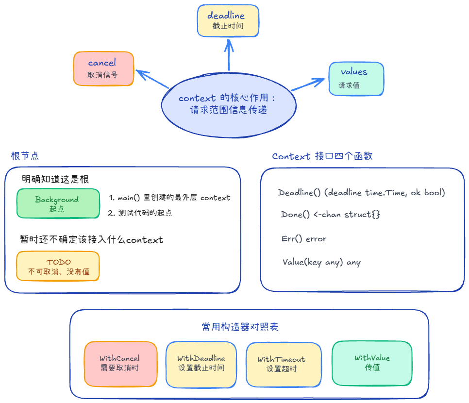
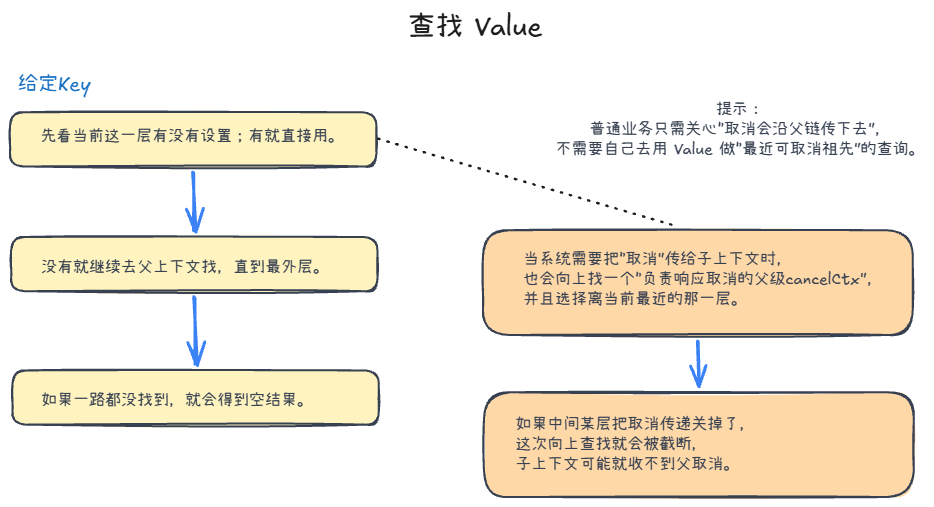
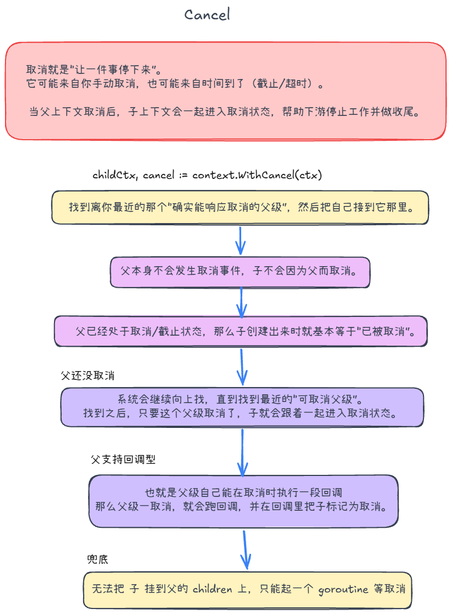

## 概念 +2



### 作用 +2
传递参数、取消信号、定时器和超时器

### 接口
| 方法 | 语义 |
|---|---|
| `Deadline() (t, ok)` | 是否设置截止时间；到点应该取消 |
| `Done() <-chan struct{}` | 只读取消通道：取消时会被 close |
| `Err() error` | 被取消后的原因（如 `context.Canceled` / `context.DeadlineExceeded`） |
| `Value(key any) any` | 从当前 context 及其父链向上查找对应 value；找不到返回 `nil` |


## 超时信号、定时器 +1

要求这个函数必须在100ms内返回，我们可以使用context的WithTimeout功能。使用缓冲区大于1的channel来接收成果。
在select里面，可以监听channel和context的Done()信号。如果超时，返回超时错误。

> WithTimout源码也是调用WithDeadline来实现的，里面有用time.AfterFunc

```go
func MyStrictService(parentCtx context.Context, params string) (string, error) {
	// 1. 在 Service 层设置 100ms 的硬性超时
	ctx, cancel := context.WithTimeout(parentCtx, 100*time.Millisecond)
	defer cancel() // 严防定时器泄露

	// 2. 关键：必须使用【带缓冲区】的 Channel 接收结果，容量设为 1
	resChan := make(chan string, 1)
	errChan := make(chan error, 1)

	// 3. 将真正的耗时业务丢进子协程异步执行
	go func() {
		// 传递当前的 ctx 给底层的业务
		result, err := doRealHeavyWork(ctx, params)
		if err != nil {
			errChan <- err
			return
		}
		resChan <- result
	}()

	// 4. 使用 select 进行生死竞速
	select {
	case result := <-resChan:
		// 场景 A：100ms 内成功拿到了结果
		return result, nil

	case err := <-errChan:
		// 场景 B：100ms 内业务自己报错了（比如数据库报错）
		return "", err

	case <-ctx.Done():
		// 场景 C：时间到了（100ms已过），业务还没干完！
		// 此时 ctx.Done() 会被关闭，我们立刻给前端返回超时错误
		return "", fmt.Errorf("服务接口响应超时(100ms): %w", ctx.Err())
	}
}

// 模拟真实的耗时业务（比如查数据库或调第三方接口）
func doRealHeavyWork(ctx context.Context, params string) (string, error) {
	// 如果你使用了 GORM，必须把 ctx 传给它：
	// db.WithContext(ctx).Find(&user)
	
	// 如果你使用了 http.Client，也必须传 ctx：
	// http.NewRequestWithContext(ctx, "GET", ...)

	time.Sleep(150 * time.Millisecond) // 模拟一个需要 150ms 的慢操作
	return "success_data", nil
}
```

**为什么 resChan 必须是带缓冲的**

防止GoRoutine泄漏，如果是无缓冲，那么超时之后，函数退出，就没有人监听这个Channel了。当我完成工作后，发现没人在读，就会阻塞

而带缓冲，我们直接放缓冲区里即可，协程安全销毁，不会泄露。

## value +2

### 存些什么值？ +1

适合传「整次请求、多层都要用」的鉴权/trace 这类**元数据**

不适合业务参数——因为 Value 要链式查找、返回 any 还得断言，隐式、难读、难测，业务输入应走函数参数。

### 查找 Value +1



先找自己，再往父找

## 取消 Cancel +1



先取消父，再到子
