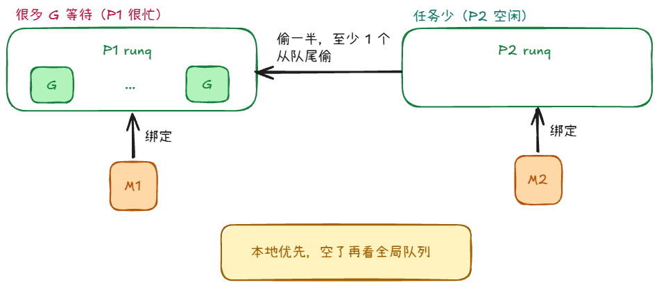
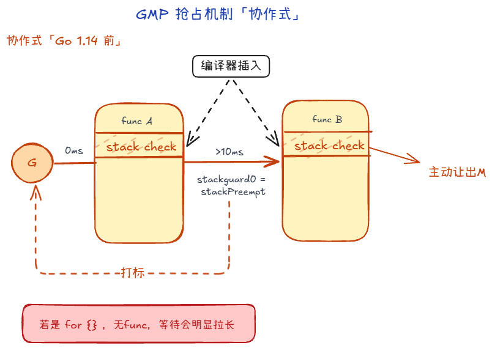
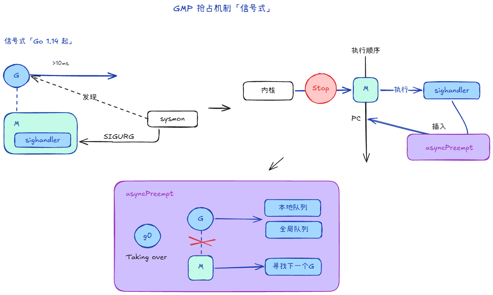
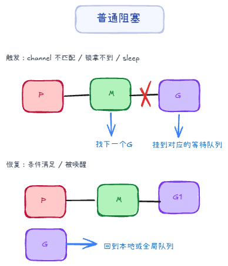
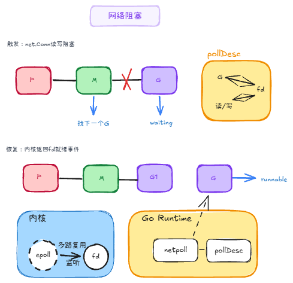
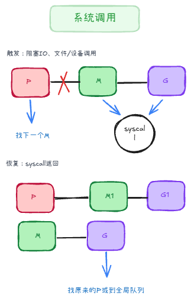

## 调度结构 +999


Think of GMP in one sentence: **M is the worker, G is the task, P is the workstation and resource package, and schedt is global scheduling hub.**



GMP 可以先理解成一句话：**M 是工人，G 是任务，P 是工位与资源包，schedt 是全局调度中心。**



### 1. G：真正要跑的任务 +1



`G` (goroutine) is essentially a "schedulable execute unit" that carries two kinds of information:

1. **Execution context**: stack, PC, SP, context (enough to resume where it left off).
2. **Scheduling state**: is it runnable, running, waiting, or blocked in a system call?

From an application code perspective, G is the task you spawn with `go func(){...}`.
From the runtime's perspective, G is an execution snapshot that can be suspended, resumed, and migrated.



`G`（goroutine）本质是“可调度的执行单元”，它同时带着两类信息：

1. **执行现场**：栈、PC、SP、上下文等（切回来能接着跑）。
2. **调度状态**：它现在是可运行、运行中、等待中，还是在系统调用中。

从写业务的角度，G 就是你 `go func(){...}` 出来的那个任务。
从 runtime 角度，G 是一份“可挂起、可恢复、可迁移”的执行快照。



### 2. M：真正干活的内核线程



`M` (machine) is an OS thread. It is what actually runs a G on the CPU:

1. Each M has `g0` (a dedicated scheduler stack) and `curg` (the current user goroutine).
2. M also holds pointers related to P: the current P it is bound to, `nextp` for the P it is about to bind (to avoid races when grabbing a P), and `oldp` for the P it held before entering a system call.

Think of `g0` as a backstage workbench: scheduling, switching, and other runtime work happen here so they do not pollute the user G's stack.



`M`（machine）就是操作系统线程，它负责把 G 真正跑在 CPU 上：

1. 每个 M 有 `g0`（调度专用栈）和 `curg`（当前业务 G）。
2. M还存有P的指针，表示当前M绑定的P，`nextp`表示即将绑定的P（避免“抢 P 竞争”），`oldp`表示进系统调用前绑定的P。

可以把 `g0` 理解成“后台工作台”：调度、切换、运行时内部操作尽量在这里做，避免污染业务 G 的执行栈。



### 3. P：最容易被低估的角色



`P` (processor) is a resource manager: the logical bundle of runtime resources needed to run goroutines.

Most importantly, it owns the local run queue:
- `runnext`: the high-priority next-run slot.
- `runq`: the regular local queue (**256 slots; most accesses are lock-free**).

It also caches resources such as:
- `gFree`: reusable goroutine objects.
- `mcache`: small-object allocation cache.
- `pcache`: page-level cache.



`P`（processor）是资源管理器，是运行 goroutine 需要的一组逻辑资源。

最关键的是它管理了本地运行队列：

- `runnext`：下一跳优先执行位（“插队位”）。
- `runq`：本地普通队列。（**固定长度 256，多数访问无锁**）

还有一些缓存，比如：
- `gFree`：可复用的 G 缓存池。
- `mcache`：小对象缓存。
- `pcache`：页级缓存。



### 4. schedt：全局调度中心



Think of `schedt` as the central control room. It mainly holds globally shared resources:

- **global runnable G queue**
- **idle M and P lists**

It comes into play when a local queue is not enough, or when the runtime needs global coordination (for example, waking more worker threads).



可以把 `schedt` 看成“总控室”，它主要存全局共享资源：

- **全局可运行 G 队列**
- **空闲 M、P 列表**

当本地队列不够用，或者需要全局协调（比如唤醒更多工作线程），都会走到这个层面。



### 5. 其它



**Global private variables**

1. `m0`:
   - The **initial M** at program startup (the runtime thread backing the main OS thread).
   - It is not the only M, just the first; the runtime creates more Ms as needed.

2. `g0`:
   - Scheduling switches and runtime work on the system stack (e.g. entering the scheduler via `mcall`) usually run on `g0`.
   - The familiar `m0.g0` is the first pair at startup; each new M also gets its own `g0`.

**How G, M, and P work together**

1. An M must bind to a P before it can run user Gs.
2. With a P in hand, it first looks in that P's local queue.
3. If empty, it checks the global queue or steals work from another P.
4. When a G blocks, it yields; once woken, it is put back on a runnable queue.

One line to remember: **bind M to P, run Gs; local first, global fallback, steal to balance load.**



**全局私有变量**

1. `m0`：
   - 程序启动时的**初始 M**（主线程对应的 runtime 线程）。
   - 它不是“唯一的 M”，只是第一个 M；后续 runtime 会按需创建更多 M。

2. `g0`：
   - 调度切换、系统栈上的 runtime 操作（如 `mcall` 进入调度路径）通常在 `g0` 上完成。
   - 常说的“`m0.g0`”是启动阶段最先出现的那对；后续新建的 M 也各自有自己的 `g0`。

**GMP 关系**

1. M 必须先拿到一个 P，才有资格执行 G。
2. 拿到 P 后，优先从 P 的本地队列找 G。
3. 本地没有，再看全局队列，或者去别的 P 那里偷任务。
4. G 阻塞时会让出执行机会，等待被唤醒后重新入队。

如果只记一句：**“M-P 绑定后跑 G，本地优先，全球兜底，窃取均衡。”**



## 抢占机制：防止一个 G 独占 CPU +4



Even with GMP, if a goroutine runs a tight loop or long computation without yielding the CPU, other goroutines can starve.

Go's preemption evolved in two stages:



即使有 GMP，如果某个 G 是长循环、长计算，不主动让出 CPU，其他 G 还是会饿。

Go 的抢占演进有两步：



### 协作式抢占（Go 1.14 前）



1. The compiler secretly inserts a few lines of assembly on the stack-check path at function entry. This is called `stack check`.
2. If the scheduler finds G1 has run too long (for example, **10ms**), it marks G1: `stackguard0 = stackPreempt`.
3. G1 keeps running until the next function call, where that inserted `stack check` runs.
4. The check sees G1 should not keep running, so G1 voluntarily calls `runtime.goschedImpl`, steps aside, and yields the M.

The catch: a tight loop like `for {}` with no function calls is hard to preempt in time.



1. 编译器会在**函数入口相关的栈检查路径**偷偷插入几行汇编代码，叫 `stack check`
2. 调度器发现 G1 跑了太久（比如 **10ms**），就给这个 G1 打个标记：`stackguard0 = stackPreempt`
3. G1 继续跑，当它运行到下一个函数调用时，会执行那段秘密的 `stack check` 代码
4. G1 一看，内存检测发现我不该继续跑了，于是它会主动调用 `runtime.goschedImpl`，自己把自己搬下台，把 M 让出来

问题是：如果代码是 `for {}` 这种没有函数调用的死循环，它就不容易被及时抢占。



### 信号抢占（Go 1.14 起）



1. Go registers a `sighandler` on each M.
2. The sysmon monitor finds that a G on an M has run for more than 10ms without yielding, and sends that M the signal SIGURG.
3. As soon as the signal arrives, the OS kernel immediately pauses M1's current execution.
4. M1 is forced to run `sighandler`. There, the runtime patches M1's registers (PC, etc.) and injects a call to `asyncPreempt` at the current execution point.
5. When the kernel resumes M1, M1 still thinks it is continuing where it left off—but the first thing it executes is the injected `asyncPreempt`.
6. `asyncPreempt` uses `mcall` to switch to the g0 stack (the scheduler's dedicated backstage path). On g0, it runs `gopreempt_m`, preempts G1, and M1 goes on to run another G.



1. Go给 M 注册了一个 `sighandler`
2. 监控者（sysmon）发现 M 上的 G 运行超过 10ms 了，且这哥们一直没下台，向 M 发送一个信号：SIGURG。
3. 只要信号一到，**操作系统内核**会立刻暂停 M1 的当前工作。
4.  M1 会被迫跳转去执行 `sighandler`。在这个函数里，会直接操作 M1 的**寄存器（PC 等）**，在当前的执行位置强行塞进一个叫 `asyncPreempt` 的函数调用。
5. 当内核恢复 M1 的执行时，M1 以为自己还在接着刚才的代码跑，结果跑的第一行代码就是被塞进去的 `asyncPreempt`
6. `asyncPreempt` 会通过mcall切换到 g0 栈（这是 Go 调度器的专属后台通道）。在 g0 栈里，它运行 `gopreempt_m`，正式把 G1 踢走。M1 找 G2 干活去了。



## 阻塞与唤醒、网络 +3

#### 普通阻塞（G 级别）



**Trigger cases:** a channel send/receive cannot proceed, a lock is unavailable, `time.Sleep` is waiting for its timer to fire, and so on.

**Flow:**
1. G waits for its condition to be satisfied.
2. M and P stay bound; the M runs another G.
3. Once the condition is met, the wait queue wakes G.
4. G is marked runnable and re-queued via `ready` / `runqput`.
5. The scheduler later picks it up in `findRunnable` and runs it.



**触发情况**：`channel` 收发对不上、锁拿不到、`time.Sleep` 等待计时器到期等。

**流程**
1. G 在等待条件满足
2. M 和 P 不解绑，继续去跑别的 G 
3. 条件满足后，等待队列会把该 G 唤醒
4. G 被标记回 runnable，通过 ready/runqput 回到可运行队列
5. 调度器后续在 findRunnable 取到它并继续执行



#### 网络阻塞



**Trigger cases:** when a `net.Conn` Read/Write runs and the kernel decides I/O is not ready yet, G enters a wait.

**Flow:**
1. G tries Read/Write and finds it cannot proceed yet.
2. G parks and records the link among this G, the fd, and the interested event (read/write) in a `pollDesc`-like structure.
3. M runs another G.
4. The kernel reports fd readiness via epoll or similar.
5. `netpoll` handles the result, marks G runnable, and re-queues it locally or globally.
6. G is scheduled again, retries Read/Write, and this time completes the I/O with a system call.

**Additional notes:**
- **fd**: file descriptor; the OS uses it to identify an open resource. In networking, a socket maps to an fd.
- **pollDesc**: in the Go runtime, the wait object for an fd—tracking which G is waiting on it.
- **netpoll**: the runtime layer for network I/O readiness. It registers many fds with the OS multiplexer (mainly epoll on Linux, kqueue on macOS, different wrappers on Windows) and re-queues the matching G when the kernel says the fd is readable/writable.



**触发情况**：net.Conn 去 Read/Write 时，如果内核判断“现在还不能读/写”，G进入等待。

**流程**
1. G 在 Read/Write 里试了一下，发现现在搞不定
2. G 会进入等待，并把 「这个 G ↔ 这个 fd ↔ 关心的事件（读/写）」 记到 pollDesc 一类结构里
3. M 去跑别的 G 
4. 内核通过 epoll 等机制报告 fd 就绪
5. netpoll 处理结果，把 G 设回 runnable，返回本地或全局
6. 之后 G 再被调度，重试 Read/Write，这时再做系统调用把 I/O 做完

**补充知识**
- fd: file descriptor，文件描述符，是操作系统用来标识一个文件的抽象概念。在网络里，一个 socket 就对应一个 fd。
- pollDesc：Go runtime 里“某个 fd 的等待说明书/挂钩对象”，哪个 G 在等这个 fd
- netpoll：Go runtime 里负责「网络 I/O 就绪」的那一层，把很多个 fd 交给操作系统提供的 多路复用机制（Linux 上主要是 epoll，macOS 常见 kqueue，Windows 上有别的封装），在「内核说有 fd 可读了/可写了」时把 对应的 G 重新放进可运行队列



#### 系统调用阻塞（syscall 级别）



Trigger case:
A G enters a potentially long-blocking syscall, such as blocking I/O, file I/O, or a device syscall.

Flow:
1. The G calls a syscall from user code. Before entering the syscall, the runtime executes entersyscall.
2. The G changes its state from _Grunning to _Gsyscall.
3. The M executing this G enters the kernel and may block, so the runtime releases the P from this M before the syscall blocks.
4. The released P can then be acquired by another M to continue running other runnable Gs.
5. When the syscall returns, the runtime executes exitsyscall. The G first tries the fast path to acquire an available P immediately.
6. If it succeeds, the G continues execution in user mode.
7. If it cannot acquire a P, the G is changed to _Grunnable and put into the global run queue, waiting to be scheduled again.



触发场景：
当 G 执行可能阻塞较久的 syscall 时，例如阻塞文件 I/O、设备调用、某些系统调用等，当前执行它的 M 会随 G 一起陷入内核阻塞。

流程：
1. G 在用户代码中调用 syscall，runtime 在进入 syscall 前执行 entersyscall。
2. G 状态从 _Grunning 变为 _Gsyscall。
3. 当前 M 会释放绑定的 P，使这个 P 可以被其他 M 接管，继续调度其他 runnable G，避免因为一个阻塞 syscall 浪费 P。
4. syscall 返回后，runtime 走 exitsyscall 路径，G 会优先尝试快速重新获取一个可用的 P。
5. 如果获取 P 成功，G 继续执行用户代码。
6. 如果暂时获取不到 P，G 会被标记为 _Grunnable，并放入全局运行队列，等待后续调度。


