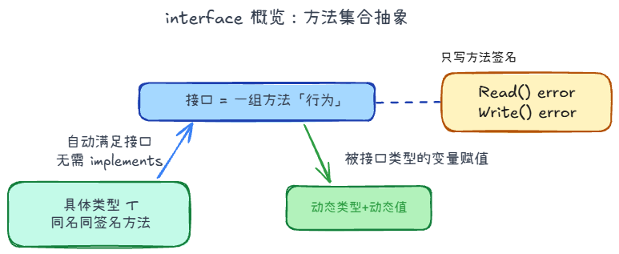

## interface +1



分为两种：

1. **空接口** `eface`：`(_type, data)`，比如`any` / `interface{}`
2. **非空接口** `iface`：`(itab, data)`，`itab` 含方法表 + 类型

### 接口 nil

在 Go 里，`error` 大致等价于下面这样的接口：

```go
type error interface {
	Error() string
}
```

结合 `error`，看清为什么 `err == nil` 有时会误判。

```go
type MyError struct{ msg string }

func (e *MyError) Error() string { return e.msg }

var e1 error
var p *MyError
var e2 error = p

fmt.Println(e1 == nil) // true：接口值「类型、值」都空
fmt.Println(e2 == nil) // false：动态类型已是 *MyError，只是 data 为 nil
```