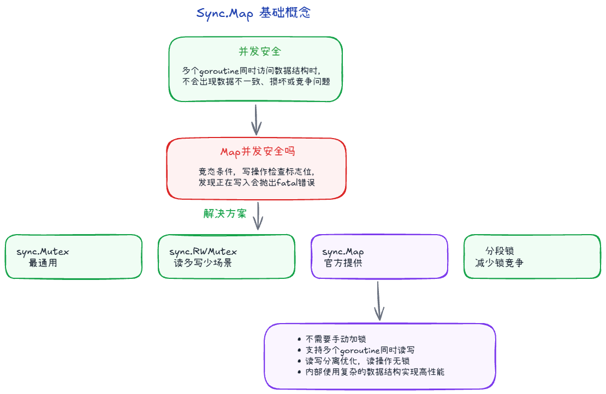
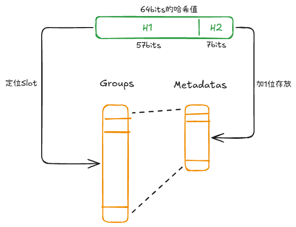
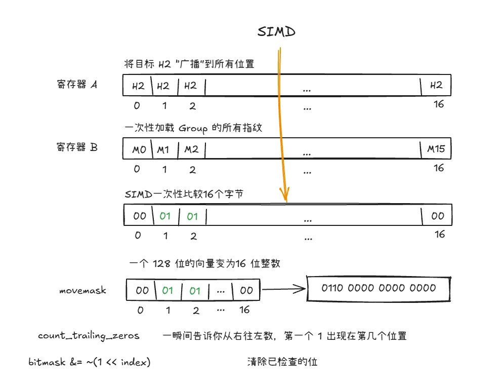
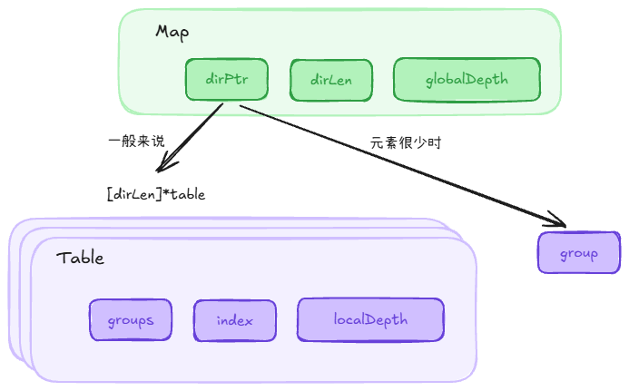
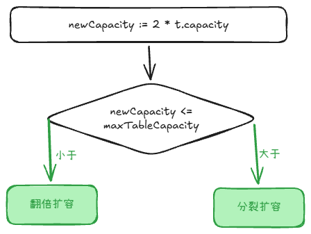
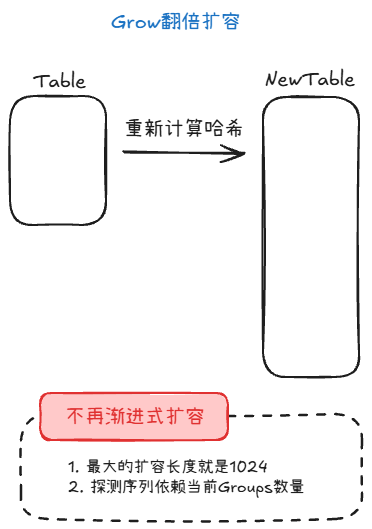
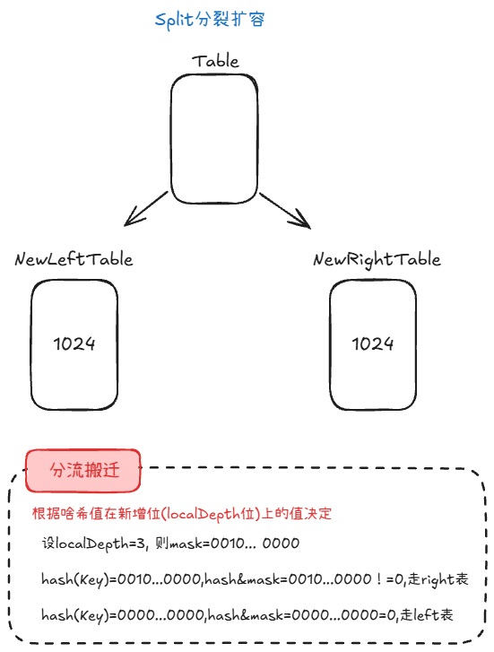
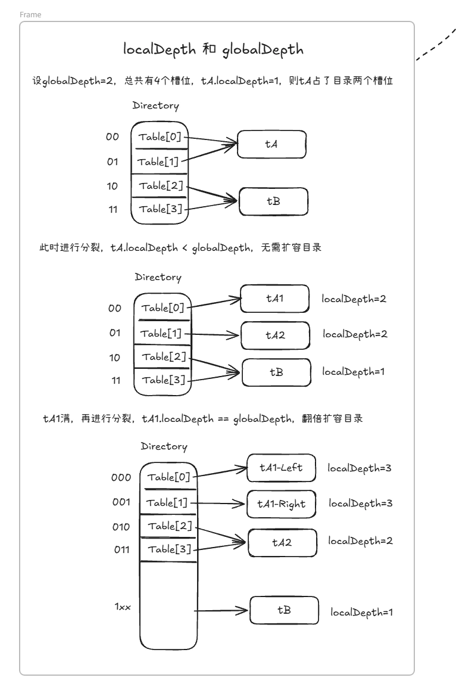

## 并发安全 +3

不是。有个标志位Writing。

操作之前会检查是否为1，为1则抛出fatal("concurrent map xxx")

concurrent map writes/concurrent map read and map write / concurrent map iteration and map write

解决方法有：

1. sync.Mutex
2. sync.RWMutex
3. sync.Map
4. 分段锁

> 分段锁：一个map分成多个段，每段各持有一个锁

## 结构 +2

为了进一步的优化性能、缓存命中率，Go从桶换成了SwissTable

### SwissTable

SwissTable就是一个map有多个group，内存连续排列，每个group有16个槽位，每个槽位有metadata与之对应。

其中hash值的高57位用于定位哪个group哪个slot，低7位+标志位存放到metadata里面。标志位有空、墓碑、满三种状态。

SwissTable最大的优势是SIMD，一条指令，同时处理多个数据。

1. CPU提供了向量寄存器，可以在一条指令中比较多个字节
2. 把 H2 广播到向量寄存器，和16个 metadata放到另一个寄存器
3. 一次比较，得到匹配槽位掩码

### Go Map 1.24

一个Map包含了多个SwissTable，方便单个扩容。

Map里包含dirPtr、dirLen以及globalDepth，其中dirPtr指向Table数组或单Group（数量小于8个的情况）。

Table里包含groups以及localDepth

> globalDepth是用多少位哈希定位槽；localDepth是用多少位哈希定位Table

## 扩容 +1

1. 判断

当前容量*2 <= 单表最大长度，也就是1024

大于，则分裂扩容；小于等于，则翻倍扩容

2. 翻倍扩容

生成一个两倍大的表，重新哈希迁移

不再渐进式扩容，因为：

- 数量最多512，一次性搬完可接受
- 没有nevacuate，查找逻辑用的是探测序列，而探测序列取决于 group 数量，扩容 group 数时，所有槽位必须按新探测序列重排，整张表必须一次性 grow。

3. 分裂扩容

生成两个最大长度的表，重新迁移

与新的localDepth位mask，结果0或1去不同的表

## 解决哈希冲突 +1

常用方法：

1. 链表法：如果冲突，就头插法插入链表里，插入删除简单，可能会造成O(n)查询；同时内存局部性利用率降低
2. 开放寻址法：如果冲突，就往下继续找，直到找到空位，内存局部性提高；更易扩容

还有：

- 再哈希法（rehash）：冲突时换一组哈希函数重新算位置。
- 公共溢出区（overflow area）：主表放不下时放到额外区域。
- Cuckoo Hashing（布谷鸟）：两个/多个哈希位置，冲突时“踢出”旧元素搬家。

## 删除删的是什么 +1

delete 立刻做的是逻辑删除和清空槽里的 key/elem；若 value 是指针，对应堆对象由 GC 回收。

同时还会看是否是探测序列结尾，如果是，置ctrlwords为空；如果不是，置为墓碑

> ctrlwords就是上文提到的metadata