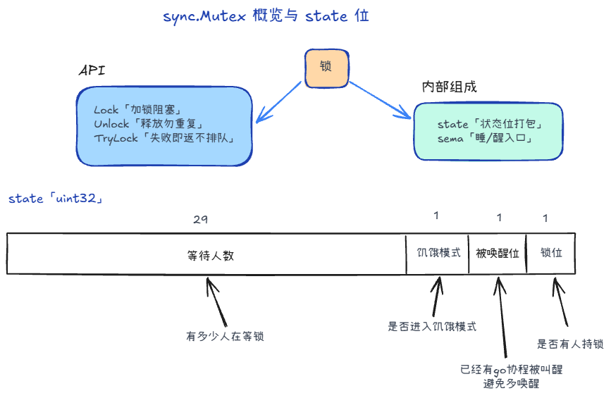
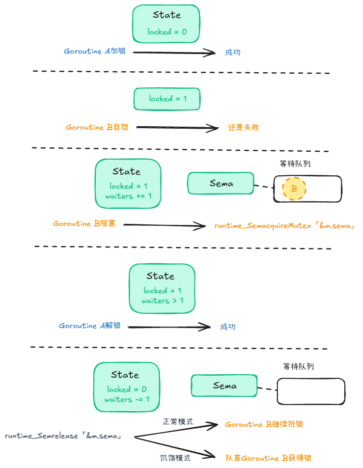

## 加锁解锁 +2

### Lock


1. **快路径**：没人持锁，我们直接 CAS 抢锁，成功直接返回。
2. **慢路径**（循环）：
   - **正常模式**下可 **自旋** 几轮。
   - 仍拿不到：在 `state` 里 **登记等待者 +1**，通过 **`sema` 睡眠**。
   - 被 `Unlock` 唤醒后 **回到循环再抢**（不保证醒来就拥有锁）。
   - 等待超过约 **1ms** 可能触发 **饥饿模式**（见下节）。

### Unlock


1. **快路径**：解锁；若 **没有等待者**，结束。
2. **慢路径**：有人在等 
   - 经 `sema` **唤醒** 或（饥饿模式下）**交给队首**。
   - 被叫醒的 goroutine 仍要在 `Lock` 慢路径里 **继续竞争**。

## 自旋 +1

**为什么要自旋**

降低调度成本：从运行队列摘下、进等待队列，再被 `Unlock` 唤醒、重新调度，有时比**多空转几轮**还贵。

**为什么不一直自旋**

一直自旋等于占着执行资源**干等**，浪费CPU；饿死同 P 上的其他 G；破坏公平，队尾可能长期抢不过新来的。

## 正常模式与饥饿模式 +1

- **正常模式**：等待者按队列排，但被 `Unlock()` 唤醒的不一定马上拿到锁，还要和**新来的 goroutine** 抢；若有人等太久（1ms），runtime 可能切入饥饿模式。
- **饥饿模式**：更偏向把锁**交给队首等待者**；新来的不占便宜（通常不自旋，排到队尾）；队列只有自己、队首等待时间回落后，会再切回正常模式。

## 结构 +1



```go
type Mutex struct {
	state int32
	sema  uint32
}

const (
	mutexLocked = 1 << iota // mutex is locked
	mutexWoken
	mutexStarving
	mutexWaiterShift = iota

	starvationThresholdNs = 1e6
)
```

`sync.Mutex` 主要由两块组成——

1. `state`：一个32位整数，里头同时塞了几种信息  
   - **`locked`（锁位）**：最低位，表示“这把锁现在有没有人占着”。  
   - **`woken`（被唤醒位）**：用来标记“已经有 goroutine 被叫醒/正处在交接链上”。  
     - 这样 `Unlock()` 在慢路径里就知道：有些人可能已经在路上了，不必重复唤醒更多人（避免无谓唤醒导致的抖动和尾延迟）。
   - **`starving`（饥饿位）**：表示 mutex 进入“饥饿模式”。  
   - **等待者计数（waiter count）**：其余高位存“当前大概有多少人在等这把锁”。  
     - `Unlock()` 用它判断：到底需不需要走唤醒逻辑，以及在某些慢路径里如何更新等待队列状态。
2. `sema`：运行时用的 **信号量**，runtime 用的「睡/醒」入口
   - Lock 抢不到且不能一直自旋时，通过它把 goroutine 挂起；
   - Unlock 发现有人在等时，通过它叫醒一个。

## sema到底是什么

辅助理解



1. 如果没有sema会怎么样？

如果不用 sema，当一个 Goroutine 发现锁已经被别人占了（state 显示已锁），它为了等锁，就只能写一个死循环

虽然一旦别人释放锁，它立马就能发现并抢到。但是太烧 CPU 了！如果前面的 Goroutine 要执行很久，后面的 Goroutine 就会疯狂空转，把 CPU 跑到 100%。

2. sema 的真正作用：拯救 CPU

为了不让等待的 Goroutine 白白浪费 CPU，Go 引入了 sema（Semaphore，信号量）。它的核心作用就是：让拿不到锁的 Goroutine 睡觉（阻塞），并在锁释放时被唤醒。

当一个 Goroutine 抢锁失败，并且不满足自旋条件时：

- 去 sema 排队：底层会把这个 Goroutine 挂到 sema 对应的等待队列里。
- 休眠：Go Runtime 会把这个 Goroutine 切换为阻塞状态，让出 CPU 给别人用（runtime_SemacquireMutex）。
- 唤醒：当占有锁的 Goroutine 释放锁时，它会通过 sema 释放一个信号，这会唤醒队列里最前面的那个 Goroutine。（runtime_Semrelease）