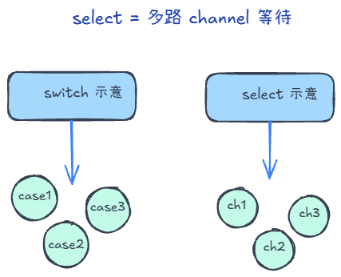
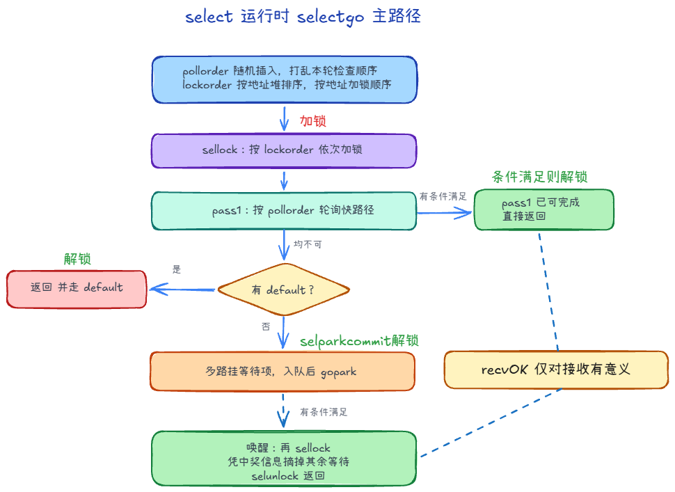

`select` 只用于 channel 的多路收发；与 `switch` 语法像，语义完全不同。

## 随机选择 +3

有多个channel时，select会随机选择一个channel进行处理。

### 为什么需要 pollorder 

**饿死与公平性**：若总是按固定顺序检查 case，长期可能让排在后面的 case 很少被轮到。runtime 用 pollorder 随机插入打乱本轮检查顺序，使各 case 在「先被尝试」上更均匀，减轻饥饿。

### 为什么需要 lockorder

加锁顺序：selectgo 按 lockorder 顺序加锁，**避免死锁**。同一 channel 连续出现时只加一次锁，避免重复加锁。

## 流程

辅助理解

