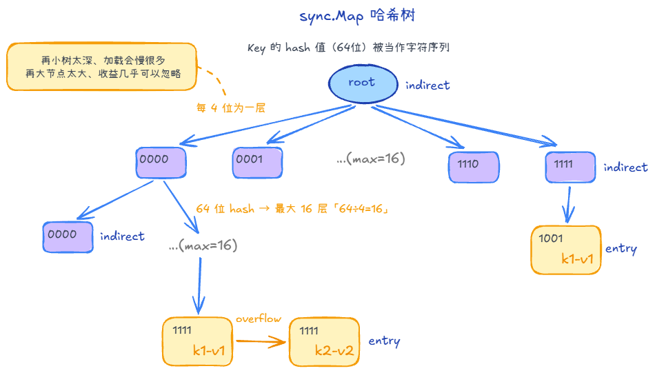

## sync.Map最佳实践、优化手段 +1

1. 用于多读少写、每个 goroutine 维护自己的 key的情况
2. 用LoadOrStore、LoadAndDelete、CAS系列方法，避免并发冲突
    - 比如热路径上，先load判断再store，中间可能被插队
3. 热路径少 Range、少 Delete
    - Range 要遍历全表，实现里通常会长时间持锁，阻塞其它读写
4. 大 value 用指针
    - sync.Map的类型是interface{}，所以大值会拷贝，增加成本

## 结构

辅助理解

