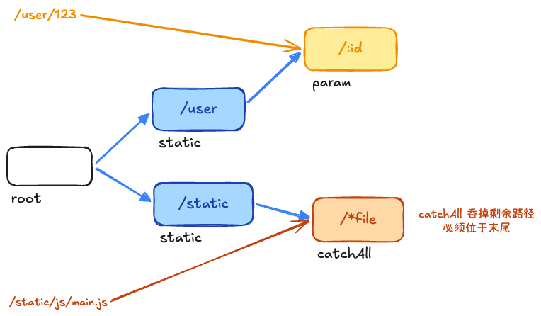

## gin路由 +2



内部结构是字典树，查找次数只和路由长度有关，和个数无关：
1. root：根节点
2. static：静态节点，默认类型，路由 /user、/home 中的 user 和 home 部分。
3. param：参数节点，对应路由中的 :id 这种形式。
4. catchAll：通配符节点，对应路由中的 *path 这种形式。必须位于路径末尾。

## gin/beego/echo 框架对比 +1

Gin简洁，性能好，按需引入工具

Beego是一个 MVC 框架，自带 ORM、日志、缓存等，适合中大型系统

Echo和Gin差不多，但社区活跃度少

## gin参数检验 +1

Gin 内置了 `go-playground/validator`，通过在结构体上打 `binding` 标签即可实现自动校验。

```go
type User struct {
    Username string `json:"username" binding:"required,min=3"`
    Email    string `json:"email" binding:"required,email"`
}
```

`required` 的本质是检查字段是否为 **Go 类型的零值**。

- **String**: `""` 报错。
- **Integer**: `0` 报错（如果你想允许用户传 0，请使用 `*int` 指针）。
- **Boolean**: `false` 报错（如果你想允许用户传 false，请使用 `*bool` 指针）。
- **Slice/Map**: 长度为 0 报错。

**最佳实践**：
对于可选字段，使用 `binding:"omitempty"`；
对于必填但可能为 0 或 false 的基础类型，务必使用 **指针** 形式。

### 如何拦截纯空格输入？

有时候 `required` 无法拦截纯空格字符串，我们可以注册自定义校验函数。

```go
func InitValidator() {
    if v, ok := binding.Validator.Engine().(*validator.Validate); ok {
        // 注册名为 "notblank" 的自定义校验规则
        v.RegisterValidation("notblank", func(fl validator.FieldLevel) bool {
            // 将字符串两端的空格去掉后，判断长度是否大于 0
            return strings.TrimSpace(fl.Field().String()) != ""
        })
    }
}

// 使用方式：binding:"required,notblank"
type UserRequest struct {
    // 同时使用 required（保证传了字段）和 notblank（保证不是纯空格）
    Nickname string `json:"nickname" binding:"required,notblank"`
}

// 注意：必须手动调用一次 InitValidator()，后续具体的校验过程是自动的
InitValidator()
```