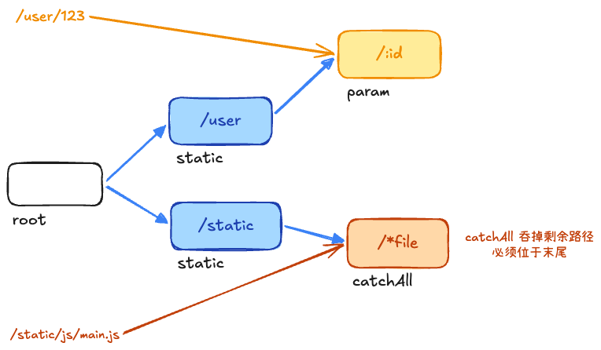

## gin路由 +2



内部结构是字典树，查找次数只和路由长度有关，和个数无关：
1. root：根节点
2. static：静态节点，默认类型，路由 /user、/home 中的 user 和 home 部分。
3. param：参数节点，对应路由中的 :id 这种形式。
4. catchAll：通配符节点，对应路由中的 *path 这种形式。必须位于路径末尾。

## gin/beego/echo 框架对比 +1

Gin简洁，性能好，按需引入工具

Beego是一个 MVC 框架，自带 ORM、日志、缓存等，适合中大型系统

Echo和Gin差不多，但社区活跃度少

## gin参数检验 +1

Gin 内置了 `go-playground/validator`，通过在结构体上打 `binding` 标签即可实现自动校验。

```go
type User struct {
    Username string `json:"username" binding:"required,min=3"`
    Email    string `json:"email" binding:"required,email"`
}
```

`required` 的本质是检查字段是否为 **Go 类型的零值**。

- **String**: `""` 报错。
- **Integer**: `0` 报错（如果你想允许用户传 0，请使用 `*int` 指针）。
- **Boolean**: `false` 报错（如果你想允许用户传 false，请使用 `*bool` 指针）。
- **Slice/Map**: 长度为 0 报错。

**最佳实践**：
对于可选字段，使用 `binding:"omitempty"`；
对于必填但可能为 0 或 false 的基础类型，务必使用 **指针** 形式。

### 如何拦截纯空格输入？

有时候 `required` 无法拦截纯空格字符串，我们可以注册自定义校验函数。

```go
func InitValidator() {
    if v, ok := binding.Validator.Engine().(*validator.Validate); ok {
        // 注册名为 "notblank" 的自定义校验规则
        v.RegisterValidation("notblank", func(fl validator.FieldLevel) bool {
            // 将字符串两端的空格去掉后，判断长度是否大于 0
            return strings.TrimSpace(fl.Field().String()) != ""
        })
    }
}

// 使用方式：binding:"required,notblank"
type UserRequest struct {
    // 同时使用 required（保证传了字段）和 notblank（保证不是纯空格）
    Nickname string `json:"nickname" binding:"required,notblank"`
}

// 注意：必须手动调用一次 InitValidator()，后续具体的校验过程是自动的
InitValidator()
```

## 优雅退出 +1

```go
func main() {
	router := gin.Default()

	// 模拟一个需要耗时处理的接口（比如大文件上传或 AI 识别）
	router.GET("/long-task", func(c *gin.Context) {
		time.Sleep(5 * time.Second) // 模拟处理 5 秒
		c.JSON(http.StatusOK, gin.H{"message": "任务成功完成！"})
	})

	// 1. 将 Gin 路由挂载到标准的 http.Server 中
	srv := &http.Server{
		Addr:    ":8080",
		Handler: router,
	}

	// 2. 必须在一个独立的 Goroutine 中启动 Web 服务！
	// 因为 srv.ListenAndServe() 是阻塞的，如果不放协程，后面的信号监听代码就无法执行
	go func() {
		log.Println("🚀 Web 服务器启动在 :8080...")
		if err := srv.ListenAndServe(); err != nil && err != http.ErrServerClosed {
			log.Fatalf("❌ 服务器启动失败: %s\n", err)
		}
	}()

	// 3. 创建一个通道，用来接收系统退出信号
	// 缓冲区设为 1，防止错过信号
	quit := make(chan os.Signal, 1)

	// 4. 监听特定的系统信号
	// syscall.SIGINT:  Ctrl+C 触发
	// syscall.SIGTERM: Docker/NAS 关机/执行 systemctl stop 时的退出信号
	signal.Notify(quit, syscall.SIGINT, syscall.SIGTERM)

	// 5. 阻塞等待信号。一旦收到信号，代码才会继续往下走
	sig := <-quit
	log.Printf("⚠️ 捕获到退出信号 [%v]，开始执行优雅关闭...\n", sig)

	// 6. 设置一个“清算缓冲时间”（Timeout）
	// 如果 10 秒内当前正在处理的请求还没跑完，就强行退出
	ctx, cancel := context.WithTimeout(context.Background(), 10*time.Second)
	defer cancel()

	// 7. 调用 srv.Shutdown 优雅关闭
	// 此时：a. 服务会立刻拒绝所有新来的连接
	//      b. 阻塞等待所有活跃连接（如那个 long-task）执行完毕，或者直到 ctx 超时
	if err := srv.Shutdown(ctx); err != nil {
		log.Fatal("❌ 服务器优雅关闭遭遇错误: ", err)
	}

	// 8. 释放其他核心资源（这一步极其关键！）
	log.Println("📦 正在断开数据库连接、保存缓存、关闭日志...")
	closeOtherResources()

	log.Println("✅ 服务器已安全退出，再见！")
}

func closeOtherResources() {
	// 在这里写你的清理逻辑：
	// - db.Close() 断开数据库
	// - rknnSession.Release() 释放NPU资源
	// - logger.Sync() 强制将内存中未落盘的日志刷到硬盘
	time.Sleep(1 * time.Second) // 模拟资源释放
}
```