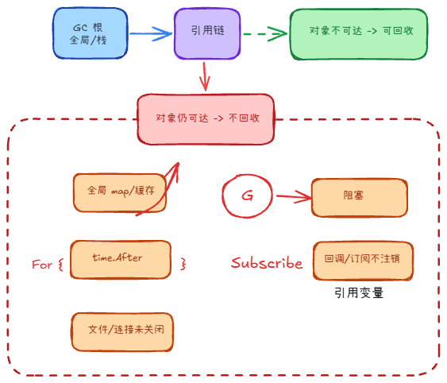
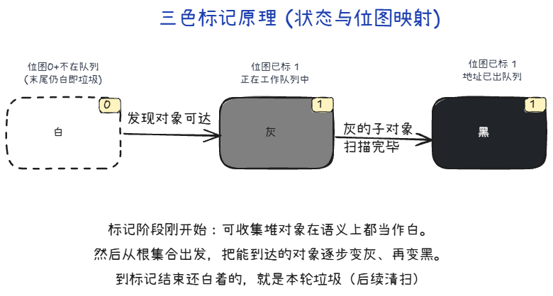
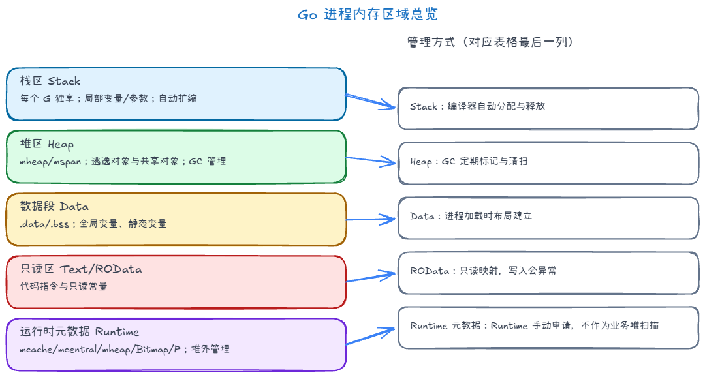

## 内存泄漏 +999

程序运行时，内存不断增加，最终导致系统资源枯竭

### 常见原因

| 模式 | 典型症状 |
|------|-----------|
| **全局 map / 缓存**只加不减 | `inuse_space` 单调涨，业务流量平峰也涨。 |
| 打开的**文件、数据库连接或网络连接**等没有被关闭 | 这些资源一直占用内存 |
| 注册了**回调 / 订阅**却从不注销 | 观察者列表越长越大，对象被间接引用。 |
| **`time.After` 等在循环里误用** | 旧 timer 未释放类问题 |
| **goroutine 泄漏**（阻塞在 chan、锁、网络读等，且仍有引用） | goroutine 数持续上涨；相关栈、闭包捕获对象可能一直可达。 |

### 排查

1. 可通过pprof来查看每个函数的执行时间和内存占用
2. 跑压测或复现场景，让进程稳定运行一段时间后抓堆快照
3. 在 pprof 里看热点函数与累计路径
4. 同时观察 GC 趋势，快速判断是否真泄漏：`GODEBUG=gctrace=1 ./your_binary`

## 内存逃逸 +3

编译期判断「生命周期是否超出当前栈帧」，导致它被分配到堆上，而不是栈上

### 常见逃逸场景

1. 闭包捕获了外部的变量
2. 在方法内返回局部变量的**指针**
3. 向切片、通道加入指针或含有指针的变量
4. 接口动态调用方法
5. 使用 **反射**
6. 切片扩容

### 如何验证

go build -gcflags="-m" .

## 内存回收机制 +2

1. **触发时机**有：2分钟一次，存活堆体积大约翻倍时，用户手动
2. 停世界，**找根节点**
3. **并发标记**
4. 停世界，**刷写屏障缓冲**（wbBuf）、做终止检查
5. **并发清理**

### 三色标记法

go里面的三色标记法，实际上是靠位图和队列完成的：

1. 白：位图0，不在队列。
2. 灰：位图1，在队列。
3. 黑：位图1，不在队列。

步骤是：

1. 所有对象最开始都在白，从根节点开始遍历，遍历到的加入灰
2. 遍历灰的子节点，能到达的节点如果是白就加入灰，遍历完就将灰本身加入黑
3. 直到灰为空，剩下的白的可以清理

### 写屏障

1. 灰的引用白的，此时取消引用；然后黑的引用白的
2. 但黑的不会再遍历，导致这个白的被错误清理

写屏障就是将写指针时把**旧值、新值相关对象**标灰入队，防止错杀

## 内存分配区域 +1

1. 栈：每个G独享一个，局部变量，动态扩容缩容，先进后出
2. 堆：大对象，逃逸对象、new/make、扩容后的 slice，需要gc介入
3. 全局变量区、静态变量区
4. 只读区
5. Go runtime区：runtime申请，无需gc介入
