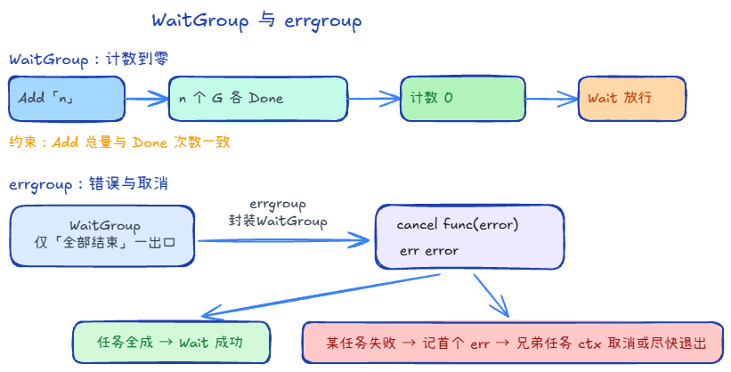

## WaitGroup +1



sync.WaitGroup 只有三个方法：

1. Add(delta int)：把计数器加上 delta。通常用来设定要等待的协程数量。
2. Done()：把计数器减 1。相当于 Add(-1)。通常在子协程结束时（利用 defer）调用。
3. Wait()：阻塞当前协程，直到计数器变成 0。

```go
var mutex sync.Mutex

func f() {
    gnum := 0
    wg := sync.WaitGroup{}
    count := 10000

    wg.Add(1)
    for i := 0; i < count; i++ {
        go func() {
            defer wg.Done()
            
            mutex.Lock()
            gnum++
            mutex.Unlock()
        }()
    }
    wg.Wait()
    fmt.Println(gnum)
}
```

`Add(1)` 只把计数设为 1，却启动了 `count` 个 goroutine 各自 `Done()`，第二个及之后的 `Done()` 会让计数变负，**panic: sync: negative WaitGroup counter**，通常还来不及打印 `gnum`。

正确写法是循环前 `wg.Add(count)`（或每次 `go` 前 `Add(1)`），使 `Add` 与 `Done` 次数一致；配合 `mutex` 保护共享变量，稳定输出 **10000**。