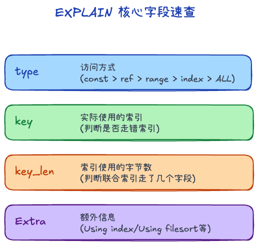

## B+ 树结构 +999

1. 叶子节点才存数据，其它节点都是索引，故又矮又胖，一般3-4层就能查到数据
2. 叶子节点有双向链表连接，方便范围查询

## 为什么不用其它的结构 +1

1. Hash：O(1)时间存取，但是不支持范围查询
2. 二叉查找树：容易退化成链表
3. 二叉平衡树、红黑树
    - 二叉树，一个节点两个分支，会导致树变高
    - 维持平衡需要消耗性能
    - 内存局部性低
4. B树：
    - 所有节点都有数据
    - 范围查询是中序遍历
    - 全表查询是整棵树遍历，而B+是叶子节点直接遍历即可

## 表的最大长度是？+1

2kw。如果你的数据量突破了 2200 万，并且表很“胖”（单行数据极大，包含大文本），B+ 树的层高就会从 3 层增加到 4 层。

层高从 3 变成 4，听起来只加了 1，但在物理层面上是致命的：

1. 磁盘 I/O 次数增加：
    - B+ 树的每一层，在最坏情况下都对应一次物理磁盘 I/O 读写。
    - 3 层树：查一条数据最多需要 3 次磁盘 I/O。4 层树最多需要 4 次磁盘 I/O。
    - 磁盘 I/O 是数据库最慢的瓶颈。这多出来的一下 I/O，会使单次查询的耗时直接增加 33% 以上。
2. Buffer Pool（缓存）吃不消：
    - MySQL 会把常用的索引和数据页缓存在内存（InnoDB Buffer Pool）里。
    - 当树是 3 层时，前 2 层的索引页非常少，可以常驻内存，每次查询实际上只有第 3 层需要读磁盘（即只需要 1 次物理 I/O）。
    - 当树变成 4 层，索引节点呈指数级暴涨，内存再也装不下所有的索引页。这会导致内存频繁进行页置换（Swap），查询时需要多次去读磁盘，导致 P95/P99 延迟呈断崖式下跌。

## 索引类型、作用 +3

### 类型

1. 聚簇索引：叶子节点是主键ID-数据，存放的是**完整的一整行记录数据**
2. 非聚簇索引：叶子节点是其它索引-主键ID，比如name-主键ID，还需回表查一次聚簇索引

### 作用

1. 加快查找速度：就跟字典里有目录查询更快一样
2. 减少磁盘IO次数：如果没有索引，就得顺序、逐页读盘 

## 索引查看 +3

### 预计查看

1. type：
    - system / const：极优，通过主键或唯一索引一次定位。
    - eq_ref / ref：较好，常见于普通索引等值查询。
    - range：中等，适用于范围查询。
    - index：全索引扫描，说明虽然扫描的是索引树，但仍然遍历了大量叶子节点
    - All：全表扫描，数据量一大就是危险信号。
2. key：表示实际使用到的索引
3. possible_keys：MySQL 预测可能会用到的索引
4. key_len：联合索引到底命中了多少列
5. extra
    - **`Using index`**：命中了覆盖索引，不需要回表。
    - **`Using index condition`**：触发了 ICP（索引下推），在索引遍历阶段就做了一部分过滤。
    - **`Using filesort / Using temporary`**：说明排序、分组、去重没有很好地利用索引，往往需要进一步优化。
6. rows：预估扫描行数 

### 实际扫描

EXPLAIN ANALYZE（MySQL 8.0.+）
-> Filter: (users.age > 18)  (cost=10.5 rows=25) (actual time=0.081..0.155 rows=30 loops=1)

> 除了 `EXPLAIN`，还有慢查询日志查看，有个开关log_queries_not_using_indexes = ON可以看

### Index Hint（索引提示）

- FORCE INDEX（强制使用索引）
- USE INDEX（建议使用）
- IGNORE INDEX（忽略索引）
