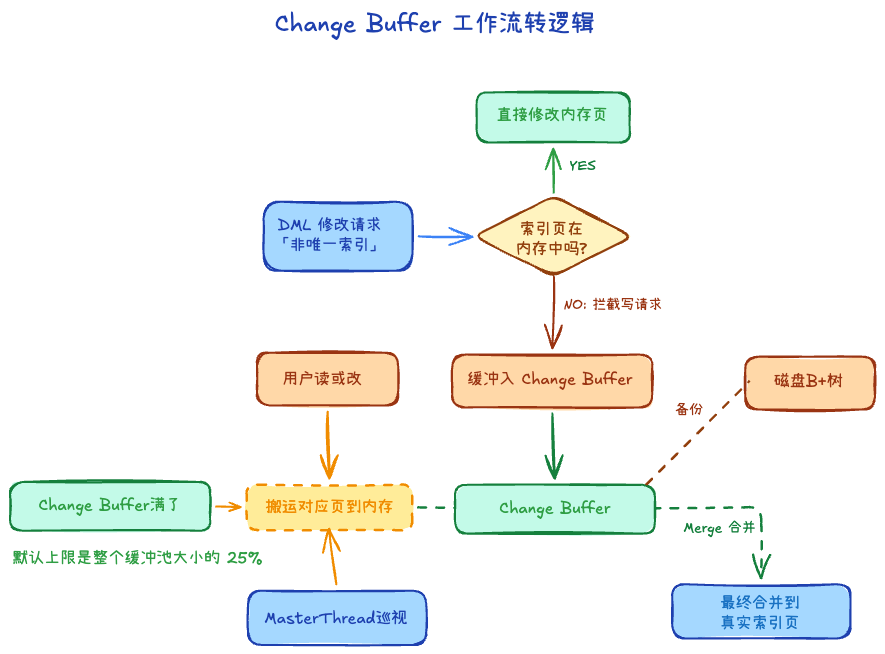

## 什么情况会设计索引 +1 

- 查询明显变慢，且 EXPLAIN 显示代价高
- WHERE / JOIN 条件稳定、重复出现
- 需要排序、分组，且数据量大
- 有唯一性 / 完整性要求
- 读多写少，或读的性能是瓶颈

## 索引失效 +2

1. 索引列参与运算
    - WHERE age + 1 = 18 或 WHERE YEAR(birthday) = 2020
    - B+树无法对“计算后的结果”进行二分查找，因为树里没有存“计算后的值”。
    - 如果做优化，计算成本、边界都要考虑，更麻烦
2. 格式转换
    - 当字符串和数字进行比较时，MySQL 会自动把字符串转为数字再比较
    - 所以字段 phone 是 VARCHAR 类型，但查询时写成 WHERE phone = 13800000000
    - 但是字段 age 是 INT 类型，但查询时写成 WHERE age = "12"，是可以使用索引的
3. like '%xxx'
    - WHERE name LIKE '%ob'，可能有很多情况，所以不能用索引
4. a or b，有一列不是索引
5. 组合索引没用对
6. 优化器认为全表更快

### 其它

1. or

WHERE A = 1 OR B = 2, 如果 `A`、`B` 都有索引，MySQL 5.0+ 的 **Index Merge（索引合并）** 机制将会生效。引擎会分别并发扫描 A 索引和 B 索引，提取出匹配的主键 ID 集合，并在内存中进行**求并集（Union 去重）**操作，最终拿着并集后的 ID 统一进行回表。

2. null

在 InnoDB 引擎中，B+树索引（二级索引）是记录了 NULL 值的。在 B+树中，所有 NULL 值都会被放在叶子节点的最左边（最小端）。既然索引里有，那么理论上绝对可以走索引。可能走，可能不走的原因还是在优化器的估算

## 为什么用了索引还是慢 +1

1. 区分度低，重复的太多
2. 回表次数太多
3. 范围查询导致联合索引后缀利用不足
4. 排序、分页没按索引
4. 返回结果集过大
5. 统计信息不准

## changeBuffer +1

**基本等价于唯一索引和普通索引在实现上的区别**

主键索引是顺序的，插入磁盘就比较快；而二级索引是随机插入的，比较慢

所以对非唯一的二级索引，有一个ChangeBuffer存放修改后的脏页

等后续合适的时机再一并刷盘

> 唯一二级索引不用 Change Buffer（要立刻判重）