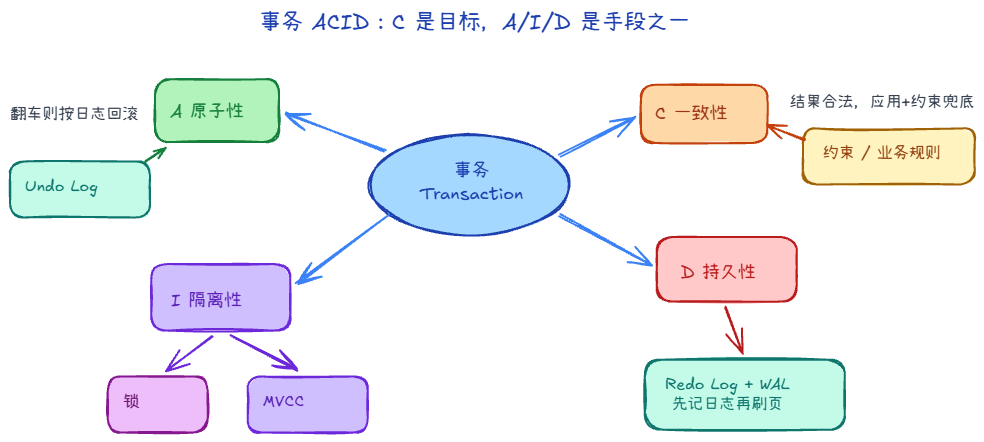
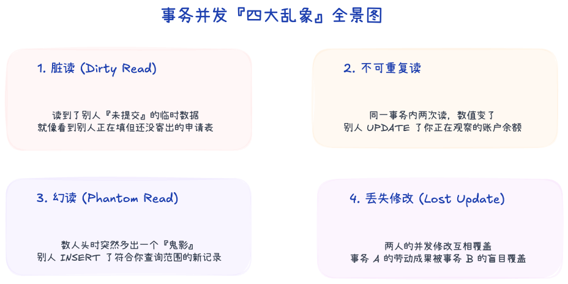
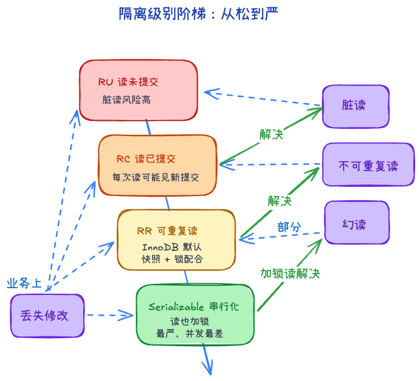
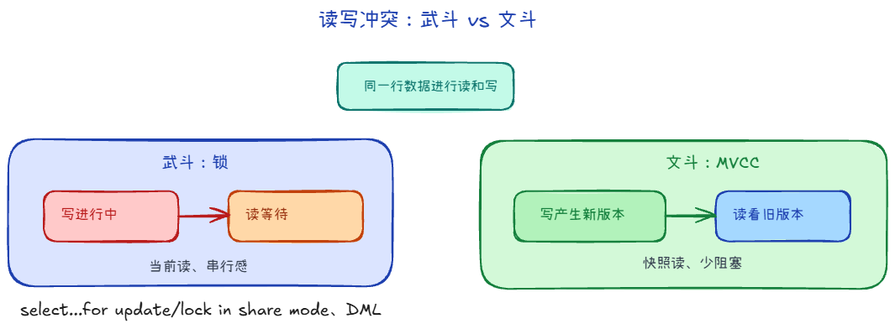
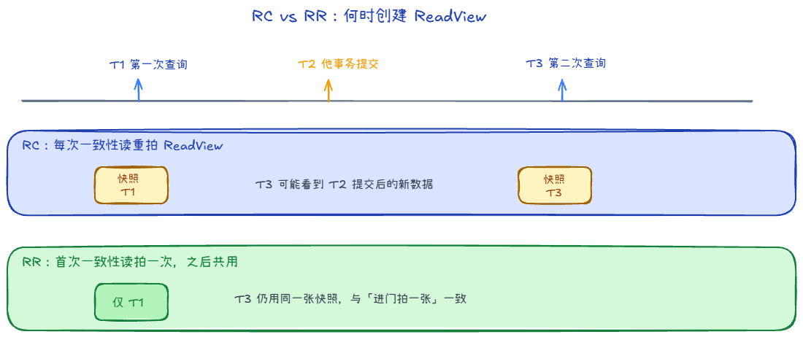
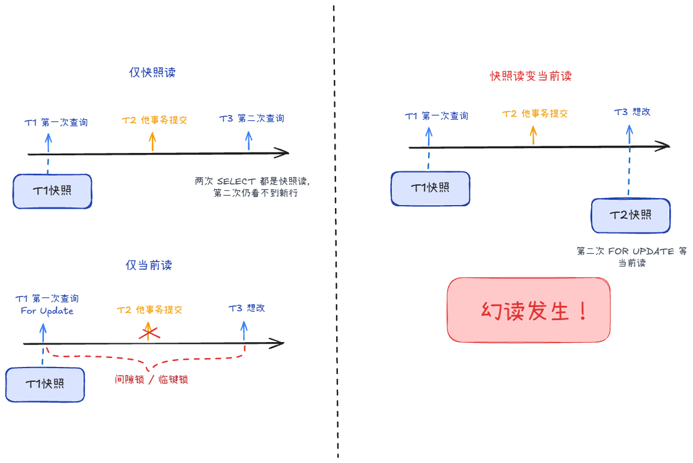

## 事务 +2

### 事务的ACID +2

1. A：原子性。事务要么完成要么失败。由Undolog保证
2. C：一致性。事务前后数据保持一致。由其它三样保证
3. I：隔离性。事务之间互不干扰。由锁+MVCC保证
4. D：持久性。事务变更永久有效。由Redolog保证

### 并发事务的四大问题

1. 脏读。读别人未提交的数据
2. 不可重复读。读两次数据不一致
3. 幻读。读两次数据量不一致
4. 丢失修改。两个事务改同一数据，有个修改丢失了

### 四个隔离级别分别能解决哪些问题？ +2

1. 读未提交，都不能解决
2. 读已提交，解决脏读
3. 可重复读，解决不可重复读，
    - 默认模式
    - 减轻幻读
4. 串行化，解决幻读

## MVCC +2

### MVCC 是什么？

MVCC（Multi-Version Concurrency Control）：多版本并发控制。在不加锁或少加锁的情况下，实现高并发读写，组成有Undo Log和ReadView：

1. UndoLog：每次更新一行数据时，会生成新的记录版本，旧版本放在 undo log 里，通过 roll_pointer 串成版本链
2. ReadView：规定该事务哪些数据能看，哪些不能看。
- 主要角色
    - 生成 ReadView 时，当前活跃事务 ID 列表
    - 活跃事务里最小的事务 ID
    - 下一个将要分配的事务 ID
    - 创建这个 ReadView 的事务 ID
- 总体规则只能查看**创建 ReadView 前已提交的事务**

读取时先看最新版本的 trx_id 是否对当前事务可见，如果不可见，就沿着 undo log 版本链往前找，直到找到可见版本。

### 快照读和当前读在 MVCC 下分别怎么走？

1. 快照读，读的是“过去某一时刻的数据版本”
    - 在读已提交的情况下，每条 SQL 重新生成 ReadView
    - 在可重复读的情况下，第一次 SELECT 生成 ReadView
2. 当前读，读的是最新的数据。加锁，防止别人同时修改
    - 显式加共享锁 (S 锁)：有select ... lock in share mode
    - 显式加排他锁 (X 锁)：有select ... for update
    - 或者其它修改操作 

## InnoDB 在 RR 级别下还会有幻读吗？ +3

MySQL InnoDB 的 RR 级别：
- 如果全程使用快照读（普通 SELECT），无幻读。
- 如果全程使用当前读（SELECT ... FOR UPDATE/lock in share mode），通过间隙锁，无幻读。
- 如果混合使用快照读和当前读，或者先读后写再读，依然存在幻读。

### 可重复读

也是一样，如果混合使用快照读和当前读，或者先读后写再读，依然存在不可重复读

表面上结果确实变化了，但这两次读取使用的是不同的读取语义。 

前者主动要求“按照我的一致性快照读”，后者主动要求“给我当前最新版本并加锁”。不能拿它来说明 RR 的一致性快照失效了。
