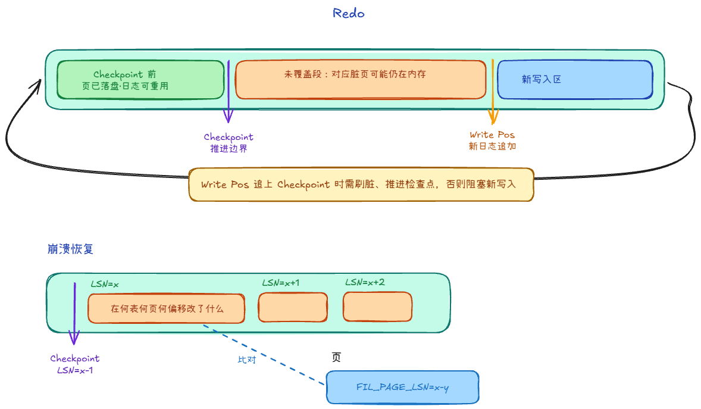
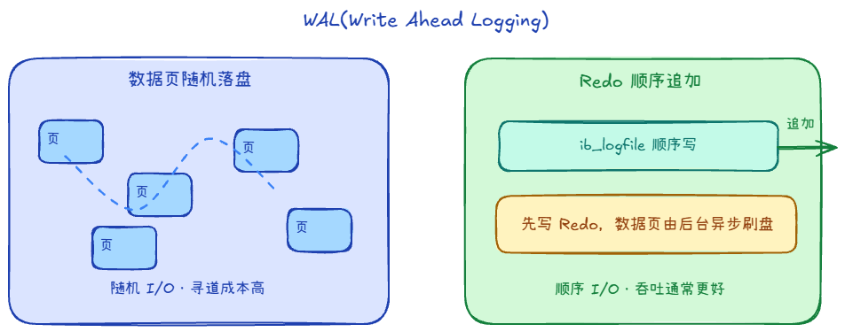

## Redo Log +1

重做日志，方便崩溃后恢复。默认一组循环文件。

记录的是表空间 + 页号 + 偏移做了什么修改

恢复的话是从checkpoint之后恢复，Checkpoint 之前的 Redo 对应脏页都已落盘。

### 为什么用 WAL，先写日志再刷数据页？

写日志是顺序写，I/O 模式更简单，吞吐通常更好；刷数据是随机IO

### LSN（Log Sequence Number，日志序列号）的作用

1. 决定崩溃恢复的起点与范围
    - 确定恢复起点：直接从最后一次成功的 Checkpoint LSN 开始往后扫描
    - 幂等重做（避免重复应用）：读取某个数据页时，对比该页的 Page LSN 和 redo log 的 LSN：
        - 小于的话得重做，大于等于的话不需要重做
2. 管理 Redo Log 的循环覆写与空间释放
    - 对比 当前写入 LSN 与 Checkpoint LSN 的差值
        - 如果过大，说明脏页刷盘太慢，redo log 快要追尾了。此时会触发 Furious Flush（同步急刷盘），阻塞业务写请求，强行推进 Checkpoint LSN 释放空间

## Redo Log 和 Binlog、Undolog

### 区别

1. 记录形式不同
    - Redolog是什么表什么页什么偏移做了什么修改
    - Binlog是**逻辑/行级**：改了哪些行、何种事件
    - Undolog是之前的数据以及操作
2. 用处不同
    - Redolog用于崩溃后恢复
    - Binlog用于主从复制、审计
    - Undolog用于回退
3. 层级
    - RedoLog、UndoLog属于**InnoDB 存储引擎**内部
    - BinLog属于**Server 层**，与引擎解耦

### redo log能用于主从复制吗

1. 空间限制：Redo Log是环形循环写入，没有历史全量记录。
    - 如果从库网络中断断开 1 小时，等网络恢复时，主库对应的 redo log 早就被覆写了，从库根本无法追平数据
2. 层级限制：Redo Log 是 InnoDB 专有的，不具备跨引擎能力
3. 语义限制：Redo Log 是“物理日志”，极其依赖底层物理文件结构
    - 要求从库的表空间 ID、数据页分布、甚至文件碎片情况必须与主库完全物理一致

但在现代存算分离的云原生数据库中，通过共享存储突破了物理限制，已经实现了基于 Redo Log 的高效内存级复制。
