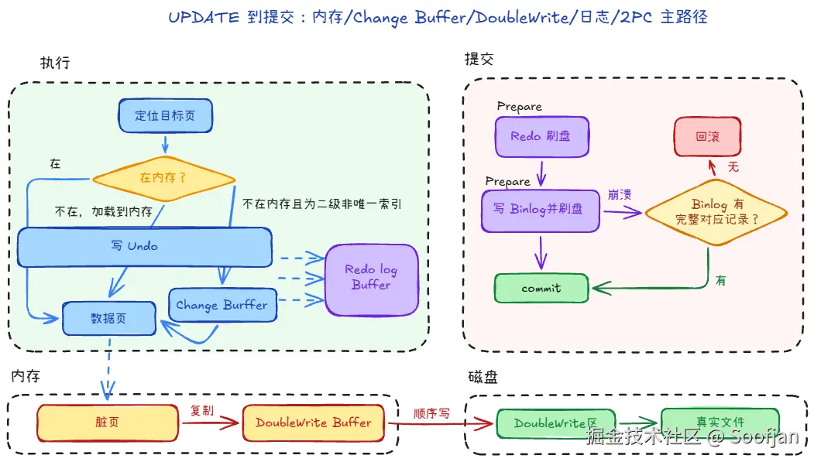

# 写入顺序

当update语句执行时：

## 一、 执行阶段：Undo、Redo、Change Buffer 如何配合

1. 定位目标页（或走 Change Buffer）
    - 在 Buffer Pool 里找目标页。若目标是二级非唯一索引且页不在内存，可先不读该页，改写 Change Buffer 记录，后续再 merge 到真实索引页。
2. 先组织 Undo，再应用行修改
    - 先生成本次修改所需的 Undo 信息（回滚与 MVCC 读旧版本要用），再在内存中改行数据。
    - 改完后数据页（以及可能的 Undo 页）都可能成为脏页。
3. Redo 伴随页修改持续产生
    - 无论是写 Undo 页、改数据页，还是写 Change Buffer 相关页，都会把对应物理变更先写入 Redo Log Buffer。
    - 提交或触发刷盘时再按策略写入 Redo 日志文件。此时数据文件里的页仍可能是旧值，这是 WAL 的正常状态。

## 二、 提交：Redo 与 Binlog 的两阶段提交（2PC）

目标：Redo 与 Binlog 对「这个事务是否提交」达成一致，且崩溃恢复时能据此裁决。

1. Prepare（引擎）
    - InnoDB 将本事务的 Redo 刷到磁盘（达到持久化要求），事务在引擎侧标记为 prepare，尚未结束。
2. 写 Binlog（Server）
    - Server 把本次事务对应的 Binlog 事件写入 Binlog 文件并刷盘（策略受 sync_binlog 等影响）。
3. Commit（引擎）
    - Binlog 写成功后，引擎把该事务从 prepare 改为 commit，提交完成。

## 三、 崩溃恢复：只看 Redo 不够

重启后分两步：先把页修到能用，再裁定 prepare 事务提交还是回滚。

**1. 修页：两次写**
    - 脏页 16KB、盘常按 4KB 写，刷到一半会撕页，CRC 失败。
    - Redo 是「某页某偏移改什么」，页结构坏了无从下手。
    - 先从 Doublewrite 捞回完整页（或确认数据文件里的页没动过）。

**2. 重放：Redo 全打上去**
    - 从 Checkpoint 往后扫 Redo，对比 Page LSN，该重做的都重做。
    - 不管事务提交没有——已 commit、prepare、未提交，只要进了 Redo，物理修改都会回到页上。
    - 这一步结束后：页是完整的、内容是「崩溃前 Redo 已刷盘的最新样子」，但有些不该对外生效的事务也在页上。

**3. 收尾：看事务状态，决定留下还是 Undo**
    - Redo 里已是 commit：改动留下。
    - 从未进入 prepare（写 Redo 到 prepare 之前就崩）：Undo 滚掉。
        - 停在 prepare：再对 Binlog（引擎和 Server 对齐，不是另开一套「主从恢复」）
        - 有完整 Binlog：补 commit，改动留下。
        - 没有：Undo 滚掉。
