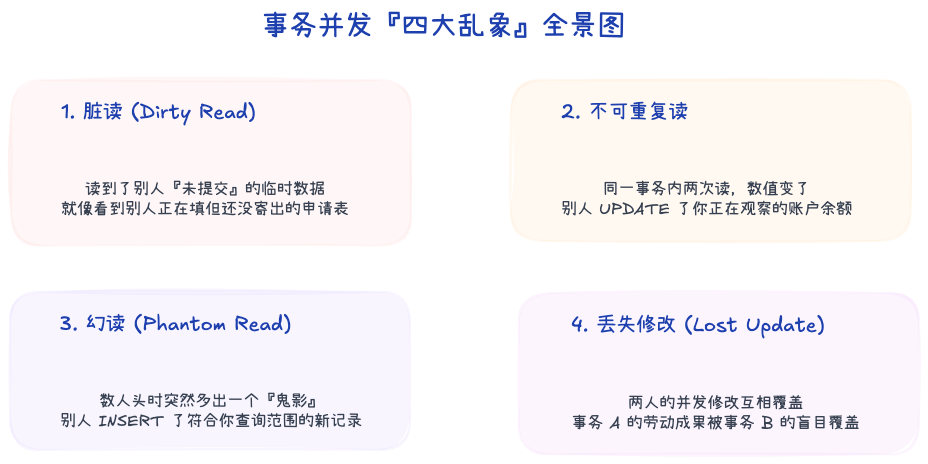
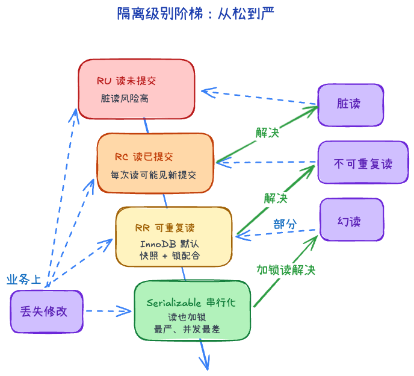
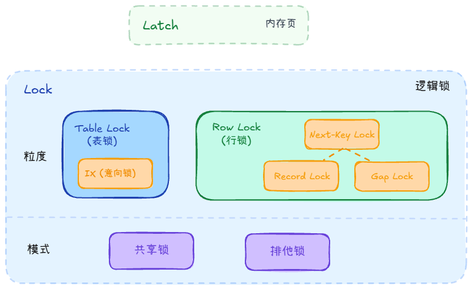
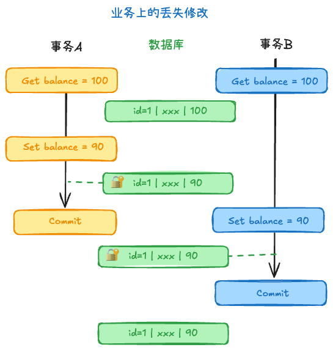
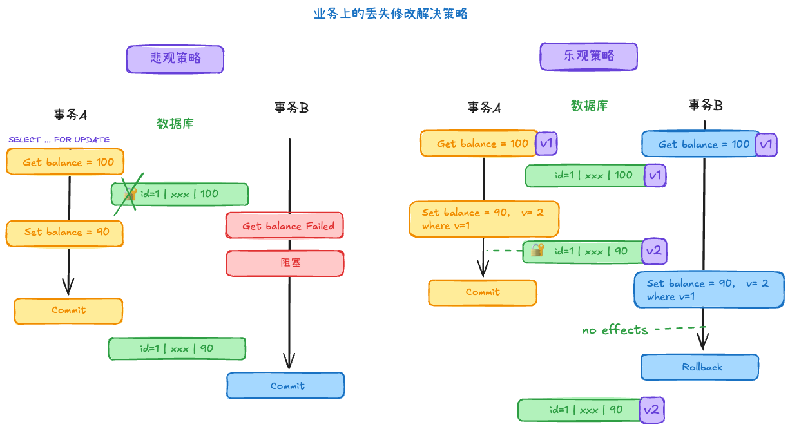
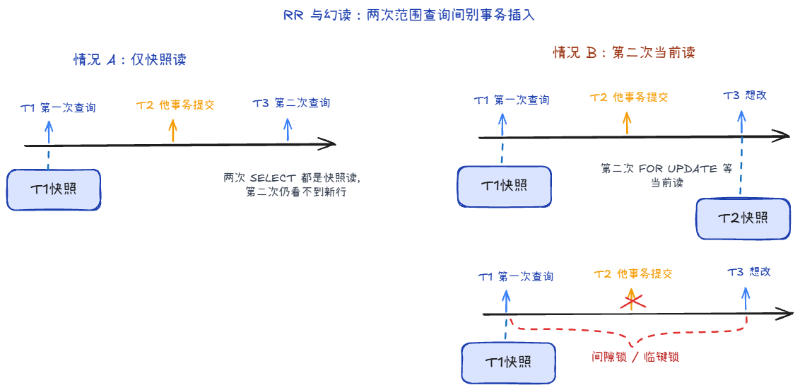
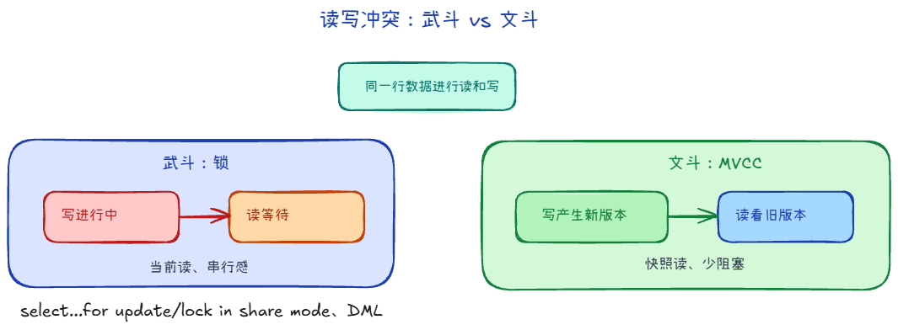
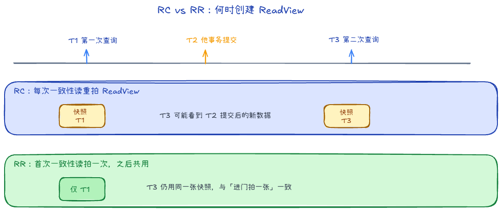

## 事务 +2

### 事务的ACID +2

1. A：原子性。事务要么完成要么失败。由Undolog保证
2. C：一致性。事务前后数据保持一致。由其它三样保证
3. I：隔离性。事务之间互不干扰。由锁+MVCC保证
4. D：持久性。事务变更永久有效。由Redolog保证

### 并发事务的四大问题

1. 脏读。读别人未提交的数据
2. 不可重复读。读两次数据不一致
3. 幻读。读两次数据量不一致
4. 丢失修改。两个事务改同一数据，有个修改丢失了

### 四个隔离级别分别能解决哪些问题？ +2

1. 读未提交，都不能解决
2. 读已提交，解决脏读
3. 可重复读，解决不可重复读，
    - 默认模式
    - 减轻幻读
4. 串行化，解决幻读

## 锁的类型 +2

锁是事务实现隔离性的手段
1. Latch：锁的是内存页
2. Lock：锁的是逻辑数据
    1. 粒度
        - 表级锁，还有意向锁
        - 行级锁：包含Record、Gap、Next-Key
    2. 类型
        - 共享锁，可以读读，不能写
        - 排他锁，只能一人获取，其它不能获取

### 锁解决丢失修改问题

其实在任何隔离级别下，都不会导致数据库理论上的丢失修改问题，因为有行级锁，不会出现两个事务同时改同一数据的情况

但是在真实业务场景下，可能会出现这个问题，也就是先查后改：

如何解决：

1. **悲观策略 (SELECT ... FOR UPDATE)**
   从查询的那一刻起，直接对这行数据挂上排他锁（X锁）。虽然这会让所有后续也想读写的兄弟事务立刻进入阻塞死等状态（影响吞吐量），但防范成功率 100%。

2. **乐观策略 (版本控制 / CAS)**
   在业务表里自己多加一列 `version`（或时间戳）。
   每次读取带走这个 `version`，更新时附带条件：`UPDATE table SET balance = balance - 50, version = 2 WHERE id = 1 AND version = 1`。如果受影响行数为 0，说明在你犹豫的时候有人捷足先登了，你在业务层处理回滚重试即可。

## 幻读 +2

### InnoDB 在 RR 级别下如何防止幻读？

1. 未修改情况下。MVCC下读的数据都是一开始快照读的数据，不会有幻读发生
2. 修改情况下，会触发当前读，可能出现幻读；InnoDB 用 Next-Key / Gap Lock 把间隙锁住，防止别人插入，从而防幻读。

## MVCC +1

### MVCC 是什么？

MVCC:Multi-Version Concurrency Control。在不加锁或少加锁的情况下，实现高并发读写，组成有Undo Log和ReadView：
- UndoLog：有指针串成新旧数据链，方便回退。
- ReadView：规定该事务哪些数据能看，哪些不能看。
    - 主要角色是活跃事务IDs，最老的活跃事务ID，最新的事务ID
    - 总体规则是只能查看已提交的事务

### 快照读和当前读在 MVCC 下分别怎么走？

1. 快照读，读的是“过去某一时刻的数据版本”
    - 在读已提交的情况下，每条 SQL 重新生成 ReadView
    - 在可重复读的情况下，第一次 SELECT 生成 ReadView
2. 当前读，读的是最新的数据。命令有select ... for update，或者其它修改操作

