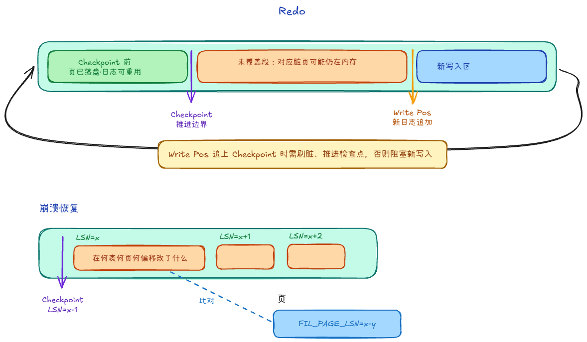
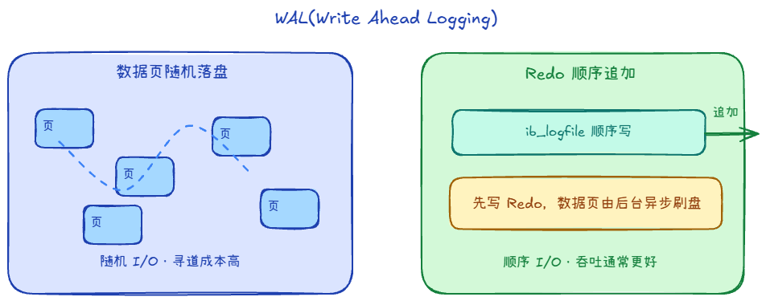

## Redo Log +1

### Redo Log 是什么？作用是什么？

重做日志，方便崩溃后恢复。默认一组循环文件。

记录的是表空间 + 页号 + 偏移做了什么修改

恢复的话是从checkpoint之后恢复，Checkpoint 之前的 Redo 对应脏页都已落盘。

### 为什么用 WAL，先写日志再刷数据页？

写日志是顺序写，I/O 模式更简单，吞吐通常更好；刷数据是随机IO

### 崩溃恢复时，只看 Redo Log 能恢复吗？

1. 两次写保证原页完整
2. Redo Log用于恢复
3. Redo 会重放未提交事务的物理修改，最后靠 Undo 回滚未提交

### Redo Log 和 Binlog、Undolog 有什么区别？

1. 记录形式不同
    - Redolog是什么表什么页什么偏移做了什么修改
    - Binlog是**逻辑/行级**：改了哪些行、何种事件
    - Undolog是之前的数据以及操作
2. 用处不同
    - Redolog用于崩溃后恢复
    - Binlog用于主从复制、审计
    - Undolog用于回退
3. 层级
    - RedoLog、UndoLog属于**InnoDB 存储引擎**内部
    - BinLog属于**Server 层**，与引擎解耦

## 两次写

辅助理解

刷脏页到表空间时，若崩溃发生在**写某一页写到一半**，磁盘上会出现 **partial page write（撕裂页）**，直接对该页做 Redo 可能越修越错。

InnoDB 先把脏页副本写到 **doublewrite buffer**（共享表空间中的一块连续区域），再写回真实表空间位置

恢复时若发现页校验失败，可**从 doublewrite 里的完整副本还原整页**，再对该页应用 Redo。