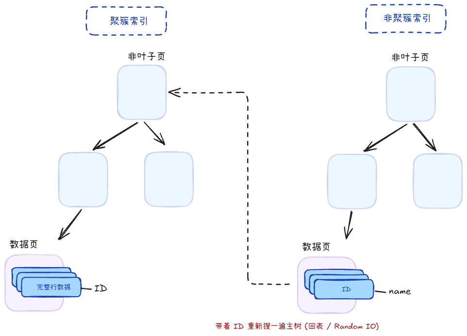
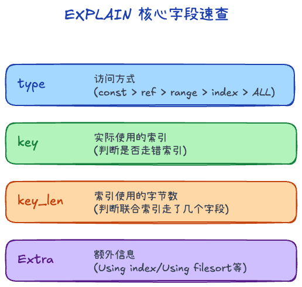
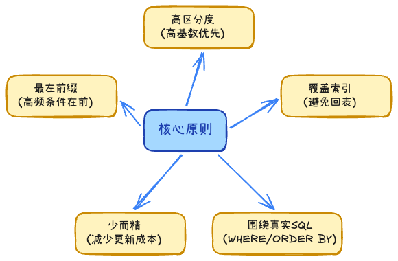
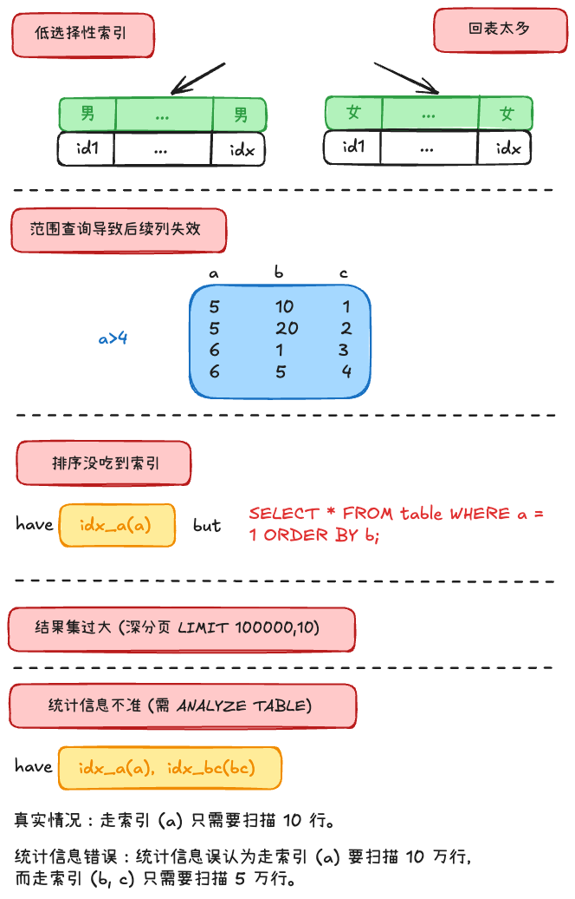

## B+ 树 +999

1. 叶子节点才存数据，其它节点都是索引，故又矮又胖，一般3-4层就能查到数据
2. 叶子节点有双向链表连接，方便范围查询

### 为什么不用其它的结构

1. Hash：O(1)时间存取，但是不支持范围查询
2. 二叉查找树：容易退化成链表
3. 二叉平衡树、红黑树
    - 二叉树，一个节点两个分支，会导致树变高
    - 维持平衡需要消耗性能
    - 内存局部性低
4. B树：
    - 所有节点都有数据
    - 范围查询是中序遍历
    - 全表查询是整棵树遍历，而B+是叶子节点直接遍历即可

## 索引类型、作用 +3

### 类型

1. 聚簇索引：叶子节点是主键ID-数据，存放的是**完整的一整行记录数据**
2. 非聚簇索引：叶子节点是其它索引-主键ID，比如name-主键ID，还需回表查一次聚簇索引

### 作用

1. 加快查找速度：就跟字典里有目录查询更快一样
2. 减少磁盘IO次数：如果没有索引，就得顺序、逐页读盘 

## 索引查看 +2

EXPLAIN查看：
1. type：
    - system / const：极优，通过主键或唯一索引一次定位。
    - eq_ref / ref：较好，常见于普通索引等值查询。
    - range：中等，适用于范围查询。
    - index：全索引扫描，说明虽然扫描的是索引树，但仍然遍历了大量叶子节点
    - All：全表扫描，数据量一大就是危险信号。
2. key：表示实际使用到的索引
3. key_len：联合索引到底命中了多少列
4. extra
    - **`Using index`**：命中了覆盖索引，不需要回表。
    - **`Using index condition`**：触发了 ICP（索引下推），在索引遍历阶段就做了一部分过滤。
    - **`Using filesort / Using temporary`**：说明排序、分组、去重没有很好地利用索引，往往需要进一步优化。

> 除了 `EXPLAIN`，还有慢查询日志查看，有个开关log_queries_not_using_indexes = ON可以看

## 索引问题 +1

### 什么情况会设计索引 +1 

- 查询明显变慢，且 EXPLAIN 显示代价高
- WHERE / JOIN 条件稳定、重复出现
- 需要排序、分组，且数据量大
- 有唯一性 / 完整性要求
- 读多写少，或读的性能是瓶颈

### 索引失效 +1

1. 索引列参与运算
2. 格式转换
3. like '%xxx'
4. a or b，有一列不是索引
5. 组合索引没用对
6. is null或者is not null
7. 优化器认为全表更快

> WHERE A = 1 OR B = 2, 如果 `A`、`B` 都有索引，MySQL 5.0+ 的 **Index Merge（索引合并）** 机制将会生效。引擎会分别并发扫描 A 索引和 B 索引，提取出匹配的主键 ID 集合，并在内存中进行**求并集（Union 去重）**操作，最终拿着并集后的 ID 统一进行回表。

### 为什么用了索引还是慢 +1

1. 区分度低，重复的太多
2. 回表次数太多
3. 范围查询导致联合索引后缀利用不足
4. 排序、分页没按索引
4. 返回结果集过大
5. 统计信息不准

### 慢查询怎么办 +1

1. 首先看是否稳定出现
2. 使用 `EXPLAIN` 看执行计划
3. 没有就看能不能加
4. 有就看是否用到
5. 有没有锁竞争与事务影响等等

## changeBuffer +1

**基本等价于唯一索引和普通索引在实现上的区别**

主键索引是顺序的，插入磁盘就比较快；而二级索引是随机插入的，比较慢

所以对非唯一的二级索引，有一个ChangeBuffer存放修改后的脏页

等后续合适的时机再一并刷盘

> 唯一二级索引不用 Change Buffer（要立刻判重）