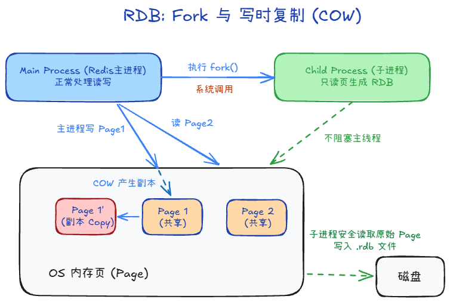
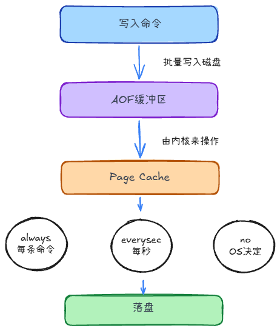

## 持久化 +2

### RDB

把内存数据打成**二进制快照**写到磁盘。

### 写时复制（COW）

fork 后共用物理页；主进程**改**某页时 OS 复制该页再改；子进程看到的是 fork 瞬间镜像，据此写 `.rdb`。

### AOF

以**追加写命令**的方式持久化：命令 → AOF 缓冲区 → `write` 到 Page Cache → 按策略 `fsync` 落盘。

### AOF 重写是干什么？

日志只增不减，用重写生成等价但更短的 AOF，后台 `BGREWRITEAOF`。

## RDB和AOF的区别

1. AOF数据多，故有AOF重写；RDB文件小，恢复更快
2. 数据形式不同
3. 丢失窗口不同，RDB可能丢失上次快照之后的所有数据，AOF更少

## 混合持久化

当 Redis 同时开启了 RDB（快照）和 AOF（只追加日志）时，Redis 重启时会绝对优先使用 AOF 进行数据恢复，而直接忽略 RDB 文件。因为AOF 的数据完整性更高

但它有一个致命弱点：恢复太慢了，所以 Redis 4.0 引入了“混合持久化（Hybrid Persistence）”（配置项：aof-use-rdb-preamble yes）

1. AOF 重写（Rewrite）时：Redis 把当前的内存数据以 RDB 的二进制格式写入 AOF 文件的头部。
2. 后续运行中：新的写命令继续以 AOF 的文本格式追加到文件的尾部。
3. 复原时：
    1. Redis 依然只读取 appendonly.aof。
    2. 它会先以 RDB 的超快速度把头部的二进制数据直接载入内存（极快！）。
    3. 然后再重放尾部少量的 AOF 增量命令。
    4. 结果：既拥有了 RDB 的极速恢复速度，又拥有了 AOF 的数据高完整性。