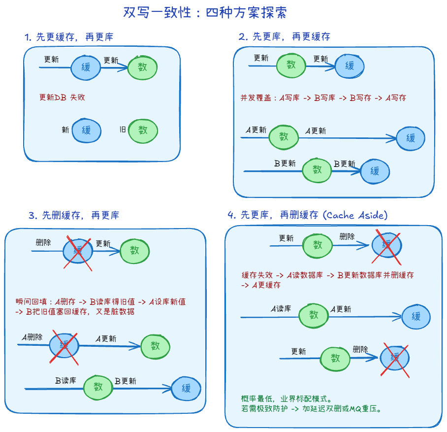
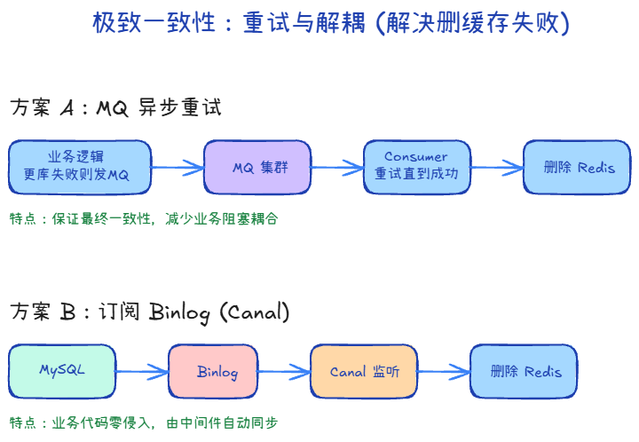
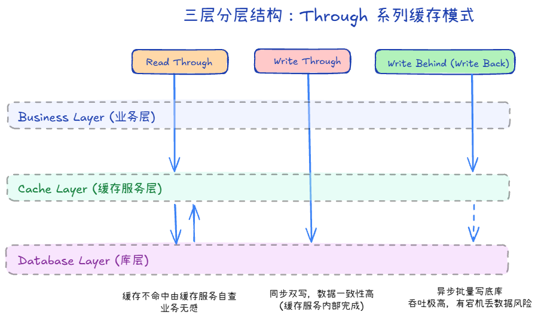

## Cache Aside（旁路缓存）+1

### 读和写是什么样的？

1. 读：先读缓存，没有再读数据库，然后放到缓存
2. 写：先更新数据库，再删除缓存

### 四种情况

只记得有删除，我们可以做推理

1. 先更新数据库 再删除缓存

假设A更新了数据库，B读了缓存，就是旧缓存。但它的问题通常只是：短暂读到旧数据。

等 A 删除缓存后，后续请求发现缓存没了，就会去数据库读 new，再写回缓存。

2. 先删除缓存 再更新数据库

假设A删了缓存，B读没读到，去数据库拿，放回缓存，A才更新数据库。

3. 先更新数据库 再更新缓存

A和B同样操作，A比B慢，会造成数据不一致

4. 先更新缓存 再更新数据库

和3一样，会造成数据不一致。但是更危险，因为你先让别人看到一个“数据库还没承认”的值。

> 总结：更新数据时，不要想着“把缓存改对”，而是“把缓存删掉，让它下次从数据库重新长出来”。

## 极致一致性：重试与解耦 

### 删除缓存失败

当A更新数据库成功，删除Redis却失败了。结果后续读请求一直读的旧缓存

### 解决方法

1. 消息队列：让MQ来删除
2. 订阅Binlog：使用canal监控，去删除Redis

## Through 系列（读穿 / 写穿 / 写回）

1. 读穿：读的时候，应用只找缓存，发现没有后，缓存帮你查数据库
2. 写穿：写的时候，应用只写缓存，缓存同步到数据库，而且要等数据库成功。
3. 写回：写的时候，应用只写缓存，数据库是异步写。