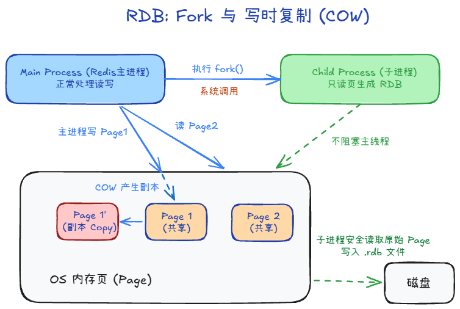
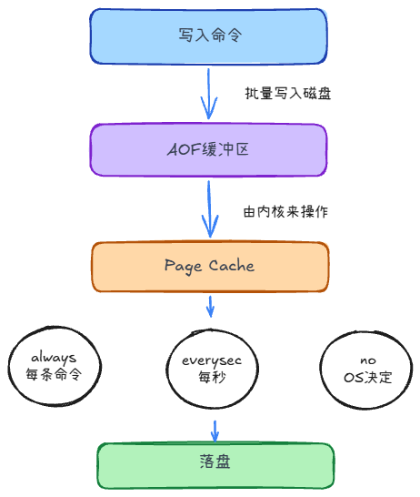

## 持久化 +2

### RDB

把内存数据打成**二进制快照**写到磁盘。

### 写时复制（COW）

fork 后共用物理页；主进程**改**某页时 OS 复制该页再改；子进程看到的是 fork 瞬间镜像，据此写 `.rdb`。

### AOF

以**追加写命令**的方式持久化：命令 → AOF 缓冲区 → `write` 到 Page Cache → 按策略 `fsync` 落盘。

### AOF 重写是干什么？

日志只增不减，用重写生成等价但更短的 AOF，后台 `BGREWRITEAOF`。

## RDB和AOF的区别

1. AOF数据多，故有AOF重写；RDB文件小，恢复更快
2. 数据形式不同
3. 丢失窗口不同，RDB可能丢失上次快照之后的所有数据，AOF更少