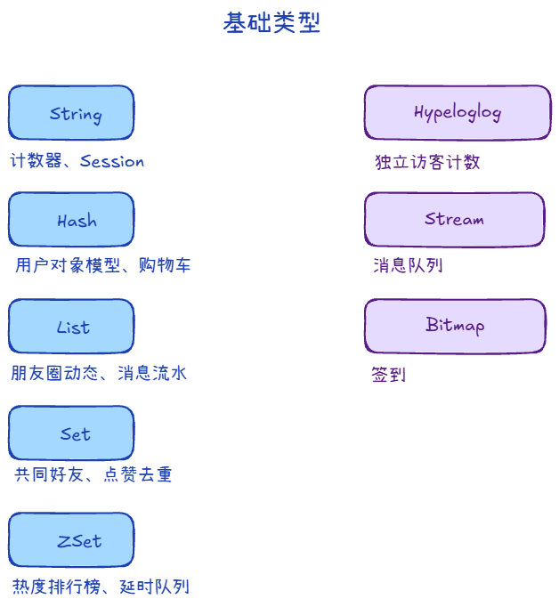
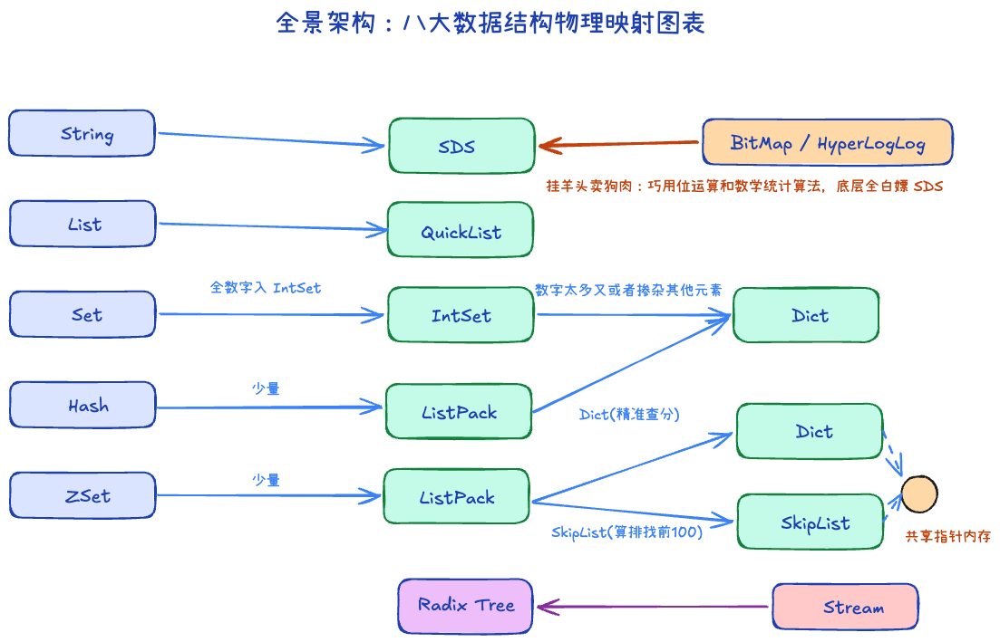

## 类型 +3

1. String：校验码、Token
2. Hash：对象
3. List：存列表
4. Set：无序集合、自动去重
5. ZSet：可排序的Set
6. Hyperloglog：uv计数
7. Stream：消息队列
8. Bitmap：签到

### HyperLogLog +1

用很小的内存，估算一个很大的去重数量:

1. 把元素通过 hash 映射成一个均匀分布的二进制串
2. 观察这个二进制串里出现的前导零个数
3. 用多个“桶”统计这些前导零的信息
4. 根据概率规律反推出集合的基数

如果 hash 值是均匀随机的：

1. 出现 0xxxx... 的概率是 1/2
2. 出现 00xxxx... 的概率是 1/4
3. 出现 000xxxx... 的概率是 1/8

所以如果你在很多 hash 里看到了很长的前导零，说明样本量可能已经很大了

## 上层类型与底层结构 +1

1. SDS：O(1) 取长度、二进制安全、预分配减少扩容 
2. ListPack：紧凑列表
3. QuickList：双向链表，每个节点是ListPack
4. SkipList：跳表，快速查找
5. Dict：渐进式扩容

### ZSet的底层结构是什么 +1

1. 数据少的时候是ListPack
2. 数据多的时候是Dict+SkipList
    - Dict方便快速查询
    - SkipList方便排序、范围查询
    - 两个结构指向相同的底层数据