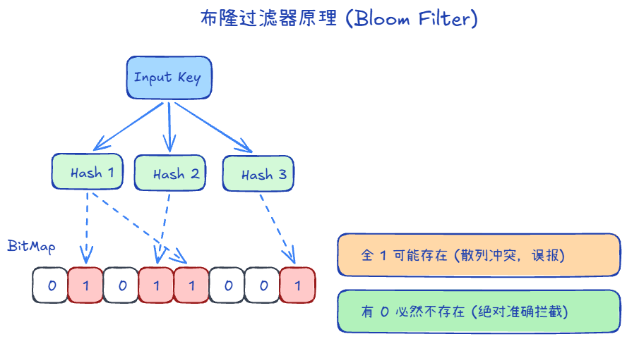

## 缓存穿透、击穿、雪崩 +4

假设是一个商城系统

### 缓存穿透

一直是个不存在的商品请求，打到数据库，可以用：

1. 缓存请求，若攻击 key 每次都不同，缓存无效
2. 布隆过滤器
3. 限流

### 缓存击穿

一个热点商品的缓存突然失效，导致请求都打到数据库，可以用：

1. 提前预热
2. 永不失效
3. 互斥锁：key 过期时，只有一个请求查 DB 并写回缓存，其余等待或读旧值
4. SingleFlight（Go）：同一 key 并发只执行一次回源

### 缓存雪崩

多个商品同时失效，可以用：

1. 如果是redis服务不可用，建立集群，多级缓存
2. 如果是缓存失效，预热，永不失效，或不同时期过期
3. 熔断 / 降级：Redis 或 DB 扛不住时返回默认值，保护 DB

## 布隆过滤器 +2

布隆过滤器本质上是一个超长位数组（Bitmap）+ 多个哈希函数，用来快速判断一个 key **是否可能存在**。

### 布隆过滤器原理

**写入流程：**
    1. 拿一个数据（如 `User123`）。
    2. 用多个哈希函数计算多个下标（如 10、50、80）。
    3. 把位数组对应位置都置为 1。

**查询流程：**
    1. 对待查询 key 计算同样的多个下标。
    2. 只要有一个位置是 0 => 一定不存在。
    3. 如果全部是 1 => 可能存在（再查缓存/数据库确认）。

### 要点

1. 在建立Redis时全量更新，后续加入数据就加到过滤器里
2. 保证一定不存在，不保证存在
3. 删除数据后，过滤器里的不删除，因为可能有别的数据也占位了，所以要定时重新更新
