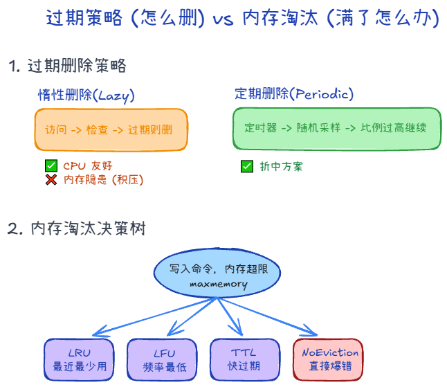

## 过期删除 +1

1. 惰性删除：用到才看有没有过期
2. 定期删除：抽20个来看，如果删除超过1/4，则继续

## 内存淘汰 +1

有多种方式，比如：

1. 报错
2. 删除最近最久未使用的
2. 设置了过期时间里的，删除最近最久未使用的
4. 使用频率最低的
5. 随机删除

### 删除 +1

1. 一但删除就查不到了
2. 小元素直接清理内存，大元素可能由后台异步释放

